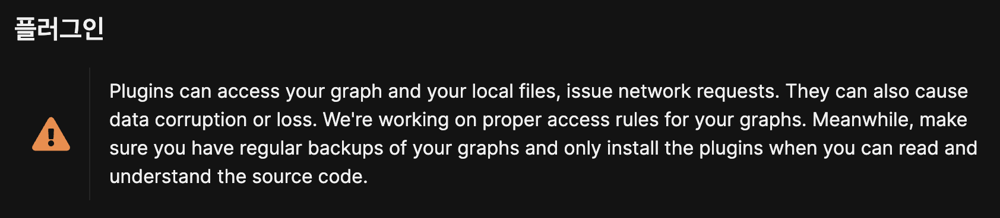

- #DD-CN 2/131
	- DONE 오전 2시간 HTML 강의
	  :LOGBOOK:
	  CLOCK: [2025-05-14 Wed 18:09:01]--[2025-05-14 Wed 18:09:02] =>  00:00:01
	  :END:
		- 처음보는 태그도 있었지만 쓰지 않으면 잊어버리고, 필요할 때 공부해도 늦지 않다고 생각했다..
		- `html` 태그에서 `alt` 속성을 '과거에 통신이 늦을 때 이미지 렌더링에 실패한 경우에 중요하게 썼고 요즘은 잘 쓰지 않는다' 라는 설명을 들었다..
		- 하지만, 시각장애인을 위한 웹 접근성이나 SEO 측면에서 여전히 중요하기 때문에, 가능한 한 alt 속성을 작성해주는 것이 시멘틱한 마크업을 구현하는데 도움이 될 것 같다.
	- DONE 팀스터디 모집 \~오늘까지
	  :LOGBOOK:
	  CLOCK: [2025-05-14 Wed 18:08:03]--[2025-05-14 Wed 18:08:03] =>  00:00:00
	  CLOCK: [2025-05-14 Wed 18:17:27]--[2025-05-14 Wed 18:20:29] =>  00:03:02
	  :END:
		- [프로젝트 스터디](https://www.notion.so/patsot/1f399e5316ed806fa63fd70faca44a41) 모집 실패.
		- CKA, AWS SAA 자격증 스터디 모집 완료.
	- DONE 교육과정 로드맵 작성하기 \~ 5시까지
	  :LOGBOOK:
	  CLOCK: [2025-05-14 Wed 18:07:43]--[2025-05-14 Wed 18:07:52] =>  00:00:09
	  :END:
	- #GitHub
		- DONE 개발 블로그용 GitHub Pages 생성하기
		  :LOGBOOK:
		  CLOCK: [2025-05-14 Wed 18:20:04]--[2025-05-14 Wed 18:20:26] =>  00:00:22
		  :END:
			- [[Deploy Logseq Graph to GitHub Pages]]
	- #SQLD
		- D-17 학습계획
			- 노마드코더 SQL 강의 프로그래머스 SQL 고득점 Kit → 면접을 위한 CS 전공 지식 노트 데이터 베이스 파트 공부 → SQLD 기출문제 풀이
			- + DBeaver 인터페이스 익히기
		- TODO DDL 실습 & 정리
		- TODO DML 실습 & 정리
		  :LOGBOOK:
		  CLOCK: [2025-05-14 Wed 18:28:12]--[2025-05-14 Wed 18:28:13] =>  00:00:01
		  CLOCK: [2025-05-14 Wed 18:28:14]--[2025-05-14 Wed 18:28:14] =>  00:00:00
		  :END:
-
- #Logseq
	- TODO 배포할 때 Flashcards, Whiteboards 탭 보이지 않게 설정하기
	- TODO 폰트 수정
	- DONE 배포할 때 로컬에서 사용하는 플러그인을 함께 배포할 수는 없는지? 알아보기
		- 불가능함
		- 
	- DONE Git 관련 설정 변경
	  :LOGBOOK:
	  CLOCK: [2025-05-14 Wed 18:51:54]--[2025-05-14 Wed 18:52:58] =>  00:01:04
	  :END:
		- '60초 마다'에서 '창을 닫을 때'로 변경
		- Git 플러그인 설치