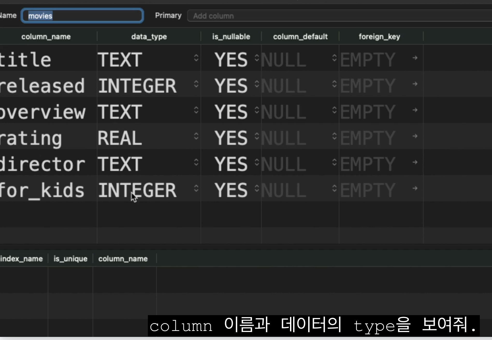

- #DD-CN 2/131
	- DONE 오전 2시간 HTML 강의
	  :LOGBOOK:
	  CLOCK: [2025-05-14 Wed 18:09:01]--[2025-05-14 Wed 18:09:02] =>  00:00:01
	  :END:
		- 처음보는 태그도 있었지만 쓰지 않으면 잊어버리고, 필요할 때 공부해도 늦지 않다고 생각했다.
		- `html` 태그에서 `alt` 속성을 '과거에 통신이 늦을 때 이미지 렌더링에 실패한 경우에 중요하게 썼고 요즘은 잘 쓰지 않는다' 라는 설명을 들었다..
		- 하지만, 시각장애인을 위한 웹 접근성이나 SEO 측면에서 여전히 중요하기 때문에, 가능한 한 alt 속성을 작성해주는 것이 시멘틱한 마크업을 구현하는데 도움이 될 것 같다.
	- DONE 팀스터디 모집 \~오늘까지
	  :LOGBOOK:
	  CLOCK: [2025-05-14 Wed 18:08:03]--[2025-05-14 Wed 18:08:03] =>  00:00:00
	  CLOCK: [2025-05-14 Wed 18:17:27]--[2025-05-14 Wed 18:20:29] =>  00:03:02
	  :END:
		- [프로젝트 스터디](https://www.notion.so/patsot/1f399e5316ed806fa63fd70faca44a41) 모집 실패.
		- CKA, AWS SAA 자격증 스터디 모집 완료.
	- DONE 교육과정 로드맵 작성하기 \~ 5시까지
	  :LOGBOOK:
	  CLOCK: [2025-05-14 Wed 18:07:43]--[2025-05-14 Wed 18:07:52] =>  00:00:09
	  :END:
	- DONE '오늘 할일' 스프레드 시트 채우기
		- [클라우드 4회차 오늘 할 일](https://docs.google.com/spreadsheets/d/1G3UdNw562EQmuDoFGIQV28-Uc8S75dp09qY_T86XnJw/edit?gid=485081343#gid=485081343)
-
- #devblog #GitHub
	- DONE 개발 블로그용 GitHub Pages 생성하기
	  :LOGBOOK:
	  CLOCK: [2025-05-14 Wed 18:20:04]--[2025-05-14 Wed 18:20:26] =>  00:00:22
	  :END:
		- [[Deploy Logseq Graph to GitHub Pages]]
- #SQLD
	- D-17 학습계획
		- 노마드코더 SQL 강의 프로그래머스 SQL 고득점 Kit → 면접을 위한 CS 전공 지식 노트 데이터 베이스 파트 공부 → SQLD 기출문제 풀이
		- + DBeaver 인터페이스 익히기
-
- #Logseq
	- TODO 배포할 때 Flashcards, Whiteboards 탭 보이지 않게 설정하기
	- TODO 폰트 수정
	- DONE 배포할 때 로컬에서 사용하는 플러그인을 함께 배포할 수는 없는지? 알아보기
		- 불가능함
		- 
	- DONE Git 관련 설정 변경
	  :LOGBOOK:
	  CLOCK: [2025-05-14 Wed 18:51:54]--[2025-05-14 Wed 18:52:58] =>  00:01:04
	  :END:
		- '60초 마다'에서 '창을 닫을 때'로 변경
	- Git 플러그인 설치
-
- #Logseq #GitHub #TroubleShooting
	- DONE Logseq 에 플러그인 설치하였고 push 하는데 에러
	- https://github.com/Vinzent03/obsidian-git/issues/461
		- Git Credential 과 관련하여 gh CLI로 발급받은 인증 토큰의 기한이 만료로 발생한 문제로 추측
		- 아래와 같이 git 설정 업데이트 하고 재인증 하여 해결.
		- ```
		  git config --global credential.helper osxkeychain
		  gh auth login
		  ```
-
-
- #SQL마스터클래스
	- Chapter 3. DDL
		- ==SQL은 네가 무엇을 하고 있는 지 스스로 잘 알고 있다고 생각해==
		-
		- `DROP TABLE`
			- 테이블을 잘못 생성(ex. 열 이름을 잘못 작성)했을 때 문제를 해결하기 위한 가장 쉬운 방법은 테이블을 삭제하고 올바른 철자로 다시 만드는 것
			- 나중에 테이블을 삭제할 수 없을 때 사용하는 방법이 있는데 그게 '마이그레이션'
			- RDMS 단축키 Run current command
		-
		- CREATE TABLE __TABLE_NAME__ (
			- COL_NAME1,
			- COL_NAME2,
			- COL_NAME3,
			- ...
		- );
		-
		- DROP TABLE __TABLE_NAME__
		-
		-
		- INSERT INTO __TABLE_NAME__ VALUES (
			- 'The Godfather',
			-
		- )
		- 우리가 해야할 것들은 열의 순서를 기억하는 것 뿐.. 행을 추가하는 가장 단순한 방법
		- 가장 단순한 방법에서 ... 더 나은 방식으로, 더 복잡하게, 더 안전하게, 더 좋은 방식으로 만들어가는 것
		-
		- DROP TABLE
		  DROP TABLE 문은 CREATE TABLE 문으로 추가된 테이블을 제거합니다.
		  주의! 삭제된 테이블은 데이터베이스 스키마와 디스크 파일에서 완전히 제거됩니다.
		  테이블을 복구할 수 없습니다. 테이블과 관련된 모든 인덱스 및 트리거도 삭제됩니다.
		  외래 키 제약 조건이 활성화된 경우 DROP TABLE 명령은 데이터베이스 스키마에서 테이블을 제거하기 전에 암시적 DELETE FROM 명령을 수행합니다.
		  https://www.sqlite.org/lang_droptable.html
		-
		- INSERT
		  INSERT INTO table VALUES(...);
		  첫 번째 폼("VALUES" 키워드 포함)은 기존 테이블에 하나 이상의 새 행을 생성합니다.
		  테이블 이름 뒤의 열 이름 목록이 생략된 경우 각 행에 삽입되는 값의 수는 테이블의 열 수와 동일해야 합니다.
		  https://www.sqlite.org/lang_insert.html
		-
		-
		- 여러 개의 데이터를 한번에 삽입하는 방법,
		- 1. 콤마를 활용
		- 
		-
			- 문제점
				- 이 방식은 열의 순서를 기억해야하는 단점이 있다. 실수로 잘못된 데이터를 삽입할 수 있다.
				- 각 열의 모든 값을 항상 알고있어야 한다. 빼먹고 삽입하면 에러가 발생한다.
			- 해결 방법
				- NULL ..  모르겠음, 존재하지 않음, 알 수 없음
			-
			- INSERT INTO movies (title, rating) VALUES('TLOTR', 10);
				- 우리가 이전에 사용했던 방식보다 훨씬 낫다. 이 방식이  최선의 방법.
				- 모든 열의 데이터를 알 필요가 없음 왜냐하면 이 영화의 director를 모를수도 있고 .. 그저 삽입하고 싶은 데이터만 선택하고 그것만 입력하면 된다.
				- 언급한 순서는 중요하다.
				- INSERT할 때 데이터 값의 중복을 체크하지는 않는다.
			- 
				- 그러나 SQLite는 그것을 알지 못한다. SQLite는 column의 이름만 알고 있어. title을 이미지에서처럼 9.8를 보내는 것을 막을 수 없고, rating에 숫자를 보내는 것도 막을 수 없다. .. ..
				- 자유로운 DB를 원한다면 괜찬. 그러나 use case를 고려하면 좋은 DB는 아니야. 우리는 SQLite와 소통해서 알려줘야 함..
				- 홀드온.. title 텍스트, rating 양수. , 어떤 값은 꼭 필요해.. 이런 사양들을 설정하는 방법을 알아보도록 하겠다.
			- SQLite 데이터타입
			- ```
			  CREATE TABLE movies (
			  	title TEXT,
			      released INTEGER,
			      overview TEXT
			      rating REAL
			      director
			      );
			  ```
		- 이러한 데이터 유형은 다른 모든 데이터베이스에서 똑같이 사용되지 않는다. 하지만 데이터 타입을 데이터베이스에 설명하는 방법은 모든 데이터베이스에서 공통적이다.
			- 열이름을 작성하고, 그 옆에 그 열이 어떤 type의 데이터를 가져야 하는지 적는 거
		- SQLite는 그다지 많은 type을 가지고 있지는 않아.
			- TEXT
			- INTEGER
			- REAL
			- NULL
			- ~~Boolean~~
				- 없다. True/False 지원하지 않아.  true, false를 사용하고 싶다면 대신에 INTEGER를 사용해야 해.
				- INTEGER 타입을 사용할 때 좀 더 확실히 제한하는 방법이 있다.
				-
			- BLOB
				- 데이터 베이스에 이미지를 저장하고 싶을 때
				- 하지만 데이터 베이스에 이미지를 저장하는 건 권장하지 않는다.
					- 대신 이미지의 경로를 text로 저장하는 것이 좋아.
					- binary large object
			-
		- 데이터 타입을 엄격하게 검사하고 어겼을 경우 에러 발생
			- 
			- 
		- RDMS Structure
			- 
			-
		-
		- DDL 의 기능을 황용하여 테이블에 어떤 데이터가 허용되는지 정확히 지정하는 방법을..
		- STRICT를 지운다면
		- 
			- 9.8을 텍스트로 변환하여 넘긴다.
			- 모든 데이터베이스가 이렇게 하지는 않아.
		- 
		- 여전히 문제. rating에 아직 음수값을 입력할 수 있기도 하고.
		- Constraints
			- UNIQUE
			- NOT NULL (DEFAULT **VALUE**) -- structure에서 is_nullable
			-
		- Constraints
		- Constraints은 테이블의 데이터 열에 적용되는 규칙으로, 테이블에 들어갈 수 있는 데이터 유형을 제한하는 데 사용됩니다.
		  이는 데이터베이스에 있는 데이터의 정확성과 신뢰성을 보장합니다.
		  NOT NULL - 열이 NULL 값을 가질 수 없도록 합니다.
		  DEFAULT - 값을 아무것도 지정하지 않은 경우 열의 기본값을 제공합니다.
		  UNIQUE - 열의 모든 값이 서로 다른지 확인합니다. (유니크 여부 확인)
		- https://www.tutorialspoint.com/sqlite/sqlite_constraints.htm
		-
		-
		- CHECK Constraint에 대해서 알아보자.
			- 매우 강력한 제약 조건인데, 데이터 유효성을 검사할 때 나만의 로직을 추가할 수 있다.
			- rating 음수가 아니도록, for_kids 0 or 1 ...
			- 의문을 가졌다.  명령어 순서를 바꾸면 동작할까?..
				- 내가 권장하는 건, 실수를 해보는 것.
				- 명령어의 순서를 바꿔보고, 어떤 명령어가 순서에 민감하고 어떤 명령어가 순서에 민감하지 않은지 확인해보라.
				- 순서에 대해 확실하지 않을 때는, 바로 시도해보고 작동하는지 확인해보자.
				- 모든 것을 암기하려고 하는 것보다는 효과적이다.
			- 
			- CHECK에는 어떤 로직이든 넣을 수 있는데 어떤 로직이든 참이 되어야함.
			-
-