- 8시 10분 기상.
- 8시 52분 출발 - 8시 59분 도착.
-
- > #DD-CN 3/131
	- 오전 HTML/CSS 강의 2시간
	- Zoom Timer 기능 발견 👀
	- DONE 팀스터디 활동 계획서 제출
		- 스터디 활동 기록 정리할 문서를 설정하는데 생각보다 많은 시간을 썼다.
	- SQL 강의 듣고 복기하는 건 수기로 진행했는데, 생각보다 빠게 할 수 있었고, 모르거나 놓치는 부분이 여실히 드러나는 것 같다.
	- 떠올리지 못하는 것에 대해 부정적인 감정을 연결시키지 말고, 그냥 반복 그저 반복이 길..
-
-
- > #SQL마스터클래스
	- DDL
		- CHECK Constraint
			- 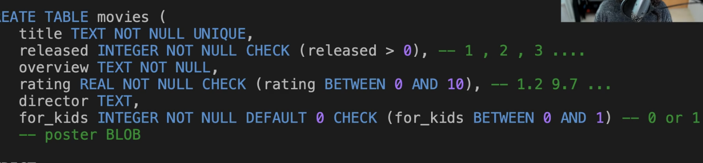
			-
		- 데이터베이스 마다 내장함수를 가지고있어. 내장 함수를 이용하여 문자열 데이터의 길이를 제한할 수 있겠지요.
	- STRICT가 정확히 어떤 역할을 하는지 .. ?
- 데이터베이스마다 타입은 조금 다르다.
-
	- Primary Key
		- 기본키는 각  행을 고유하게 식별하는 식별자야.
		- 기본키에는 두가지 2
			- 고유해야하고 고유성.
			- 변경 불가능해야 한다. 불변성
		- natural primary key
			- 테이블의 데이터와 논리적 관계를 갖는 기본키.
			- title 과 같은..
			- 테이블 데이터 행에서 파생되어 사용한다.
		- surrogate primary key
			- 대체 기본키, 인위적인 열, 이 열을 만든 이유는 고유 식별자를 추적하기 위함.
		- 자연 기본키를 불변하고 고유하게 유지하는 것은 어렵기 때문에 대체 기본키를 사용하는 것을 권장한다.
		- join과 relationship을 다룰 때 기본키가 항상 동일하게 유지되는 것이 얼마 나 중요한지 알게될 것.
		- 자연 기본키는 movie_Id와 같은 추가 column이 필요없다는 장점이 있다.
		- AUTOINCREMENT
			- SQLite에만 특화된 기능이라고 할 수 있다.
			- 항상 새롭고, 고유한 movie ID 를 기본키로 갈게 될 것을보장 받는다.
			- 300년 동안 초당 1,000개의 삽입을 수행해도 ID는 부족하지 않아..
- DML
- -- Two categoories: "update commands' and '' query command'
- data manipulation language(DML)에 대해 배운다.
  모든 언어 중 가장 중요한 언어이자, 많은 시간을 투자
  
  DML은 database에 있는 data를 실제로 사용하거나 수정한다!
  (편집, 삭제, 추출, 집계)
  data를 실제로 유용하게 만든다.
  
  DML은 두 가지 범주로 나뉜다.
  1. update 명령
  
  여러 종류의 update 명령이 있는데 data의 상태를 바꾼다.
  이미 그 중 하나인 insert into values 명령을 보았고
  DML update 명령에 속한다.
  
  2. query 명령
  
  query 명령은 하나다.
  select (가장 중요)
-
- DML
	- INSERT INTO VALUES
	- UPDATE
	- DELETE
	- update와 delete는 잠재적으로 매우 파괴적일 수 있다.
		- DELETE FROM movies;, 100만 줄의 정보를 파괴.
		- update와  delete의  범위를 좁히려면 어떻게 해야할까..
	-
	-
- AUTO INCREMENT sqlite_sequence
	- 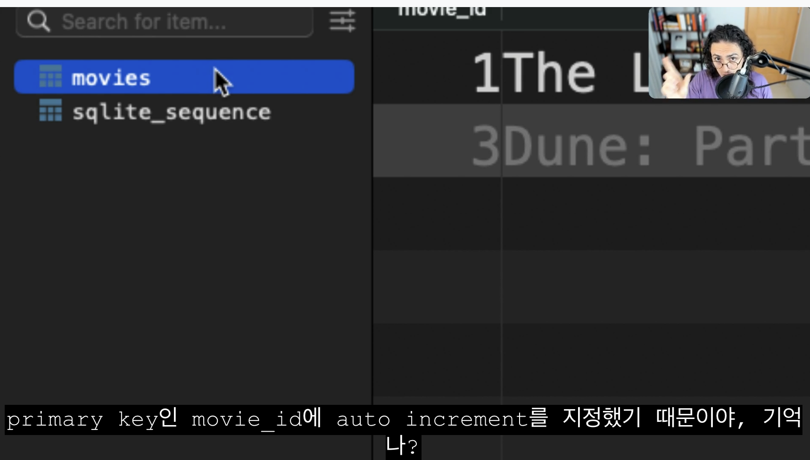
	- 이 작읍으로 인해서 sqlite는 얼마나 많은 ID가 생성되었느지 추적해야 한다.
-
- SELECT 명령을 table을 결과물로 제공하는 명령이라고 생각하자. 그것이 무엇이든.
	- 어디서 값이 오는지는 중요하지 않아, select는 row와 column이 있는 table을 반환할 것이다.
-
- SELECT
	- SELECT 1+1, 2+2, UPPER('hello');
	- SELECT * FROM movies;
		- FROM을 사용하여 source table을 지정한다.
		- 많은 사람들이 왼쪽에서 오른쪽으로 실행된다곡 생각하지만 실제로는 from이 먼저 실행된다. select 부분은 마지막에 호출되는 부분이다. 나중에 where group by, limit 추가하면. seleect 명령이 어떤 순서로 실행되는지 알 수 있을 것이다.
		- 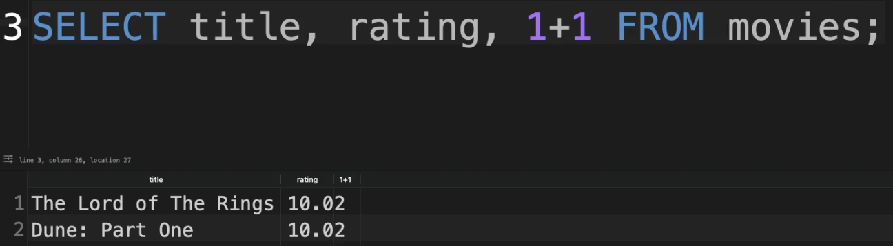
		- AS
			- 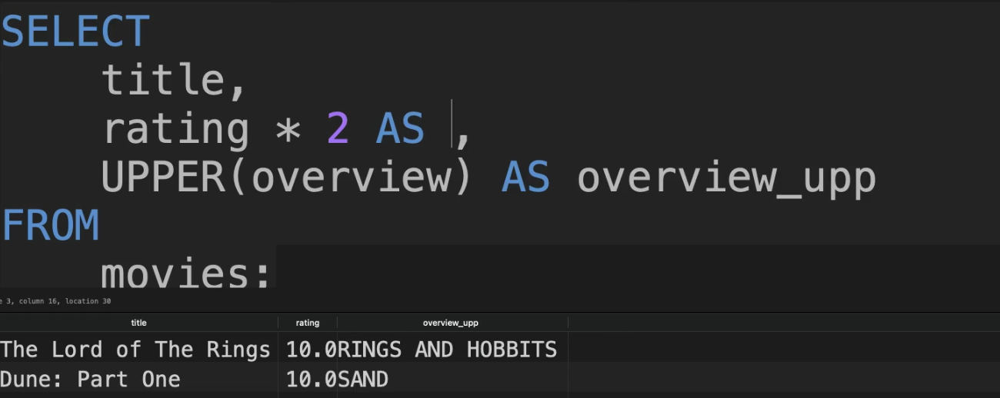
		- title의 모양을 바꾸고 싶을 때!, 언젠가 database를 편집할 수 없는 상황에 있을 수도 있기 때문에
			- 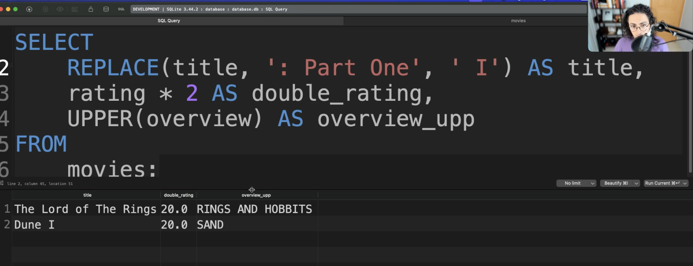
		- custom table을 만드는 것.. 결국에는 이 커다란 movies table database를 나만의 방식으로 보는것
	-
	- 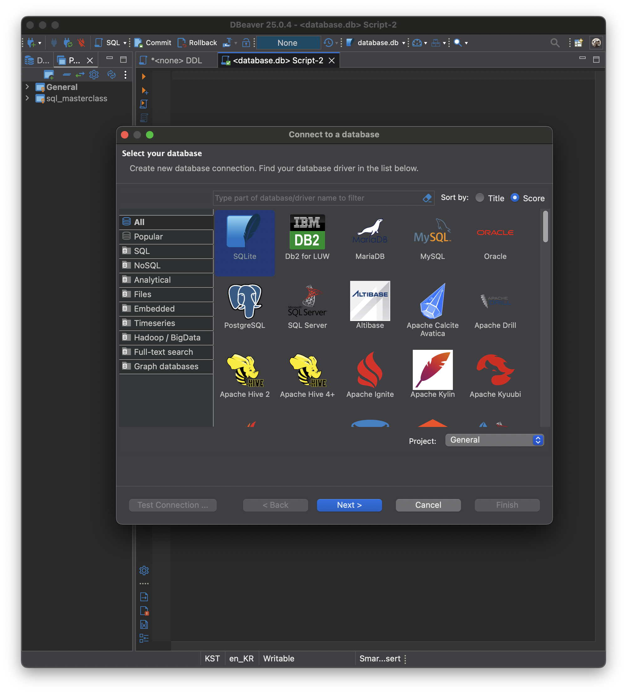
	- 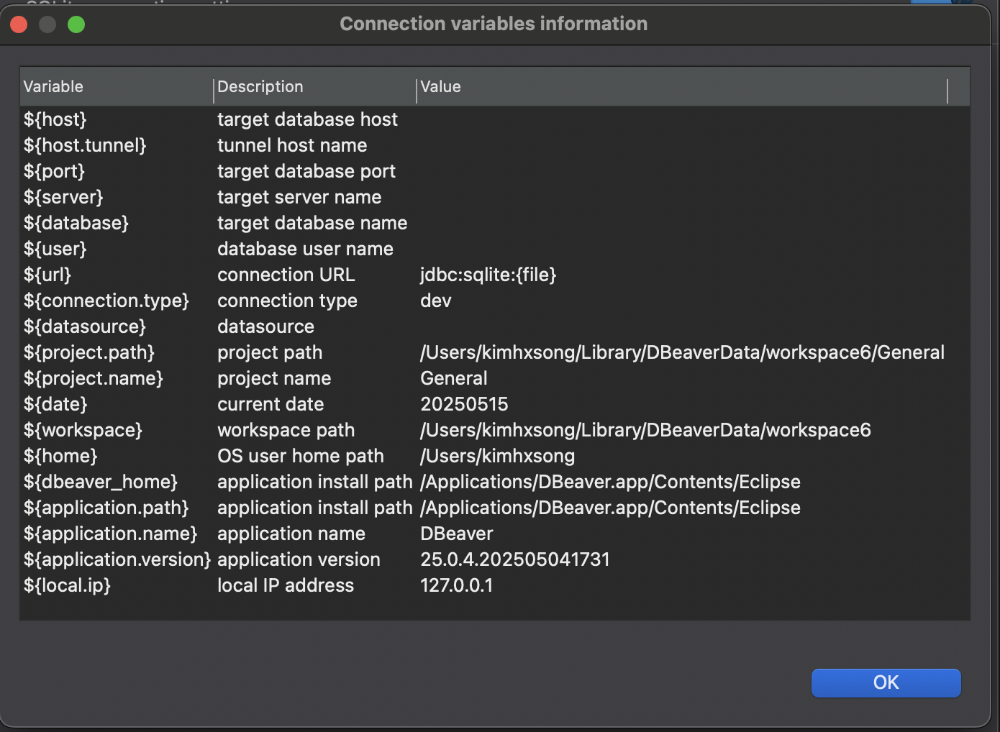
	- https://dbeaver.com/docs/dbeaver/Database-driver-SQLite/#general-sqlite-connection-settings
	-
	- [[DBeaver RDMS 프로젝트 구성요소]
	-
	- 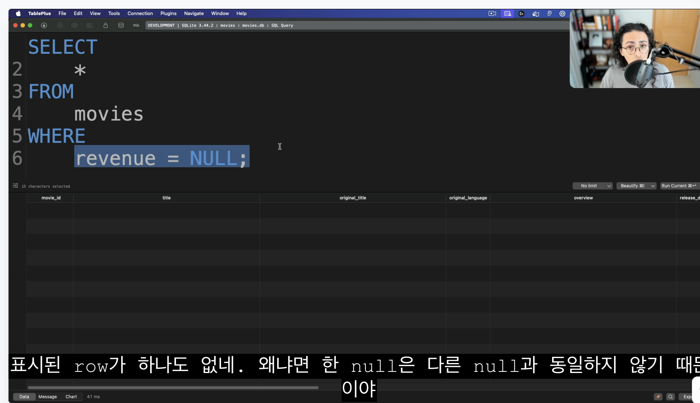
	-
	- 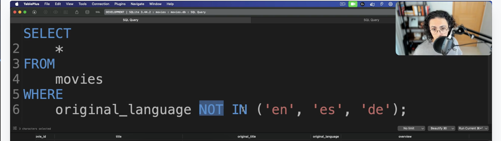
		- 패턴매칭
			- 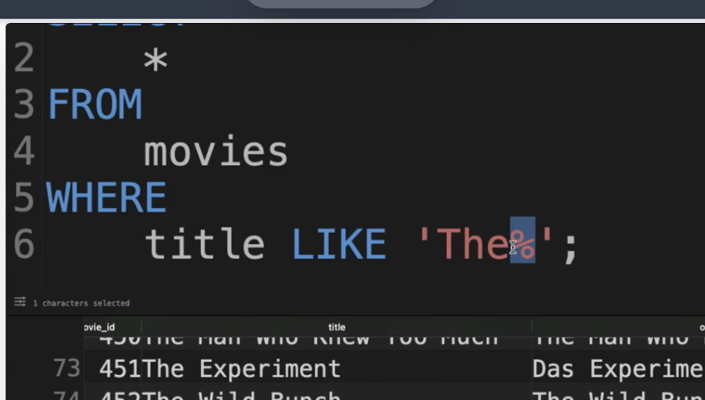
		-
- SQL grammar
	- https://forcedotcom.github.io/phoenix/
	-
-
- SELECT CASE
- 우리에게 필요한대로 특정 기준과 조건에 맞춘 컬럼을 만드는 방법을 배워볼거야
-
- LIKE 패턴 패칭
- 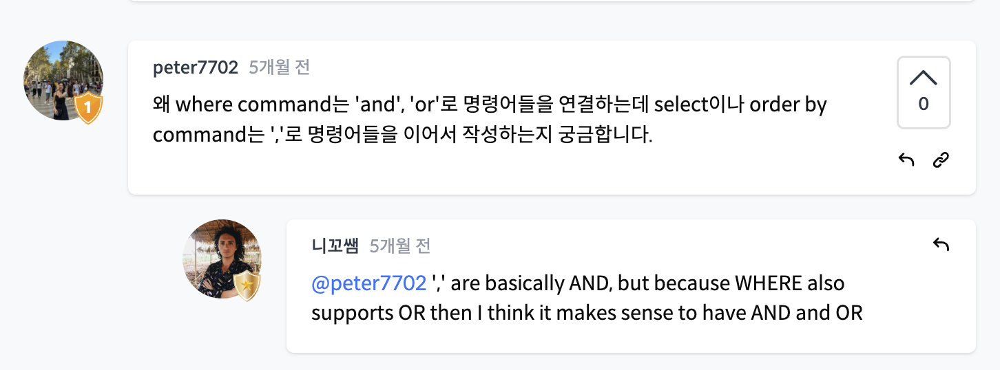
-
- ORDER BY Clause, 복수로 사용할 수도 있다. 디폴트 ASC.
- 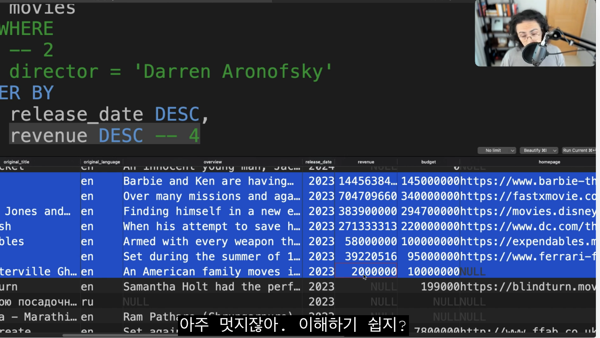
-
- LIMIT and OFFSET Clauses
	- 첫  NN 개만 조회하고 싶다면 ... LIMIT 기능을 활용할 수 있어.
	- OFFSET은 ROW들을 건너뛰어줄거야
	- 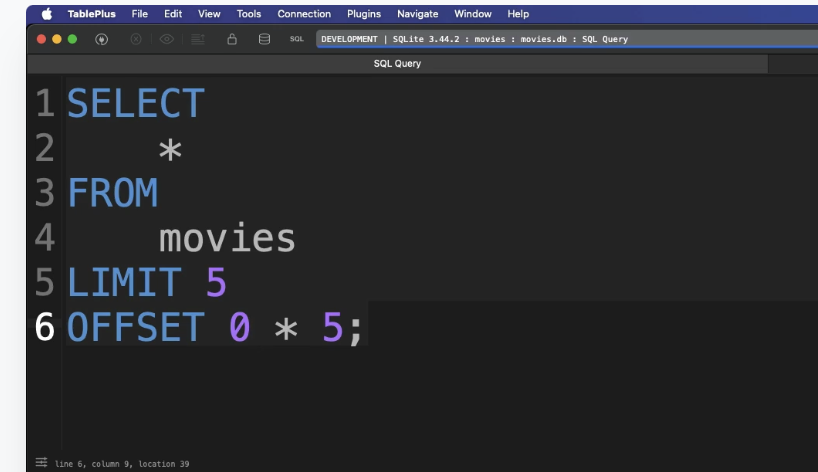
		- 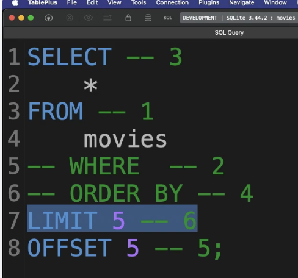
	-
	- NN개만 조회하는 거 필요하다..
- https://www.sqlite.org/lang.html
-
- GROUP BY..
	- 데이터에서 즉각적으로 분명히 나타나지는 않는 인사이트를 추출하게 해준다.
	- 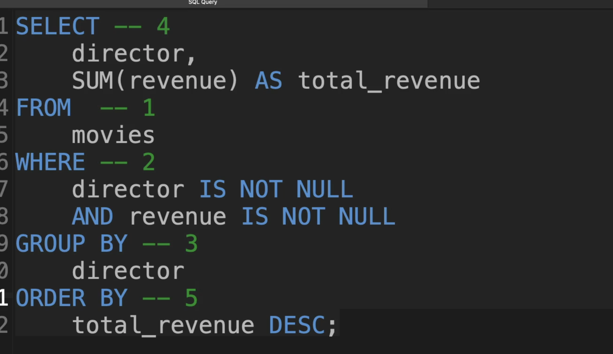{:height 441, :width 749}
-
- 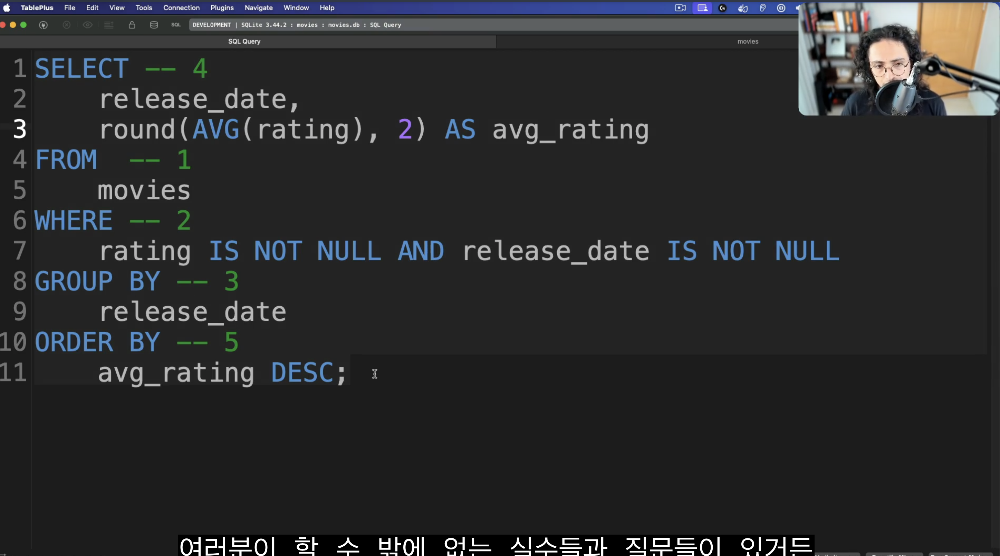
-
- 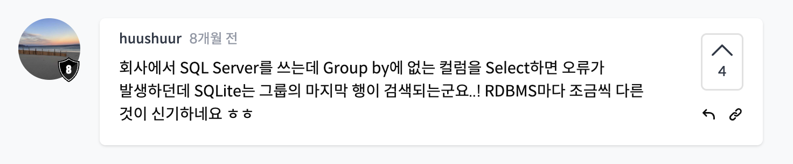
-