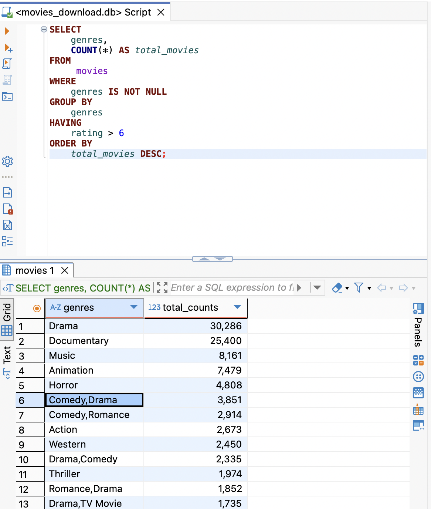

- > #DD-CN
	- #GPT MariaDB vs. MySQL
	  collapsed:: true
		- MariaDB와 MySQL은 둘 다 오픈 소스 관계형 데이터베이스 관리 시스템(RDBMS)이며, MySQL에서 파생된 포크(fork)입니다. 그러나 몇 가지 중요한 차이점이 있습니다.
		  
		  ---
		- ## **🔍 **
		- ## **기본 개요**
		  
		  | 
		  **특징**
		  | 
		  **MariaDB**
		  | 
		  **MySQL**
		  |
		  | ---- | ---- | ---- | ---- | ---- |
		  | 
		  **출시 연도**
		  | 
		  2009
		  | 
		  1995
		  |
		  | 
		  **창시자**
		  | 
		  Monty Widenius (MySQL 공동 창업자)
		  | 
		  Monty Widenius, David Axmark
		  |
		  | 
		  **라이선스**
		  | 
		  GPL v2 (100% 오픈 소스)
		  | 
		  GPL v2, (오라클 소유, 일부 상업 라이선스 제공)
		  |
		  | 
		  **기업 소유**
		  | 
		  MariaDB Foundation (독립 재단)
		  | 
		  Oracle Corporation
		  |
		  | 
		  **포크 시점**
		  | 
		  MySQL 5.5 버전 이후 독립적으로 개발
		  | 
		  현재 MySQL 8.x 버전까지 개발 중
		  |
		  
		  ---
		- ## **⚙️ **
		- ## **기능 차이**
		  
		  | 
		  **구분**
		  | 
		  **MariaDB**
		  | 
		  **MySQL**
		  |
		  | ---- | ---- | ---- | ---- | ---- |
		  | 
		  **스토리지 엔진**
		  | 
		  Aria, XtraDB(InnoDB 대체), MyRocks, ColumnStore 등
		  | 
		  기본 InnoDB, NDB Cluster, MyISAM 등
		  |
		  | 
		  **복제(Replication)**
		  | 
		  병렬 복제 지원 (멀티스레드 슬레이브), Galera Cluster 기본 포함
		  | 
		  MySQL 8.0부터 멀티스레드 슬레이브 지원
		  |
		  | 
		  **JSON 지원**
		  | 
		  제한적 지원 (Virtual Columns 사용)
		  | 
		  MySQL 5.7부터 JSON 타입 본격 지원
		  |
		  | 
		  **가상 열(Virtual Columns)**
		  | 
		  지원 (가상 생성 및 저장 생성 둘 다 지원)
		  | 
		  MySQL 5.7부터 지원
		  |
		  | 
		  **Windows 함수**
		  | 
		  MariaDB 10.2부터 지원
		  | 
		  MySQL 8.0부터 지원
		  |
		  | 
		  **CTE 및 Recursive Query**
		  | 
		  MariaDB 10.2부터 지원
		  | 
		  MySQL 8.0부터 지원
		  |
		  | 
		  **Temporal Data**
		  | 
		  완전한 Temporal Data 지원 (System Versioned Tables)
		  | 
		  MySQL 8.0에서 파트별 지원
		  |
		  | 
		  **Oracle PL/SQL 호환성**
		  | 
		  일부 지원
		  | 
		  미지원
		  |
		  | 
		  **압축 및 암호화**
		  | 
		  압축 테이블 및 TDE(Transparent Data Encryption) 지원
		  | 
		  MySQL Enterprise Edition에서만 완전 지원
		  |
		  
		  ---
		- ## **🚀 **
		- ## **성능 및 최적화**
		- **MariaDB**
			- 쓰기 성능이 상대적으로 우수하며, Galera Cluster를 통해 멀티 마스터 복제가 가능함.
			- Aria 엔진을 통해 복구 시간이 MyISAM보다 빠름.
			- ALTER TABLE 명령이 비차단(Non-Blocking)으로 실행됨.
		- **MySQL**
			- InnoDB 최적화가 잘 되어 있으며, 읽기 성능이 뛰어남.
			- 쿼리 최적화 및 병렬 처리에서 최신 버전에서 큰 개선이 이루어짐.
			- JSON 처리와 CTE(Common Table Expressions)에서 더 나은 성능을 보임.
			  
			  ---
		- ## **🔄 **
		- ## **호환성**
		- MySQL 5.5까지는 완전히 호환됨.
		- MySQL 5.7, 8.0으로 갈수록 SQL 구문 및 스토리지 엔진에서 차이가 커짐.
		- 일부 MySQL 전용 기능(e.g., NDB Cluster)은 MariaDB에서 지원되지 않음.
		  
		  ---
		- ## **🤔 **
		- ## **어떤 것을 선택해야 할까?**
		- **오픈 소스 준수 및 라이선스 문제** → MariaDB
		- **최신 JSON 및 윈도우 함수 활용** → MySQL
		- **멀티 마스터 복제 및 클러스터링** → MariaDB
		- **오라클과의 연동 및 상업 지원** → MySQL
		- **커뮤니티 지원 및 빠른 업데이트 주기** → MariaDB
		  
		  ---
		  
		  추가적인 분석이 필요하거나 특정 상황에 대한 최적의 선택이 궁금하신가요? 😊
	- TODO  #Django 장고 리뷰하기: 4장 8장, 12장
-
- #Cloud #Container
	- {{video https://youtu.be/g5GCsbjkzRM}}
-
- #SQL마스터클래스 RECAP 3.0-3.9, 4.0-4.13
  collapsed:: true
	- SQLite Data Types
		- `TEXT`
		- `INTEGER`
		- `REAL`
		- `BLOB`
		- `NULL`
			- NULL은 특별한 값으로, 데이터베이스에서는 NULL과 어떤 값을 직접 비교할 수 없습니다. = 연산자는 값 간의 비교에 사용되지만, NULL은 "알 수 없는 값"으로 간주되어 = 연산으로는 비교가 불가능합니다. WHERE director = NULL은 항상 FALSE로 평가됩니다. 따라서, NULL 값은 IS NULL 또는 IS NOT NULL 연산자를 사용하여 비교해야 합니다.
			  1. WHERE director IS NULL; (O)
			  2. WHERE director = NULL; (X)
	- Data Definition Language
		- `CREATE TABLE`
		- `DROP TABLE`
		- ```sql
		  DROP TABLE movies;
		  
		  CREATE TABLE movies (
		  	title TEXT,
		  	released INTEGER, -- 1 , 2 , 3 ...
		  	overview TEXT,
		  	rating REAL,  -- 1.2 9.7 ...
		  	director TEXT,
		  	for_kids INTEGER -- 0 or 1
		  	-- poster BLOB
		  )	STRICT;
		  
		  INSERT INTO movies
		  	(title, rating)
		  VALUES
		  	('The Lord of The Rings', -10),
		      ('Dune: Part One', -10),
		      (9.8, 9.9),
		      (NULL, NULL);
		  ```
	- STRICT: 열 타입과 일치하지 않은 데이터 입력 시도할 시 에러를 발생시킨다.
	- Constraints: 데이터베이스 테이블에 만드는 규칙으로써 데이터 유형을 지정한다.
	  collapsed:: true
		- `NOT NULL`
		- `DEFAULT`
		- `UNIQUE`
		- ```sql
		  CREATE TABLE movies (
		  title TEXT UNIQUE NOT NULL,
		  released INTEGER NOT NULL, -- 1,2,3 ...
		  overview TEXT NOT NULL,
		  rating REAL NOT NULL, -- 1.2, 9.7, ...
		  director TEXT,
		  for_kids INTEGER NOT NULL DEFAULT 0 -- 0 or 1
		  ) STRICT;
		  
		  INSERT INTO movies (title, rating, released, overview)
		  VALUES ('테스트중2', '8.5', 2, 'tes');
		  -- 다음과 같이 값을 추가하면 에러가 발생하는 줄 알았지만, 정상동작 했습니다.
		  -- 이유를 찾아보니 다음과 같습니다.
		  
		  --SQLite 공식 문서에 따르면, `STRICT` 모드에서도 다음은 허용됩니다:
		  
		  -- > "a string literal that can be losslessly converted into a REAL or INTEGER value"
		  -- > 즉, `"9.5"`처럼 **정확히 변환될 수 있는 문자열은 허용**될 수 있습니다
		  ```sql
	- CHECK Constraint: 레코드에 입력되는 값을 확인하는 조건을 추가한다.
	  조건이 false일 경우, 테이블에 데이터가 들어가지 않고, 조건이 true일 경우에만 정상적으로 테이블에 데이터가 들어갑니다.
		- ```sql
		  -- SALARY가 0보다 큰 값을 입력했을 경우에만 정상적으로 데이터가 들어감
		  CREATE TABLE COMPANY3(
		  	id INT PRIMARY KEY NOT NULL,
		  	name TEXT NOT NULL,
		  	age INT NOT NULL,
		  	address CHAR(50),
		  	salary REAL CHECK(salary > 0)
		  );
		  ```
	- Primary Key:
		- 기본 키는 데이터베이스 테이블의 각 행/레코드를 고유하게 식별하는 테이블의 필드입니다. 기본 키에는 고유한 값이 포함되어야 합니다. 기본 키 열은 NULL 값을 가질 수 없습니다. 여러 필드가 기본 키로 사용되는 경우 이를 복합 키라고 합니다.
		- 특징
			- 불변성 (해당 값이 변경되지 않아야 함)
			- 고유함 (해당 값은 유일해야 하며, 동일한 값이 가진 것이 존재하지 않아야 함)
		- 유형
			- natural : 테이블에서 자연적으로 파생됨, 테이블의 데이터와 논리적인 관계에 있음
			- surrogate : 고의적으로 만든 키, 오직 행의 추적에 의의를 둠
				- AUTOINCREMENT:
			- ```sql
			    movie_id INTEGER PRIMARY KEY AUTOINCREMENT -- surrogate key
			    title TEXT PRIMARY KEY UNIQUE NOT NULL -- natural key
			  ```
		- QnA: PRIMARY KEY와 UNIQUE의 차이점은 뭔가요?? UNIQUE도 PRIMARY KEY처럼 고유해야하지만 변경이 가능하다는 정도의 차이일까요?
			- ==@sungok1025== PRIMARY KEY와 UNIQUE는 둘 다 데이터베이스에서 고유성을 보장하는 제약 조건이지만, 몇 가지 중요한 차이점이 있습니다:
			  
			  1. NULL 허용 여부:
				- PRIMARY KEY: NULL 값을 허용하지 않습니다.
				- UNIQUE: NULL 값을 허용할 수 있습니다 (대부분의 데이터베이스에서).
			- 2. 테이블당 개수:
				- PRIMARY KEY: 테이블당 하나만 가질 수 있습니다.
				- UNIQUE: 테이블에 여러 개의 UNIQUE 제약 조건을 가질 수 있습니다.
			- 3. 인덱스 생성:
				- PRIMARY KEY: 자동으로 클러스터드 인덱스를 생성합니다 (대부분의 DBMS에서).
				- UNIQUE: 논-클러스터드 인덱스를 생성합니다.
			- 4. 레코드 식별:
				- PRIMARY KEY: 테이블의 각 레코드를 고유하게 식별하는 데 사용됩니다.
				- UNIQUE: 특정 열의 값이 고유함을 보장하지만, 반드시 레코드 식별용은 아닙니다.
			- 5. 외래 키 참조:
				- PRIMARY KEY: 다른 테이블의 외래 키가 참조할 수 있습니다.
				- UNIQUE: 외래 키의 참조 대상이 될 수 있지만, PRIMARY KEY만큼 일반적이지 않습니다.
			- 6. 변경 가능성:
				- PRIMARY KEY: 일반적으로 변경을 권장하지 않습니다 (변경 시 다른 테이블의 참조 무결성에 영향을 줄 수 있음).
				- UNIQUE: PRIMARY KEY에 비해 상대적으로 변경이 용이할 수 있지만, 여전히 주의가 필요합니다.
			- 결론적으로, UNIQUE가 PRIMARY KEY보다 변경이 더 쉽다고 볼 수는 있지만, 이는 주요 차이점 중 하나일 뿐입니다. 두 제약 조건의 역할과 특성에는 더 많은 차이가 있습니다.
	- Data Manipulation Language
		- 범주
			- update 명령: INSERT INTO VALUES, UPDATE, DELETE
			- query 명령: SELECT
		- `INSERT INTO VALUES`
			- 값을 지정하지 않은 열은 디폴트 값으로 채워지거나 디폴트가 지정되지 않은 경우 NULL 로 채워진다.
		- `UPDATE`
			- SQLite UPDATE 쿼리는 테이블의 기존 레코드를 수정하는 데 사용됩니다.
			  UPDATE 쿼리와 함께 WHERE 절을 사용하여 선택한 행을 업데이트할 수 있습니다.
			  그렇지 않으면 모든 행이 업데이트됩니다.
			  ex: UPDATE movies SET rating = rating + 1 WHERE title = 'Dune';
			  https://www.sqlite.org/lang_update.html
		- `DELETE`
			- SQLite DELETE 쿼리는 테이블에서 기존 레코드를 삭제하는 데 사용됩니다.
			  DELETE 쿼리와 함께 WHERE 절을 사용하여 선택한 행을 삭제할 수 있습니다.
			  그렇지 않으면 모든 레코드가 삭제됩니다.
			  ex: DELETE FROM movies WHERE movie_id = 2;
			  https://www.sqlite.org/lang_delete.html
		- `SELECT`
			- ```sql
			  SELECT 
			      release_date,                         
			      ROUND(AVG(rating), 2) AS avg_rating    -- 5️⃣ SELECT
			  FROM
			      movies                                 -- 1️⃣ FROM
			  WHERE
			      rating IS NOT NULL 
			      AND release_date IS NOT NULL           -- 2️⃣ WHERE
			  GROUP BY
			      release_date                           -- 3️⃣ GROUP BY
			  HAVING 
			      avg_rating > 6                         -- 4️⃣ HAVING
			  ORDER BY
			      avg_rating DESC                        -- 6️⃣ ORDER BY
			  LIMIT 10 OFFSET 5;                         -- 7️⃣ LIMIT & OFFSET
			  ```
			- 📌 실행 순서대로 보면 다음과 같습니다:
				- 1. FROM: movies **테이블에서 데이터를 가져옵**니다.
				- 2. WHERE: rating과 release_date가 NULL이 아닌 행만 **필터링**합니다.
				- 3. GROUP BY: release_date별로 데이터를 **그룹화**합니다.
				- 4. HAVING: 그룹화된 데이터 중 평균 평점(avg_rating)이 6을 초과하는 것만 **필터링**합니다.
				- 5.	SELECT: 필요한 컬럼(release_date, avg_rating)을 선택하고 **집계 함수**(AVG)를 계산합니다.
				- 6.	ORDER BY: avg_rating을 기준으로 내림차순 정렬합니다.
				- 7.	LIMIT & OFFSET: 5개를 건너뛰고, 최대 10개의 결과만 반환합니다.
- #SQL마스터클래스 5. Subqueries and CTEs
  collapsed:: true
	- 4.14 Super Practice Part One
	  collapsed:: true
		- 집계함수 https://www.sqlite.org/lang_aggfunc.html
		- What is the average of each director*?
		  logseq.order-list-type:: number
			- ```sql
			  SELECT
			      director,
			      AVG(rating) -- AS avg_rating
			  FROM
			      movies
			  WHERE
			      rating IS NOT NULL
			      AND director IS NOT NULL
			  GROUP BY
			      director;
			  -- ORDER BY avg_rating DESC;
			  ```
		- 5편 이상의 영화를 가진 각 감독의 평균 평점
		  logseq.order-list-type:: number
			- 5편 이상의 영화를 가졌다. 이미 그룹화된 상태에서 평가가 이뤄져야 할거야.
			- ```sql
			  SELECT
			      director,
			      AVG(rating) AS avg_rating
			  FROM
			      movies
			  WHERE
			      rating IS NOT NULL
			      AND director IS NOT NULL
			  GROUP BY
			      director
			  HAVING
			      COUNT(rating) >= 5
			  ORDER BY
			      avg_rating DESC;
			  ```
			- ```sql
			  SELECT
			      director,
			      ROUND(AVG(rating), 3) AS avg_rating
			  FROM
			      movies
			  WHERE
			      rating IS NOT NULL
			      AND director IS NOT NULL
			  GROUP BY
			      director
			  HAVING
			      COUNT(*) >= 5
			  ORDER BY
			      avg_rating DESC
			  
			  ```
		- 각 장르에 몇 편의 영화가 있나요,
		  logseq.order-list-type:: number
			- 데이터 중복 문제는 다음 섹션에서 해결하도록 함.
			- 
		- 6점 이상 가장 흔한
		  logseq.order-list-type:: number
			- ```sql
			  SELECT
			      rating,
			      COUNT(*) AS total_ratings
			  FROM
			       movies
			  WHERE
			      rating > 6
			  GROUP BY
			      rating
			  ORDER BY
			      total_ratings DESC;
			  ```
	- 4.15 Super Practice 2, 3
	  collapsed:: true
		- ```sql
		  -- 6. 틀!!!!!
		  
		  SELECT
		      director,
		     	sum(revenue) - sum(budget) AS profit
		  --    (revenue - budget) AS profit
		  FROM
		       movies
		  WHERE
		      director IS NOT NULL
		      AND revenue IS NOT NULL
		      AND budget IS NOT NULL
		  GROUP BY 
		      director
		  ORDER BY
		      profit DESC;
		  
		  -- 9.
		  SELECT
		  --    FLOOR(release_date * 0.1) * 10 AS release_decade,
		      (release_date / 10) * 10 AS release_decade, -- SELECT 문에 있는 요소로 GROUP BY 가능.
		      ROUND(AVG(runtime), 2) AS avg_runtime
		  FROM
		       movies
		  WHERE
		      release_date IS NOT NULL
		      AND runtime IS NOT NULL
		  GROUP BY
		      release_decade;
		  ```
	- 4.16 Super Practice 3
	  collapsed:: true
		- ```sql
		  -- 1.
		  SELECT
		      release_date,
		      MAX(rating) - MIN(rating) AS diff
		  FROM
		       movies
		  WHERE
		      release_date IS NOT NULL
		      AND rating IS NOT NULL
		  --    AND rating BETWEEN 2 AND 9.5
		  GROUP BY
		      release_date
		  ORDER BY 
		      diff DESC
		  LIMIT 5;
		  
		  -- 2.
		  SELECT 
		      director,
		      COUNT(*) AS total_movies
		  FROM 
		      movies
		  WHERE 
		      director IS NOT NULL
		      AND runtime IS NOT NULL
		  GROUP BY
		      director
		  HAVING
		  	MIN(runtime) >= 120 -- 조건을 통과한 감독만 남는다.
		  --    NOT runtime > 120 틀!!!!
		  	
		  ORDER BY
		      total_movies DESC;
		      
		  -- 3.
		  SELECT 
		      ROUND((SUM(CASE WHEN rating > 8.0 THEN 1 END) * 100.0) / COUNT(*), 2) AS percentage_above_8
		      -- ELSE NULL 을 추가하지 않아도 NULL 을 반환.
		  FROM 
		      movies
		  WHERE 
		      rating IS NOT NULL;
		  
		  -- 4. COUNT, SUM 둘 다 쓸수있지만 여기서는 COUNT가 더 적절한 것 같음.
		  SELECT
		      director,
		      --SUM(CASE WHEN rating > 7.0 THEN 1 ELSE 0 END) * 100 / COUNT(*) AS ratio
		      COUNT(CASE WHEN rating > 7.0 THEN 1.0 END) * 100 / COUNT(*) AS '%'
		  FROM 
		      movies
		  WHERE
		      director IS NOT NULL
		      AND rating IS NOT NULL
		  GROUP BY 
		      director;
		      
		  -- 5. 
		  SELECT
		      CASE WHEN runtime < 90 THEN 
		          'Short'
		      -- WHEN runtime >= 90 AND runtime <= 120 THEN
		      WHEN runtime BETWEEN 90 AND 120 THEN
		          'Medium'
		      WHEN runtime > 120 THEN
		          'Long'
		      END AS runtime_category,
		      COUNT(*) AS total_movies
		  FROM
		      movies
		  WHERE
		      runtime IS NOT NULL
		  GROUP BY
		      runtime_category;
		  ORDER BY total_movies DESC;
		  
		  -- 6. flop 수익보다 비용이 더 많이 나가는 영화
		  SELECT
		  --    CASE WHEN (revenue - budget) < 0 THEN 
		      CASE WHEN revenue < budget THEN 
		          'Flop'
		      ELSE
		          'Success'
		  --    END AS 'is_flop',
		      END AS flop_or_not,
		      COUNT(*) AS total_movies
		  FROM
		      movies
		  WHERE
		      budget IS NOT NULL
		      AND revenue IS NOT NULL
		  GROUP BY
		      flop_or_not 
		  ```
	- 4.17 Views (DDL)
	  collapsed:: true
		- View는 쿼리의 단축어 같은 기능
		- 쿼리를 기억하기 쉬운 이름으로 패키징해서 계속 사용할 수 있도록 해준다.
		- 가끔 자주 사용하게 될 쿼리가 생기기 때문에...
		- view를 사용해서 쿼리를 패키징 할 수 있다.
		- ```sql
		  CREATE VIEW v_flop_or_not AS SELECT
		  --    CASE WHEN (revenue - budget) < 0 THEN 
		      CASE WHEN revenue < budget THEN 
		          'Flop'
		      ELSE
		          'Success'
		  --    END AS 'is_flop',
		      END AS flop_or_not,
		      COUNT(*) AS total_movies
		  FROM
		      movies
		  WHERE
		      budget IS NOT NULL
		      AND revenue IS NOT NULL
		  GROUP BY
		      flop_or_not 
		  ```
		- 성공했다면 결과로서 쿼리가 실행되지 않고 'OK'가 콘솔에 출력될거야.
		- ```sql
		  SELECT * FROM v_flop_or_not;
		  DROP VIEW v_flop_or_not;
		  ```
		- view를 테이블 처럼 사용하고 있는 거임..!  작성한 SQL 명령어들이 View에 저장되는 것임.
		- view를 조회할 때 마다 view에 있는 코드가 실제로 실행되는 것임.
	- 5.1 Independent Subqueries
	  collapsed:: true
		- **Subquery**
			- subquery는 다른 명령문에 중첩된 SELECT 명령문. (다른 쿼리의 내부에 있는 쿼리)
			- subquery를 묶으려면 괄호 () 쌍을 사용.
		- **Independent Subqueries**
			- 현재 실행 중인 행에 따라 값이 바뀌지 않는 독립적인 Subquery
			- > 위의 코드에서 중첩되어 들어가는 쿼리를 SUB Query 라고 함. 다만 해당 쿼리가 모든 row의 revenue가 1000 이상인가를 계산할 때마다 반복적으로 수행되면 데이터베이스의 퍼포먼스가 떨어질 수도 있다는 생각을 할 수 있는데, 디비 자체의 쿼리 플래너가 이를 최적화하여 상수로 처리하기 때문에 걱정할 필요는 없다.
		- > -- List movies with a (rating|revenue) higher than the average (rating|revenue) of all movies  .
			- ```sql
			  SELECT AVG(rating) FROM movies;
			  SELECT COUNT(*) FROM movies WHERE rating > 5.734669125807575;
			  ```
			- ```sql
			  SELECT
			  	COUNT(*)
			  FROM
			  	movies
			  WHERE
			  	revenue > 1000
			  	AND rating > (SELECT
			  						AVG(rating)
			                  	FROM
			                  		movies);
			  ```
				- where절은 모든 열에 대해 해당 조건을 체크한다.
				- 현재 체크하고 있는 열이 무엇인지에 따라 이 서브쿼리의 결괏값이 변하지 않는다.
				- 데이터베이스가 알아서 이 쿼리를 딱 한번 실행시키고 값을 얻게될거임.
				- 영화의 평균 평점은 어떤 열에서 실행하더라도 변하지 않아. 이게 바로 independent subquery라고 불리는 이유임.
		- > -- List movies with a rating higher than the average rating of movies in their genre.
	- 5.2 CTEs
	  collapsed:: true
		- CTE는 똑같은 명령을 실행하ㅡㄴ 공통의 쿼리를 재사용하기 위해 만들어진 것
		- CTE(Common Table Expressions, 공통 테이블 표현식)를 사용하면 Independent Subqueries를 재사용할 수 있게 된다.
		- 왜 재사용하고 싶은걸까?
			- 이 결과값으로 데이터를 필터링하고 싶을뿐만 아니라 데이터에서 이 값을 시각화하고 싶기 때문이다.
			- ```sql
			  -- WITHOUT CTE.
			  SELECT 
			      title,
			      director,
			      revenue,
			      (
			          SELECT
			              AVG(revenue)
			          FROM 
			              movies) avg_revenue
			  FROM
			      movies
			  WHERE
			      revenue > (
			          SELECT
			              AVG(revenue)
			          FROM
			              movies movies);
			  
			  -- USING CTE.
			  WITH avg_revenue_cte AS (
			      SELECT
			          AVG(revenue) AS avg_revenue
			      FROM
			          movies
			  )
			  -- ), avg_rating_cte AS ( ... )
			  SELECT
			      title,
			      director,
			      revenue,
			      ROUND((SELECT * FROM avg_revenue_cte), 0) AS avg_revenue
			  --    ROUND((SELECT avg_revenue FROM avg_revenue_cte), 0) AS avg_revenue
			  FROM
			      movies
			  WHERE
			      revenue > (SELECT * FROM avg_revenue_cte);
			  
			  --    revenue > (SELECT avg_revenue FROM avg_revenue_cte);
			  -- Find the directors with a career revenue higher than the average revenue of all directors.
			  -- Find the movies with a rating higher than the average rating of movies released in the same year.
			  -- Make a super slow query and optimize it as much as we can with what we know so far.
			  ```
		- 일종의 view 같은 미니 테이블을 만드는 것과 같다고 볼 수 있다. 하지만 영구적이진 않다. 쿼리의 context에서만 생성되고 버려지기 때문.
		- CTE 내부에 서브쿼리를 작성해서 재사용할 수 있다는 것을 배웠다.
		- CTE는 select문 이전에 정의 되어야 한다.
		-
	- 5.3 Correlated Subqueries
		- 메인 쿼리가 어떤 열에서 실행중인지에 따라 결과값이 달라진다.
		- ```sql
		  -- 하드코딩된 independen subquery
		  SELECT 
		      title,
		      director,
		      rating
		  FROM
		      movies
		  WHERE
		      rating > (
		          SELECT
		              AVG(rating) 
		          FROM
		              movies
		          WHERE
		              release_date = 2023);
		  
		  -- uncorrelated subquery 로 바꾼것.
		  ---- subqeury각 외부(outer) 쿼리를 참조하도록 변경함
		  ---- 255,000 * 255,000
		  SELECT 
		      m1.title,
		      m1.director,
		      m1.rating
		  FROM
		      movies AS m1 -- main_movies
		  WHERE
		  	AND m1.title IS NOT NULL
		      AND m1.director IS NOT NULL
		      AND m1.rating IS NOT NULL
		      AND m1.rating > (
		          SELECT
		              AVG(m2.rating) 
		          FROM
		              movies AS m2 -- inner_movies
		          WHERE
		              m2.release_date = m1.release_date); 
		    			-- 각각의 레코드를 순차적으로 처리하면서 계속해서 값이 대입될 것임.
		              
		              
		  ---- 51*255,000
		  SELECT 
		      m1.title,
		      m1.director,
		      m1.rating
		  FROM
		      movies AS m1 -- main_movies
		  WHERE
		  	release_date > 2022
		  	AND m1.title IS NOT NULL
		      AND m1.director IS NOT NULL
		      AND m1.rating IS NOT NULL
		      AND m1.rating > (
		          SELECT
		              AVG(m2.rating) 
		          FROM
		              movies AS m2 -- inner_movies
		          WHERE
		              m2.release_date = m1.release_date);
		  
		  ----
		  SELECT 
		      m1.title,
		      m1.director,
		      m1.rating,
		      m1.release_date,
		      (
		      SELECT
		          AVG(m2.rating) 
		      FROM
		          movies AS m2 -- inner_movies
		      WHERE 
		          m2.release_date = m1.release_date
		      ) AS year_average
		  FROM
		      movies AS m1 -- main_movies
		  WHERE
		      release_date > 2022
		      AND m1.title IS NOT NULL
		      AND m1.director IS NOT NULL
		      AND m1.rating IS NOT NULL
		      AND m1.rating > (
		          SELECT
		              AVG(m2.rating) 
		          FROM
		              movies AS m2 -- inner_movies
		          WHERE
		              m2.release_date = m1.release_date); 
		  ```
		- 쿼리의 위치는 그다지 신경쓰지 않아도 괜찮다. 쿼리 옵티마이저가 더 실행 비용이 저렴한 서브쿼리 먼저 실행할 것이기 때문이다.
	- 5.4 Correlated CTEs
		- 괄호 내부의 쿼리가 괄호 외부의 열의 값을 참조하면, 그게 바로 correleated subquery
		- correleated subquery를 만들기 위해서는 메인 쿼리와 서브쿼리에서 쓰고 있는 테이블 하나 도는 전부에 별칭(alias)를 붙여줘야 한다.
		- 이너 별칭을 지정하지 않아도 참조가 가능하긴 하지만 가독성을 위해서 둘다 넣는 것을 선호합니다만..
		- 아래 내용을 MySQL에서 실행하려고 하면 힘들다. MySQL은 CTE 하위에 있는걸 참조하지 못함. CTE 정의 이전에 있는 것들만 참조할 수 있다.
		- MySQL, PostgreSQL 동작하지 않지만 sqlite에서는 동작한다.
		- ```sql
		  WITH movie_avg_per_cte AS (
		      SELECT
		          AVG(m2.rating) 
		      FROM
		          movies AS m2 -- inner_movies
		      WHERE 
		          m2.release_date = m1.release_date
		  )
		  SELECT 
		      m1.title,
		      m1.director,
		      m1.rating,
		      m1.release_date,
		      (SELECT * FROM movie_avg_per_cte) AS year_average
		  FROM
		      movies AS m1 -- main_movies
		  WHERE
		      release_date > 2022 -- 서브쿼리가 실행할 행의 개수를 줄여주기 위함
		      AND m1.title IS NOT NULL
		      AND m1.director IS NOT NULL
		      AND m1.rating IS NOT NULL
		      AND m1.rating > (
		          SELECT * FROM movie_avg_per_cte);
		  ```
	- 5.5
		- ```sql
		  -- 1. List movies with a rating higher than the average rating of movies
		  -- 		the average rating of movies in their genre
		  
		  WITH genres_avg_rating_cte AS (
		      SELECT
		  --        genres,
		  --        ROUND(AVG(m2.rating), 2) AS avg_rating
		          ROUND(AVG(m2.rating), 2)
		      FROM
		          movies m2
		      WHERE
		          genres IS NOT NULL 
		          AND rating IS NOT NULL 
		          AND m2.genres = m1.genres
		      GROUP BY
		          m2.genres
		  )
		  SELECT
		      m1.title,
		      m1.rating
		  FROM 
		      movies m1
		  WHERE
		      m1.rating IS NOT NULL
		  --    m1.rating > (SELECT avg_rating FROM genres_avg_rating_cte);
		      AND m1.rating > (SELECT * FROM genres_avg_rating_cte);
		  
		  -- ???. ORDER BY 넣어서 다시 돌리면 엄청 느려짐 왜? 그렇게 오래 걸릴 일인가?
		  
		  -- 2. Find the directors with a career revenue  higher than the average revenue of all directors
		  
		  --- 처음
		  WITH directors_total_revenue_cte AS (
		      SELECT
		          director,
		          SUM(revenue) AS total_revenue
		      FROM 
		          movies
		      WHERE
		          director IS NOT NULL
		          AND revenue IS NOT NULL
		      GROUP BY
		          director
		  ), directors_avg_career_revenue_cte AS (
		      SELECT
		          ROUND(AVG(total_revenue), 2)
		      FROM
		          (SELECT
		              total_revenue
		          FROM
		              directors_total_revenue_cte)
		  )       
		  SELECT
		      director,
		      total_revenue
		  FROM (SELECT
		              *
		          FROM
		              directors_total_revenue_cte)
		  WHERE total_revenue > (SELECT
		                              *
		                          FROM
		                              directors_avg_career_revenue_cte);
		  ---- 리팩토링
		  WITH directors_total_revenue_cte AS (
		      SELECT
		          director,
		          SUM(revenue) AS total_revenue
		      FROM 
		          movies
		      WHERE
		          director IS NOT NULL
		          AND revenue IS NOT NULL
		      GROUP BY
		          director
		  )
		  SELECT
		      director,
		      total_revenue
		  FROM
		      directors_total_revenue_cte
		  WHERE
		      total_revenue > (
		          SELECT
		              AVG(total_revenue)
		          FROM
		              directors_total_revenue_cte
		      );
		      
		  ---- 니코
		  WITH directors_revenues AS (
		      SELECT
		          director,
		          SUM(revenue) AS career_revenue
		      FROM 
		          movies
		      WHERE
		          director IS NOT NULL
		          AND revenue IS NOT NULL
		      GROUP BY
		          director
		  )
		  SELECT
		      director,
		      SUM(revenue) AS total_revenue
		  FROM
		      movies
		  WHERE
		      director IS NOT NULL
		      AND revenue IS NOT NULL
		  GROUP BY director
		  HAVING total_revenue > (SELECT AVG(career_revenue) FROM directors_revenues);
		  ```
	- 5.6 Final Practice
		- ```sql
		  -- best_rated_movie
		  -- worst_rated_movie
		  -- most_expensive_movie
		  -- least_expensive_movie
		  WITH director_stats AS (
		      SELECT
		          director,
		          count(*) AS total_movies,
		          avg(rating) AS avg_rating,
		          max(rating) AS best_rating,
		          min(rating) AS worst_rating,
		          max(budget) AS highest_budget,
		          min(budget) AS lowest_budget
		      FROM
		          movies
		      WHERE
		          director IS NOT NULL
		          AND budget IS NOT NULL
		          AND rating IS NOT NULL
		      GROUP BY
		          director
		      HAVING total_movies > 2
		  )
		  SELECT
		      (
		          SELECT
		              title
		          FROM 
		              movies
		          WHERE
		              rating IS NOT NULL AND budget IS NOT NULL
		              AND director = ds.director
		          ORDER BY
		              rating DESC 
		          LIMIT 1
		      ) AS best_rated_movies
		  FROM
		      director_stats AS ds; -- 7.734s, AFTER INDEXING 0.015s
		      
		  CREATE INDEX  idx_director ON movies (director);
		  -- DROP INDEX idx_director
		  ```
- #SQL마스터클래스 6. INDEXES
- #SQL마스터클래스 7. MySQL
-