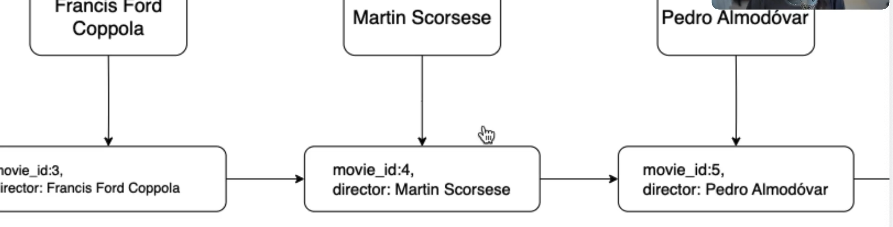

- #SQL마스터클래스 6. INDEXES
	- 6.1 Table Scans
		- Table Scan
			- 테이블 스캔은 데이터베이스가 무언가를 찾기 위해서 테이블의 모든 행을 하나씩 찾아보는 것을 말한다. (테이블 전체를 처음부터 끝까지 스캔해야 하는 것)
		- query planner
			- query planner는 SQL 문을 실행하기 위한 가장 좋은 알고리즘이나 "쿼리 계획"을 찾아내는 것. https://www.sqlite.org/queryplanner-ng.html
			- ```sql
			  -- sqlite
			  explain query plan ...
			  
			  ```
			- Without Indexing
				- 
			- Using Indexing
				- 
				- 인덱스를 추가하는 것으로 불필요한 테이블 스캔을 제거할 수 있다.
		- query plan
			- query plan은 SQL 문을 DB에서 어떻게 처리할 지에 대한 것으로 어떤 방식과 순서로 실행되는 것이 가장 효율적인 지를 결정하는 실행 계획.
			- SQL이 선언형이기 때문에 주어진 쿼리를 실행하기 위해 수많은 방법이 존재하는 것이 일반적이며 이에 따라 다양한 성능 차이를 보인다.
	- 6.2 Create Index
		- idx_ 로 시작하는 것을 선호(니코쌤)
		- 쿼리의 종류에 따라 인덱스가 성능을 해칠 수 있다.
		- 인덱스가 어느 열에서나 항상 좋다면 인덱스를 생성할 이유가 없다. 그냥 기본적으로 데이터베이스에 포함돼서 나오는 게 맞는거지!
		- 인덱스에는 대가가 따른다.
	- 6.4 B+Trees
		- ```sql
		  SELECT
		  	*
		  FROM
		  	movies
		  WHERE
		  	director = 'Guy Ritchie';
		  
		  CREATE INDEX idx_director ON movies (director);
		  
		  DROP INDEX idx_director;
		  ```
		- 인덱스는 왜 빠를까? 이것을 이해하기 위해 책에 있는 목차와 비슷하다는 것은 잊어주라.
		- 인덱스를 생성할 때 만들어지는 자료구조 B+Tree
			- 
			- Root node, Internal node, Leaf node
			- 찾고 있는 노드와 같거나 크다면 오른쪽으로 이동, 작다면 왼쪽으로 이동
			- 
			- 감독 열에 대하여 인덱스를 생성했다면, 감독 열의 값이 leaf node에 저장될 것이고 또한, 영화의 **id(Primary Key)도 같이 저장됨**
			- 왜 같이 저장되느냐? DB가 B+Tree에서 movies 테이블로 점프해서 movies 테이블의 정보를 불러와야 하기 때문에.
			- 인덱스를 생성했기 때문에 감독이 'Guy Ritchie'인 영화를 빠르게 찾을 것임, 그리고 해당 영화의 제목을 알아야 할텐데, 영화 제목은 B+Tree에 없음. 인덱스를 감독열에 대해서만 만들었으니까!!!
			- 인덱스를 이용하여 모든 영화를 찾고 나면 여러 개의 leaf node를 찾을 것임. 그 leaf node들은 각자 자신만의 movie_id를 가지고 있고, 그러면 데이터 베이스는 B+Tree에서 영화 테이블로 와서 제목 혹은 우리가 요청한 다른 정보를 줄 것임
	- 6.5 Leaf Nodes
		- 인덱스를 사용하는 검색이 테이블 스캔보다 빠르다는 것을 배웠다. 그런데 어떻게 그렇게 빠르게 정보를 불러올 수 있는거며, 왜 테이블 스캔이 필요없는가? B+Tree에서 왜 꼭 Leaf Node만을 찾아야 했는가?
			- Leaf node 안에는 감독 열의 값만이 들어있지 않다.  id(PK)도 같이 저장.
	- 6.6 Recap
		- B+Tree: MySQL
		- B-Tree: SQLite, PostgreSQL
		- 크게 차이는 없음. 요점은 빠른 검색을 위해 만들어진 자료구조라는 것
		- 인덱스는 공짜가 아니다. 인덱스는 개별적인 데이터 구조.
			- 이 말인 즉슨 너의 인덱스를 어딘가에 저장해둬야 한다는 말.
			- 인덱스를 생성한다면, 그 데이터는 복제된거나 다름없다. (디스크 공간을 차지)
			- 인덱스는 내 데이터베이스에서 추가, 수정, 삭제를 느리게 만든다는 점에서 비용이 든다.
			- 메인 데이터베이스에 감독과 함께 새 영화를 추가할때마다 인덱스를 업데이트 해야한다.
			- 변경이 잦은 열이 있다면 인덱스를 사용하지 않는 것이 좋겠다.
		- 리프 노드에는 메인 데이터베이스에 있는 해당 감독이 감독한 영화를 가르키는 포인터를 가지고 있다.
	- 6.7 Indexes and Keys
		- SQLite나 MySQL의 경우, 영화의 모든 정보가 있는 실제 data의 모든 행은 실제로 B+트리를 사용하여 구조화 되어있다.
		- 중요한 것은... PK가 data 구조를 정렬하는데 사용되고 있고 이 data 구조 또한 B+ 트리.
		- 
		- 검색 결과인 id(PK)를 가지고서 메인 데이터베이스 B+트리 에서 검색하여 찾는 것임.
		- PostgreSQL은 같은 구조로 저장되지는 않음.
			- PostgreSQL은 유일하고 null이 아닌 Primary Key를 생성할 때 index 를 생성할 것primary key 인덱스를 만드는 것.
			- PK로 검색하는 것이 빠르겠지.
		- Primary Key를 만들지 않았어도, DB는 여전히 뒤에서 내부적으로 Primary Key 같은 것을 가지고 있다. data를 고유하게 식별하기 위해서.
		- select 명령어 에서 테이블에 정의하지 않은 column(rowid)을 조회했더니 movie_id가 복사되어 나타난다. 무슨 일이 일어난 걸까?
			- 좋든 싫은 SQLite의 table은 항상 rowid column을 갖게 된다. 모든 row는 항상 rowid 값을 가질꺼야
			- '*' 을 사용하여 모든걸 가져오는 경우에 우리는 row id를 가져올 수 없지만(hidden) rowid를 명시하여 조회할 수 있다. MySQL에서도 발생하는 일인데, data를 위한 고유 식별자를 제공함. 그러나 내부적으로만 사용됨.
			- SQLite에서 Primary Key를 생성하거나 명시할 때 integer, not null, unique 라고 하면 SQLite는 기본적으로 primary key를 rowid의 별칭으로 만들것임.
		- 여러분은 이런 종류의 내부 필드나 각 DB가 수행하는 작업이 무엇인지에 대해 걱정할 필요 없다. 중요한 것은 SQLite와 MySQL이 메인 데이터 또한 B+트리 형태로 저장한다는 것임.! 이말인 즉슨 각 행에 대한 고유 식별자가 필요함.
		- MySQL은 자동적으로 rowid를 제공하지는 않음
			- PK가 없는게 첫번째 조건, 두번째는 table에 unique한 column이 없는 경우. 우리가 이후 보게될 unique column 또한 index를 만든다.
		- DB에서 unique한 column을 만들 때, 자동으로 해당 column에 index가 만들어진다.
		- Primary Key도 Unique하므로 primary key 로 index를 얻게될 것임
			- SQLite와 MySQL의 경우, 여러분은 primary key의 index를 보지 못할 수 있음. 이미 data가 primary key에 대한 Index를 사용해서 저장된다는 걸 알고 있기 때문이다. 그래서 PostgreSQL이 데이터를 B+트리로 저장하지 않더라도 primary key 검색이 빠른 것임.
	- 6.8 Multi Column Indexes
		- 정의
			- 두 개 이상의 컬럼을 조합해 만든 인덱스로
			- 쿼리에서 여러 컬럼을 동시에 조건으로 사용할 때 **성능 최적화**에 효과적
		- 예시
			- ```sql
			  SELECT
			  	title
			  FROM
			  	movies
			  WHERE
			  	release_date = 2022 AND rating > 7;
			      
			  CREATE INDEX idx ON movies (release_date, rating) 
			  ```
			- 모든 단일 column 마다 index를 추가하지 않는다.
			- 애플리케이션을 빌드하고 그런 다음 무엇이 느린지 확인하고 느린 query를 인덱스로 최적화 할 수 있는지. 처음부터 인덱스를 사용하는 것이 아니라 필요할 때 추가해서 최적화 하는 것임.
		- 주요 특징
			- 1.	선두 컬럼 우선 규칙
				- 인덱스는 정의된 컬럼의 순서대로만 효과를 발휘
				- 예시: INDEX(col1, col2, col3)
				- 
				- ✅ 사용 가능:
					- WHERE col1 = 'A'
					- WHERE col1 = 'A' AND col2 = 'B'
					- WHERE col1 = 'A' AND col2 = 'B' AND col3 = 'C'
				- ❌ 비효율적:
					- ==WHERE col2 = 'B' AND col3 = 'C' (col1 없이 시작하면 인덱스 무효)==
			- 2.	조건 순서 고려
				- 조건문에서 자주 쓰이는 컬럼을 앞쪽에 배치하는 것이 좋음
				- 예시: WHERE col1 = ? AND col2 = ? 조건이 많다면 INDEX(col1, col2)가 효과적
				- 
			- 3.	범위 조건의 한계
				- ==범위 조건(예: col2 > 100)이 들어가면, 그 이후 컬럼의 인덱스는 무시됨==
				- 예시: INDEX(col1, col2, col3)에서
					- WHERE col1 = 'A' AND col2 > 100 AND col3 = 'X' → col3 인덱스는 사용 안 됨
	- 6.9 Covering Indexes
		- query의 요구사항을 완벽하게 만족시키는 index.
		- ```sql
		  SELECT
		  	title
		  FROM
		  	movies
		  WHERE
		  	rating > 7;
		  
		  CREATE INDEX idx ON movies (rating);
		  CREATE INDEX idx ON movies (rating, title);
		  
		  DROP INDEX idx;
		  ```
		- 
		- 커버링 인덱스는 데이터베이스에서 특정 쿼리를 처리할 때, 쿼리의 모든 데이터를 인덱스 자체에서 가져올 수 있도록 하는 인덱스. 커버링 인덱스를 활용하면 테이블의 본문 데이터에 접근하지 않고 인덱스만으로 쿼리를 해결할 수 있기 때문에 성능 향상이 크게 된다.
		- 작동 방식
			- 커버링 인덱스 조건: 커버링 인덱스는 쿼리의 SELECT 절에 있는 ==모든 컬럼이 인덱스에 포함==되어야 합니다.
			  logseq.order-list-type:: number
			- 인덱스의 완전 활용: 쿼리에서 필요한 데이터가 인덱스에 포함된 경우, 데이터베이스는 테이블의 본문을 탐색할 필요 없이 인덱스에서 모든 데이터를 읽습니다.
			  logseq.order-list-type:: number
		- 항상 covering index를 사용하려고 하는 건 지양하길 바람. 진짜 길고 방대한 index가 될 수도 있고 성능 문제를 일으킬 수도 있기 때문이다. 검색이 아니라 신규 영화를 추가하거나, 삭제, 편집할 때!
	- 6.10 When To Use Indexes
		- 📌 인덱스를 사용하면 좋은 경우
			- **자주 사용하는 컬럼**
				- `WHERE`, `ORDER BY`, `JOIN`에 ==자주 등장하는 컬럼==에 인덱스를 생성
			- **==고유 값==이 많은 컬럼 (High Cardinality)**
				- 예: 이메일, 주민번호, 사용자 ID 등
				- table을 생성할 때 unique 제약이 있으면 index가 자동으로 생성된다.
				- unique 제약이 없더라도 고유한 값을 가진 column이 있을 수 있다. (high cardinality, 좋은 index 후보)
			- **데이터 양이 많은 테이블**
			- **외래 키 (Foreign Keys)**
				- 자식 테이블에서 참조 무결성을 자주 체크하므로 인덱스가 유용함
				- 가끔 자동으로 생성되는 경우가 있다.
		- ⚠️ 인덱스 사용 시 주의사항
			- **과도한 인덱스 생성은 피하자**
				- `INSERT`, `UPDATE`, `DELETE` 성능 저하 및 저장소 낭비. 공짜 아님
			- **인덱스는 데이터 입력 후, ==필요할 때 추가==**
				- 초기 개발 단계보다는 조회 최적화 시점에 적용
				- index가 유용할 것 같은 곳을 추측하려고 하지마
				- 먼저 사용자를 확보하고 무엇이 느린지 확인한 다음 최적화해
			- **복합 인덱스 (Multi-Column / Composite Indexes)**
				- 여러 컬럼이 함께 필터링 또는 정렬 조건일 때 성능 향상
				- **주의**: 인덱스 컬럼 순서 중요 (선두 컬럼부터 조건에 사용되어야 함)
			- **커버링 인덱스 (Covering Index)**
				- 쿼리의 모든 컬럼이 인덱스에 포함되면 디스크 접근 없이 처리 가능
			- **작은 테이블에는 인덱스 필요 없음**
				- 전체 스캔이 더 빠를 수 있음
			- **수정이 잦은 컬럼은 인덱스 신중히**
				- `UPDATE`가 자주 발생하면 인덱스 유지 비용이 큼
			- **대용량 텍스트 컬럼에는 Full-Text Index 사용**
				- 영화 설명이나 개요, 블로그 포스트 같은 긴 글을 담은 column의 경우 default값인 B+Tree 대신 full-text-index를 사용할 것.
				- SQLite에서 지원되지 않음.
				- 일반 B-Tree 인덱스보다 검색 성능이 좋음
- #SQL마스터클래스 7. MySQL
	- 7.1 Installation
		- 꼭 기억하기
			- 
		- Start MySQL Server at System Startup & Grant full access & Uncheck 'Create ... Database'
		- 중요한 것은 root 패스워드를 꼭 기억하거나 적어두거나 해야 한다는 것
	- 7.2 MySQL Workbench
		- MySQL의 공식 GUI.
		- 이걸로 데이터베이스 스키마나 object들을 작업할 수 있다. 데이터 추가 import, export, migrate 등 ...
		- 강의에서는 다루지 않으나 MySQL을 잘 사용하고 싶다면 워크벤치를 배우는게 좋다. 어쨌든 결국 워크벤치로 작업하게 될 것이기 때문.
		- SQLite로 작업할 땐, 데이터베이스가 그냥 하나의 파일이었는데 MySQL과 PostgreSQL은 데이터베이스를 연결하기 위한 도구가 필요하다.
		- [[왜 SQLite는 하나의 파일만으로 작동할까?]]
		-
-
- #SQL마스터클래스 8. Foreign Keys
-
- #SQL마스터클래스 9. Joins
- #SQL마스터클래스 10. Normalization
-
- ### #Channels
-
- #SRE #JD #토스
	- Kotlin, Java, Gradle, Node.js
	- Netty, Spring Mvc, Spring Webflux, Spring Boot, Spring Cloud Gateway, Spring Cloud Config
	- JPA/Hibernate, MySQL, MongoDB, Hadoop, Redis, Memcached, Zookeeper
	- Kubernetes + Istio, Haproxy, Nginx
	- GoCD, ArgoCD, Consul, Vault, Git, Docker, Spinnaker, Jenkins, Ceph, Harbor
	- Kafka, ELK, Prometheus + Thanos, influxData, Grafana
-
- #애자일
	- [[📚 김창준, 함께 자라기 - 애자일로 가는 길, 인사이트 2018]]
	-