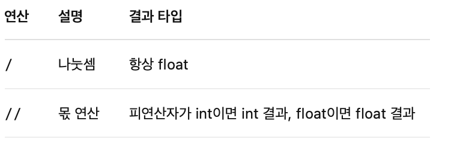

- #알고리즘
	- [[알고리즘을 위한 파이썬]]
	- [[AE Data Structures Crash Course]]
-
- #트러블슈팅
	- https://computer-science-student.tistory.com/719
	- 
	-
	-
- [[쿠버네티스 용어집]]
-
- #DD-ALGO
	- 기초수학
		- 운동 중독 플레이어
		  collapsed:: true
			- [[파이썬에서 입출력 다루는 방법]]
			- Python에서의 나눗셈 연산 /은 항상 float 결과를 반환. 굳이 float로 map할 필요가 없었음.
				- {:height 142, :width 446}
			-
		- 울타리
		  collapsed:: true
			- import sys
			- N = int(sys.stdin.readline())
			  lstA = list(map(int, sys.stdin.readline().split()))
			  outer_fences = N * 2 + lstA[0] + lstA[-1]
			  inner_fences = sum(abs(a - b) for a, b in zip(lstA, lstA[1:]))
			- result = outer_fences + inner_fences
			  print(result)
		- 여유 황금비
		  collapsed:: true
			- 파이썬에서는 연속된 부등식(Chain Comparison)을 사용할 수 있다.
				- if min(A, B) * 160 <= max(A, B) * 100 <= min(A, B) * 163:
			- 대부분의 실수 계산 문제는 계산 과정에서 언어별로 오차가 발생할 수 있기 때문에 정수로 변환하여 해결하는 편이 좋다.
			- 곱했을 때 값이 최대 10^15까지 나올 수 있기 때문에 정수 자료형보다 큰 자료형이 필요하다.
			-
-
- #CKA
	- #KodeKloud
		- Practice Test  - PODs, ReplicaSets
			- 
			- #kubectl
				- kubectl get pods
				- kubectl get pods --all-namespaces
				- kubectl get pods -o wide
				- kubectl describe pod <pod-id>
				- kubectl get pods -o wide
			- Kubernetes에서 apiVersion은 단순히 v1, v2처럼 숫자만 올라가는 형식이 아니라, 리소스 종류에 따라 API 그룹과 버전이 함께 사용되는 구조로 되어 있다. 예를 들어 Pod, Service, ConfigMap 등은 Kubernetes의 코어(Core) API 그룹에 속하기 때문에 apiVersion: v1처럼 단순하게 표현된다. 반면, ReplicaSet, Deployment, StatefulSet과 같은 리소스는 apps API 그룹에 속하므로 apiVersion: apps/v1처럼 그룹 이름과 버전을 함께 명시해야 한다.
			- 이처럼 쿠버네티스는 기능의 복잡도가 증가하면서 API를 그룹별로 분리하고 버전을 따로 관리하게 되었다. 예를 들어, 배치 작업을 위한 Job, CronJob은 batch/v1, 네트워크와 관련된 Ingress는 networking.k8s.io/v1, 권한 관리에 사용되는 Role, RoleBinding 등은 rbac.authorization.k8s.io/v1과 같은 API 그룹을 사용한다.
			- 따라서 apiVersion은 단순한 숫자 형태가 아니라, 해당 리소스가 속한 API 그룹과 그 그룹의 버전을 함께 지정하는 것이 일반적이다. ReplicaSet의 경우에도 apiVersion: apps/v1처럼 명시해야 Kubernetes가 올바르게 인식하고 실행할 수 있다.
			- 요약하자면, Pod, Service처럼 core 그룹에 속한 리소스는 v1만으로 충분하지만, 그 외의 리소스들은 apps/v1, batch/v1 등 각 리소스가 속한 API 그룹에 따라 apiVersion을 다르게 설정해야 한다는 점을 기억해야 한다.
	- https://etcd.io/docs/v3.5/faq/
-
- #SQL마스터클래스
	- 7.4-7.5 MySQL Data Types
		- named contraint
		- ```sql
		  CREATE TABLE users (
		      user_id BIGINT UNSIGNED PRIMARY KEY AUTO_INCREMENT,
		      username CHAR(10) NOT NULL UNIQUE,
		  --    email VARCHAR(50) NOT NULL UNIQUE
		      email VARCHAR(50) NOT NULL,
		      gender ENUM('Male', 'Female') NOT NULL,
		      interests SET('Technology', 'Sports', 'Music', 'Art', 'Travel', 'Food', 'Fashion', 'Science') NOT NULL,
		      bio TEXT NOT NULL, -- TINYTEXT profile_picture TINYBLOB, -- TINYBLOB, BLOB, MEDIUMBLOB, LONGBLOB
		  -- TINYINT SIGNED: -128 TO 127 UNSIGNED: 0 TO 255
		  -- SMALLINT: SIGNED: -32768 TO 32767, UNSIGNED: 0 TO 65535
		  -- MEDIUMINT SIGNED: -8388608 TO 8388607 UNSIGNED: 0 TO 16777215
		  -- INT SIGNED: -2147483648 TO 2147483647, UNSIGNED: 0 TO 4294967295
		  -- BIGINT SIGNED: -9223372036854775808 TO 9223372036854775807, UNSIGNED: 0 TO 18446744073709551615
		  -- age TINYINT UNSIGNED NOT NULL CHECK (age < 100),
		      age TINYINT UNSIGNED NOT NULL,
		      is_admin BOOLEAN DEFAULT FALSE NOT NULL, -- TINYINT(1, 0)
		      balance FLOAT DEFAULT 0.0 NOT NULL, -- DECIMAL(p,s)
		      /* TIMESTAMP - '1970-01-01 00:00:01' UTC to '2038-01-19 03:14:07' UTC
		      DATETIME - '1000-01-01 00:00:00' to '9999-12-31 23:59:59' */
		      joined_at TIMESTAMP DEFAULT CURRENT_TIMESTAMP NOT NULL, -- DATETIME YYYY-MM-DD hh:mm:ss
		      updated_at TIMESTAMP DEFAULT CURRENT_TIMESTAMP ON UPDATE CURRENT_TIMESTAMP NOT NULL,
		      birth_date DATE NOT NULL,
		      bed_time TIME NOT NULL,
		      graduation_year YEAR NOT NULL, -- 1901 to 2155
		  -- We also have JSON, GEOMETRY, POINT, LINESTRING, POLYGON, MULTIPOINT, MULTILINESTRING, MULTIPOLYGON, & GEOMETRYCOLLECTION
		  -- named contraints
		      CONSTRAINT chk_age CHECK(age < 100),
		      CONSTRAINT uq_email UNIQUE(email)
		  );
		  
		  
		  ```
		- 
		-