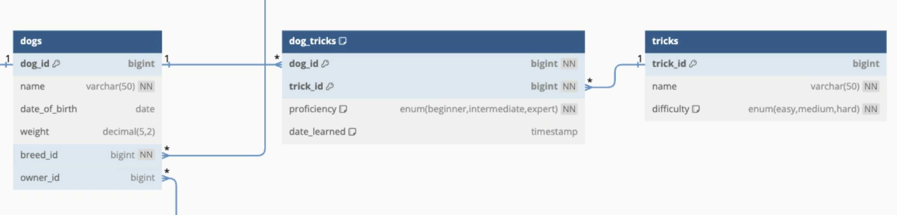

- #DD-ALGO
	- 기초구현
	  collapsed:: true
		- 합계산기
			- 연산자 딕셔너리 매핑, 언패킹
			- ```python
			  import sys
			  
			  answer = 0;
			  T = int(sys.stdin.readline())
			  for _ in range(T):
			  	expr = list(sys.stdin.readline().split())
			  	op = expr[1]
			  	left = int(expr[0])
			  	right = int(expr[2])
			  	if (op == '+'):
			  		answer += left + right
			  	elif (op == '-'):
			  		answer += left - right
			  	elif (op == '*'):
			  		answer += left * right
			  	elif (op == '/'):
			  		answer += left // right
			  sys.stdout.write(str(answer) + "\n")
			  
			  import sys
			  import operator
			  
			  # 연산자 딕셔너리 매핑
			  ops = {
			      '+': operator.add,
			      '-': operator.sub,
			      '*': operator.mul,
			      '/': operator.floordiv  # 정수 나눗셈
			  }
			  
			  answer = 0
			  T = int(sys.stdin.readline())
			  for _ in range(T):
			      left, op, right = sys.stdin.readline().split()
			      left = int(left)
			      right = int(right)
			      answer += ops[op](left, right)
			  
			  sys.stdout.write(str(answer) + "\n")
			  ```
		- 합리적 소비
			- ```python
			  import sys
			  
			  N = int(sys.stdin.readline())
			  cheap = ["", 200000]
			  expensive = ["", 0]
			  
			  for _ in range(N):
			  	product, price = sys.stdin.readline().split()
			  	price = int(price)
			  	if (price < cheap[1]):
			  		cheap = [product, price]
			  	elif (price > expensive[1]):
			  		expensive = [product, price]
			  
			  print(expensive[0], expensive[1])
			  print(cheap[0], cheap[1])
			  
			  ##
			  
			  import sys
			  
			  N = int(sys.stdin.readline())
			  products = [tuple(sys.stdin.readline().split()) for _ in range(N)]
			  
			  # 문자열로 읽은 가격을 비교할 수 있도록 int 변환
			  products = [(name, int(price)) for name, price in products]
			  
			  most_expensive = max(products, key=lambda x: x[1])
			  cheapest = min(products, key=lambda x: x[1])
			  
			  print(f"{most_expensive[0]} {most_expensive[1]}")
			  print(f"{cheapest[0]} {cheapest[1]}")
			  
			  ##
			  
			  import sys
			  from collections import namedtuple
			  
			  Product = namedtuple("Product", ["name", "price"])
			  
			  N = int(sys.stdin.readline())
			  products = [Product(name, int(price)) for name, price in (line.split() for line in sys.stdin)]
			  
			  most_expensive = max(products, key=lambda x: x.price)
			  cheapest = min(products, key=lambda x: x.price)
			  
			  print(f"{most_expensive.name} {most_expensive.price}")
			  print(f"{cheapest.name} {cheapest.price}")
			  
			  ##
			  
			  import sys
			  from dataclasses import dataclass
			  
			  @dataclass
			  class Product:
			      name: str
			      price: int
			  
			  N = int(sys.stdin.readline())
			  products = [Product(name, int(price)) for name, price in (line.split() for line in sys.stdin)]
			  
			  most_expensive = max(products, key=lambda x: x.price)
			  cheapest = min(products, key=lambda x: x.price)
			  
			  print(f"{most_expensive.name} {most_expensive.price}")
			  print(f"{cheapest.name} {cheapest.price}")
			  ```
		- 과연 승자는?
			- 파이써닉한 코드에 대한 고민.
			- ```python
			  # -*- coding: utf-8 -*-
			  # UTF-8 encoding when using korean
			  
			  import sys
			  
			  N = int(sys.stdin.readline())
			  A = tuple(map(int, sys.stdin.readline().split()))
			  B = tuple(map(int, sys.stdin.readline().split()))
			  
			  scoreA = 0;
			  scoreB = 0;
			  for i in range(N):
			  	diff = abs(A[i] - B[i])
			  	if A[i] > B[i]:
			  		if diff == 7:
			  			scoreA -= 1
			  			scoreB += 3
			  		else:
			  			scoreA += 2
			  	elif A[i] < B[i]:
			  		if diff == 7:
			  			scoreA += 3
			  			scoreB -= 1
			  		else:
			  			scoreB += 2
			  	else:
			  			scoreA += 1
			  			scoreB += 1
			  
			  sys.stdout.write(str(scoreA) + " " + str(scoreB))
			  				
			  
			  ## 최적ㄱ화 버전
			  
			   import sys
			  
			  N = int(sys.stdin.readline())
			  A = list(map(int, sys.stdin.readline().split()))
			  B = list(map(int, sys.stdin.readline().split()))
			  
			  scoreA = scoreB = 0
			  
			  for a, b in zip(A, B):
			      if a > b:
			          if a - b == 7:
			              scoreA -= 1
			              scoreB += 3
			          else:
			              scoreA += 2
			      elif a < b:
			          if b - a == 7:
			              scoreA += 3
			              scoreB -= 1
			          else:
			              scoreB += 2
			      else:
			          scoreA += 1
			          scoreB += 1
			  
			  print(f"{scoreA} {scoreB}")
			    
			    
			  ```
		-
		-
		-
	- 기초시뮬레이션
	  collapsed:: true
		- 나무꾼 구름이
			- 최적화: 매 회차마다 높이를 1씩 증가시키는 대신, 전체 증가량을 누적시켜 적용하는 방법.
			- 계산 시점에만 증가분을 반영하기 때문에 시간 복잡도를 O(Q x N)에서 O(Q + N)으로 줄일 수 있음
			- ```python
			  import sys
			  
			  N, M, x = map(int, sys.stdin.readline().split())
			  H = list(map(int, sys.stdin.readline().split()))
			  Q = int(sys.stdin.readline())
			  moves = sys.stdin.readline().split()
			  
			  x -= 1
			  increment = 0
			  answer = 0
			  
			  for move in moves:
			      height = H[x] + increment
			      if height >= M:
			          answer += height
			          H[x] = -increment  # 수확 후 초기화
			  
			      increment += 1
			  
			      if move == 'L':
			          x = (x - 1) % N
			      elif move == 'R':
			          x = (x + 1) % N
			  
			  print(answer)
			  ```
		- 복제 로봇
			- Membership Test Operator
			- in/ not in 키워드를 사용해서 어떤 값이 컨테이너(리스트, 튜플, 세트, 딕셔너리 등)에 포함되는지 여부를 판단하는 연산자.
			- 좌표쌍을 dict의 key로 쓰거나, in 연산자로 탐색할 때는 반드시 튜플을 써야한다. 리스트는 불가능
			- 파이썬에서 set이나 dict는 내부적으로 해시값을 사용해서 빠르게 탐색하는데 튜플은 해시 가능하지만 리스트는 해시 불가능.
			- 웅덩이 좌표의 제한이 행렬로 담을 수 없을 만큼 커지고, 조종과 웅덩이 개수 또한 최대치로 커지면 set과 같은 자료구조에 담는 방식을 사용해서 풀어내야 한다.
				- ```python
				  # -*- coding: utf-8 -*-
				  # UTF-8 encoding when using korean
				  import sys
				  
				  x, y = map(int, sys.stdin.readline().split())
				  N = int(sys.stdin.readline())
				  ponds = set(tuple(map(int, sys.stdin.readline().split())) for _ in range(N))
				  
				  Q = int(sys.stdin.readline())
				  commands = sys.stdin.readline().split()
				  
				  directions = {
				      'L': (-1, 0),
				      'R': (1, 0),
				      'U': (0, 1),
				      'D': (0, -1),
				  }
				  
				  for cmd in commands:
				      dx, dy = directions[cmd]
				      nx, ny = x + dx, y + dy
				      if (nx, ny) not in ponds:
				          x, y = nx, ny
				  
				  print(x, y)
				  ```
		- 빵야
			- 시뮬레이션 문제는 시간적으로 최적화를 해야 하는 문제가 많다. 따라서 시뮬레이션 문제를 접할 때는 최적화 할 수 있는 부분이 무엇인지 항상 확인할 것
			- O((4Hi/10) * N)이 되므로 제한 시간 안에 해결이 불가능.
			- 반복되는 구조가 있는지 살펴볼 것 ...
			- divmod
		-
-
- #DBeaver
	- Refresh
		- {:height 371, :width 339}
	- AutoCommit On
		- {:height 211, :width 289}
-
- #SQL마스터클래스
	- 7.6 INSERT INTO VALUES
	  collapsed:: true
		- ```sql
		  INSERT INTO users (
		      username,
		      email,
		      gender,
		      interests,
		      bio,
		      age,
		      is_admin,
		      birth_date,
		      bed_time,
		      graduation_year
		  ) VALUES (
		      'mr.pizza',
		      'mr@pizza.com',
		      'Male',
		      'Travel,Food,Technology',
		      'I like running',
		      31,
		      TRUE,
		      '1999-05-08',
		      '23:00',
		      '2022'
		  );
		  
		  ```
	- 7.7-7.8 ALTER TABLE
	  collapsed:: true
		- 컬럼을 삭제하거나 추가하는 방법, 컬럼의 데이터 타입을 변경하는 방법, 제약조건을 삭제하거나 생성하는 방법 등
			- ```sql
			  -- drop column
			  ALTER TABLE users DROP COLUMN profile_picture;
			  
			  -- rename column : 
			  ALTER TABLE users CHANGE COLUMN bio about_me TEXT; -- 타입도 변경 가능
			  
			  SHOW CREATE TABLE users; -- 데이터베이스가 우리 테이블을 실제로 어떻게 보는지 확인할 수 있다. 
			  						 -- 데이터 타입을 수정하거나 할 때 자주 보게 될 것
			                           
			  -- Drop Column (컬럼 삭제)
			  ALTER TABLE users DROP COLUMN profile_picture;
			  
			  -- Rename Column and also type (컬럼 이름 및 데이터 타입 변경)
			  ALTER TABLE users CHANGE COLUMN bio about_me TEXT; -- This is used to change both the column name and type of data (이것은 컬럼 이름과 데이터 타입을 모두 변경할 때 사용됩니다)
			  
			  -- Change the column type only (데이터 타입만 변경, 기존 타입과 호환이 되는 타입으로 변경)
			  ALTER TABLE users MODIFY COLUMN about_me TINYTEXT; -- This is used when to change the type of data only (이것은 데이터 타입만 변경할 때 사용됩니다)
			  
			  -- Rename database (데이터베이스 이름 변경)
			  ALTER TABLE users RENAME TO customers;
			  ALTER TABLE customers RENAME TO users;
			  
			  -- Drop Constraints (제약 조건 삭제)
			  ALTER TABLE users DROP CONSTRAINT uq_email;
			  ALTER TABLE users
			  DROP CONSTRAINT username,
			  DROP CONSTRAINT chk_age;
			  
			  -- Add Constraints (제약 조건 추가)
			  ALTER TABLE users
			  ADD CONSTRAINT uq_email UNIQUE (email)
			  ADD CONSTRAINT uq_username UNIQUE (username);
			  
			  ALTER TABLE users ADD CONSTRAINT chk_age CHECK(age
			  -- Modify Column (컬럼 수정)
			  ALTER TABLE users MODIFY COLUMN bed_time TIME NULL;
			  
			  -- Literally to show all columns (모든 컬럼 보기)
			  SHOW CREATE TABLE users;
			  DESCRIBE users; 
			  ```
		- 데이터 타입을 변경했는데 충돌이 발생한 경우 즉, 데이터가 유효하지 않거나, 데이터베이스에 저장된 테이터가 새로 지정한 데이터 타입과 일치하지 않은 경우 어떻게 migration 할 수 있을까?
			- ALTER TABLE은 비용이 꽤나 클 수 있다.
			- SQLite를 배울 때 ALTER TABLE 을 배우지 않은 이유가 있는데, 테이블 이름 변경, 컬럼 추가, 컬럼 이름 변경 밖에 할 수 없음. 이미 설정된 컬럼을 제거하거나, 데이터 타입을 변경하거나, 제약조건을 추가 혹은 삭제하는 건 불가능. 아주 제한적.
		- 시나리오1: 졸업연도 를 졸업연월일 로 바꾸고싶다.
			- ```sql
			  ALTER TABLE users MODIFY GOLUMN graduation_year DATE;
			  -- ERROR! incorrected date value: '1976' for column 'graduation_year' at row 1
			  
			  ALTER TABLE users ADD COLUMN graduation_date DATE;
			  
			  -- SELECT graduation_year, MAKEDATE(graduation_year, 1) from users;
			  UPDATE users SET graduation_date = MAKEDATE(graduation_year, 1) from users;
			  
			  ALTER TABLE users DROP COLUMN graduation_year; -- DROP 할 때 항상 주의.
			  
			  ALTER TABLE users MODIIFY COLUMN graduation_date DATE NOT NULL;
			  -- 데이터베이스에 추가하는 새로운 컬럼을 NOT NULL로 하려면 기존의 모든 row에 들어갈 기본값을 넣어줘야 해
			  -- 그래야 말이 되긴 하지만 수만 개의 row가 있는데 거기에 기본값으로 뭘 넣어야할까? NULL...
			  -- NOT NULL을 추가하면 NULL을 허용하지 않는데 기본값이 NULL이니까
			  
			  -- 아니면...
			  ALTER TABLE users ADD COLUMN graduation_date DATE NOT NULL DEFAULT
			  MAKEDATE(graduation_year, 1);
			  ```
	- 7.9 Generated Columns, Computed Columns
	  collapsed:: true
		- ```sql
		  CREATE TABLE users_v2 (
		      user_id BIGINT UNSIGNED PRIMARY KEY AUTO_INCREMENT,
		      first_name VARCHAR(50),
		      last_name VARCHAR(50),
		      email VARCHAR(100),
		      -- (...) 괄호 안에 다른 모든 컬럼에 접근할 수 있음, 이게 어떤 종류의 Generated Column인지 정해줘야 함...!
		      full_name VARCHAR(101) GENERATED ALWAYS AS (CONCAT(first_name)) STORED
		  );
		  
		  INSERT INTO users_v2 (
		      first_name, last_name, email
		  ) VALUES ('hs', 'kim', 'hs@kim');
		  
		  
		  USE sql_masterclass2;
		  ALTER TABLE users_v2 MODIFY COLUMN full_name VARCHAR(101) GENERATED ALWAYS AS (CONCAT(first_name, ' ', last_name)) STORED;
		  
		  ALTER TABLE users_v2 ADD COLUMN email_domain VARCHAR(50) GENERATED ALWAYS AS
		  (SUBSTRING_INDEX(email, '@', -1)) VIRTUAL; 
		  ```
			- 
		- STORED vs. VIRTUAL
			- STORED: 물리적인 디스크 공간에 저장됨. 실제로 데이터베이스에 값이 저장. row가 업데이트될 때만 다시 계산됨
			- VIRTUAL: email_domain 컬럼을 조회(SELECT)할 때마다 매번 연산을 수행
	- 7.10 Data Import
	  collapsed:: true
		- JSON을 직접 지원하는 DB 관리 툴은 많지 않기 때문에, JSON 데이터를 CSV로 변환한 후 가져오는 방식이 더 안정적이다. MySQL Workbench는 다소 불안정한 면이 있어, 이번에는 Python을 사용해 JSON 데이터를 MySQL 테이블에 직접 삽입
			- https://gist.github.com/kimhxsong/6b0b33f648d18627af6816594e32f02d
	- ### 8. FOREIGN KEYS
		- 보다 나은 DB를 디자인 하는 방법.. Foreign Keys(FK), FK Contraints, Normalization
		- 우리는 Normal form을 배우지 않을 것이고 이것이 의미하는대로 따라가지 않을 것임
		- 대신에 data를 살펴보면서 문제를 파악하고 이를 해결함으로써 저절로 3번째 Normal Form에 도달 할 것.
	- 8.1 Data Normalization
		- **Normalization(정규화)**는 데이터베이스에서 중복 데이터를 제거하고, 데이터를 한 곳에만 저장할 수 있도록 도와주는 과정.
		- 데이터가 중복되지 않으면, 수정, 추가, 삭제 작업이 더 쉽고 빠르며, 데이터의 일관성을 유지하기 쉬워진다.
		- 이는 중복된 여러 위치를 일일이 업데이트할 필요 없이, 한 곳만 수정하면 되기 때문.
		- 현재 실습중인 영화 테이블은 정규화되어 있지 않다. 즉 중복된 data가 많이 있단 이야기.
	- 8.2 Entities
		- 아래 테이블은 정규화 되어 있지 않고, 이런 형태의 DB를 갖는 것은 좋지 못함
			- ```sql
			  CREATE TABLE dogs (
			      dog_id BIGINT UNSIGNED PRIMARY AUTO_INCREMENT,
			      name VARCHAR(50) NOT NULL,
			      breed_name VARCHAR(50) NOT NULL,
			      breed_size_category ENUM('small', 'medium', 'big') DEFAULT 'small',
			      breed_typical_lifespan TINYINT,
			      date_of_birth DATE,
			      weight DECIMAL,
			      owner_name VARCHAR(50) NOT NULL,
			      owner_email VARCHAR(100) UNIQUE,
			      owner_phone VARCHAR(20),
			      owner_address TINYTEXT
			  );
			  ```
			- 두 마리의 강아지가 있고 주인이 같은 경우를 생각해보면 두 개의 row에 서로 다른 강아지 이름과 견종이 있을 것.
			- 하지만 주인 이름, 이메일, 전화번호, 주소 모두 중복될것. 세 개의 다른 entity에 대한 Data를 갖고있기 때문. dog, breed, owner
			- 만약 entity 이름에 _가 있는 column이 보인다면 = 디자인에 실수가 있었다는 것을 알 수 있겠다.
			- entity를 분리할 것임
				- ```sql
				  CREATE TABLE
				  dogs (
				  dog_id BIGINT UNSIGNED PRIMARY KEY AUTO_INCREMENT,
				  name VARCHAR(50) NOT NULL,
				  date_of_birth DATE,
				  weight DECIMAL(5, 2),
				  owner_id BIGINT UNSIGNED,
				  breed_id BIGINT UNSIGNED
				  );
				  
				  CREATE TABLE
				  owners (
				  owner_id BIGINT UNSIGNED PRIMARY KEY AUTO_INCREMENT,
				  name VARCHAR(50) NOT NULL,
				  email VARCHAR(100) UNIQUE,
				  phone VARCHAR(20),
				  address TINYTEXT
				  );
				  
				  CREATE TABLE
				  breeds (
				  breed_id BIGINT UNSIGNED PRIMARY KEY AUTO_INCREMENT,
				  name VARCHAR(50) NOT NULL,
				  size_category ENUM('small', 'medium', 'big') DEFAULT 'small',
				  typical_lifespan TINYINT
				  );
				  
				  ```
		- 8.3 Foreign Keys
			- ~~조금 졸음 ..~~
			- FK를 사용함으로써 데이터가 일관되지 못하게 되는 실수로부터 부터 보호받을 수 있다. 가령 존재하지 않은 owner_id로 dog를 생성하는 실수 같은 것.
			- ```sql
			  CREATE TABLE dogs (
			  	dog_id BIGINT UNSIGNED PRIMARY KEY AUTO_INCREMENT,
			  	name VARCHAR(50) NOT NULL,
			  	date_of_birth DATE,
			  	weight DECIMAL(5, 2),
			  	owner_id BIGINT UNSIGNED,
			  	breed_id BIGINT UNSIGNED,
			    	FOREIGN KEY (owner_id) REFERENCES owners (owner_id),
			    	FOREIGN KEY (breed_id) REFERENCES breeds (breed_id)
			  );
			  
			  INSERT INTO
			  	breeds (name, size_category, typical_lifespan)
			  VALUES
			  	('Golden Retriever', 'big', 12);
			  
			  INSERT INTO
			  	owners (name, email, phone, address)
			  VALUES (
			    'Adam Smith',
			    'adam@smith.com',
			    '1122334455',
			    '9010 St. Scotland');
			  
			  INSERT INTO dogs
			  	(name, date_of_birth, weight, breed_id, owner_id)
			  VALUES
			  	('Buddy', '2018-03-15', 10.5, 1, 1);
			  
			  # ERROR
			  INSERT INTO dogs
			  	(name, date_of_birth, weight, breed_id, owner_id)
			  VALUES
			  	('Champ', '2018-03-15', 10.5, 6, 7);
			  ```
		- 8.4 ON DELETE
			- dogs 테이블에 데이터를 삽입하고 참조된 아이디를 각각 owners, breeds 테이블에서 삭제하려고 한다면?
				- 실패한다. 왜래키 제약 조건을 참으로 유지해야하기 때문에 실행될 수 없음.
				- 우리가 할 수 있는 것은 Foreign key 제약을 만들 때 참조된 row가 삭제될 때 어떻게 할 건지 지정하는 것임
			- 옵션1
			  ```sql
			  FOREIGN KEY (owner_id) REFERENCES owners (owner_id) ON DELETE CASCADE
			  ```
				- CASCADE는 관련된 레코드가 삭제되면, 그것과 연결된 다른 레코드도 삭제되는 것을 의미
					- 이러한 동작을 원하는 경우가 있을 수 있다. 예를 들어 사용자가 있고 사용자가 댓글을 달 수 있다고 하면 사용자 계정이 삭제되면? 댓글 table은 cascade 삭제를 가져야할 것임
					- 댓글을 단 사용자가 삭제되면, 해당 사용자가 단 모든 댓글을 삭제해야 할 수도 있음
				- 주인이 삭제되면 강아지도 같이 삭제됨
			- 옵션2
			  
			  ```sql
			  FOREIGN KEY (owner_id) REFERENCES owners (owner_id) ON DELETE SET NULL
			  ```
				- 주인이 삭제되면 dogs table의 owner_id column을 Null로 설정하고 싶다 는 의미.
				- 이 작업을 위해서는 Not NULL 제약을 갖고 있지 않은지 확인해야 한다.
				- 주인이 삭제되면 주인 없는 강아지가 됨
			- 옵션3
			  
			  ```sql
			  FOREIGN KEY (owner_id) REFERENCES owners (owner_id) ON DELETE SET DEFAULT
			  ```
			- ON DELETE 하고 SET NULL을 SET DEFAULT로 바꾸는 걸 까먹었다면..?
				- 먼저 해야 할 일은 만들었던 제약을 삭제하고, ...
					- In MySQL, ALTER TABLE DROP FOREIGN KEY owner_fk;
					- In PostgreSQL, ALTER TABLE DROP CONSTRAINT
				- ADD CONSTRAINT owner_fk .......
			-
		- 8.5 One-To-Many and One-To-One
			- 
			- FK에 UNIQUE 제약을 추가하는 순간 1:1 관계가 될 것임
		- 8.6. Many-To-Many
			- 많은 강아지들은 트릭을 알 수 있고, 많은 트릭은 많은 강아지들에게 알려질 수 있음
			- bridge나 link table 없이 N:N relationship을 표현하는 것은 불가능하다.
			- 
			- 복잡하지만 이점이 있다. 강아지가 새로운 트릭을 배운 시점, 또는 배운 트릭이 어느 수준인지 추적할 수 있음.
			- 다른 예시, 회원은 많은 클럽에 가입할 수 있고,  클럽에는 많은 회원들이 있을 수 있다. 즉 N:N
				- Users ←--- Memberships ---→ Clubs
				- 회원이 클럽을 떠났다면 데이터 베이스 멤버쉽 레코드를 삭제하기만 하면 된다.
			- 두 개의 PK는 가질 수 없ㄷㅏ.
	-
-
- #news
	- {{video https://youtu.be/rPWzbT_pG_s}}