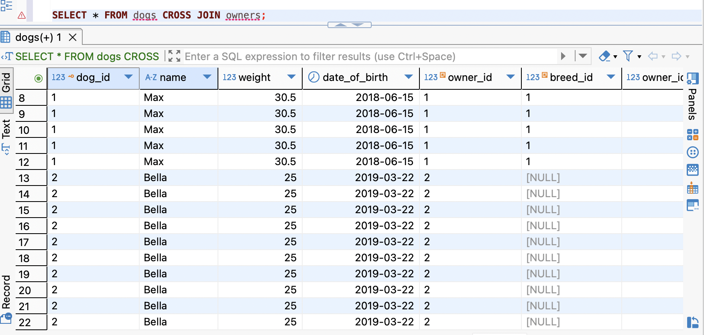
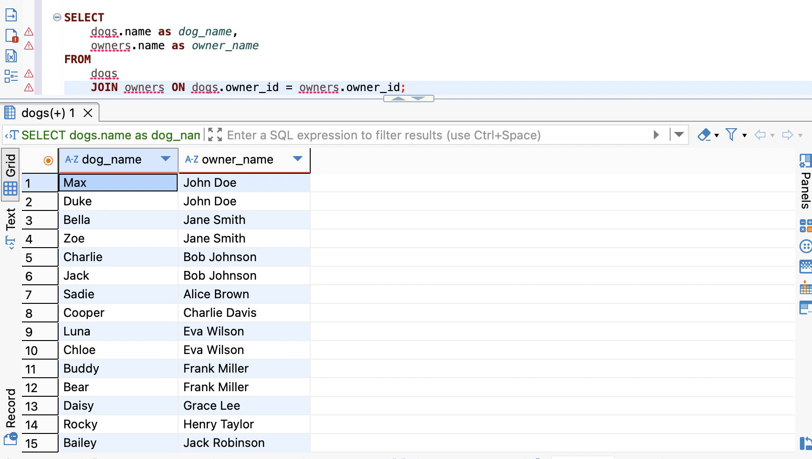
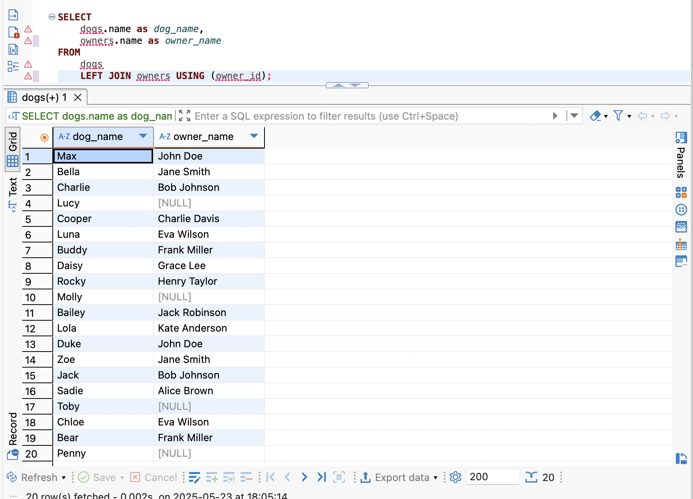
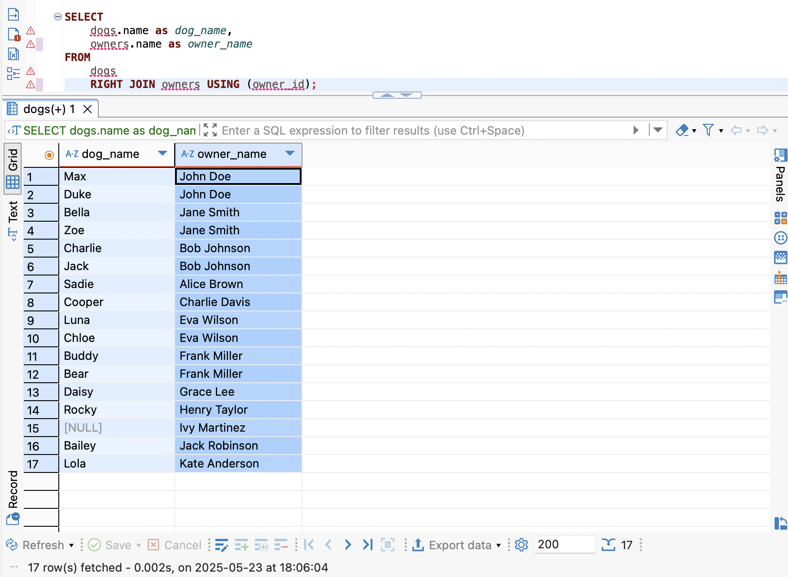
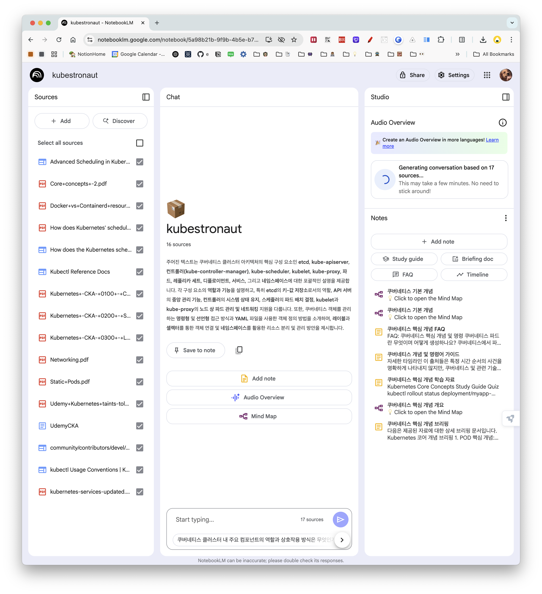
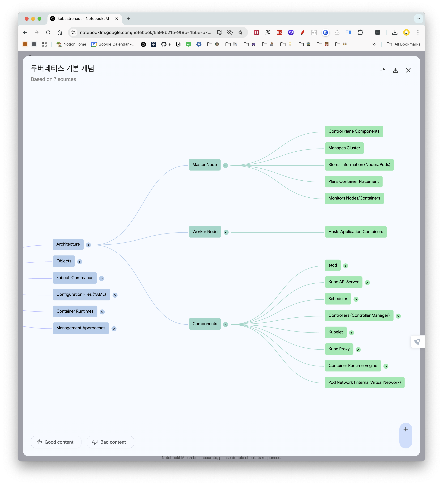
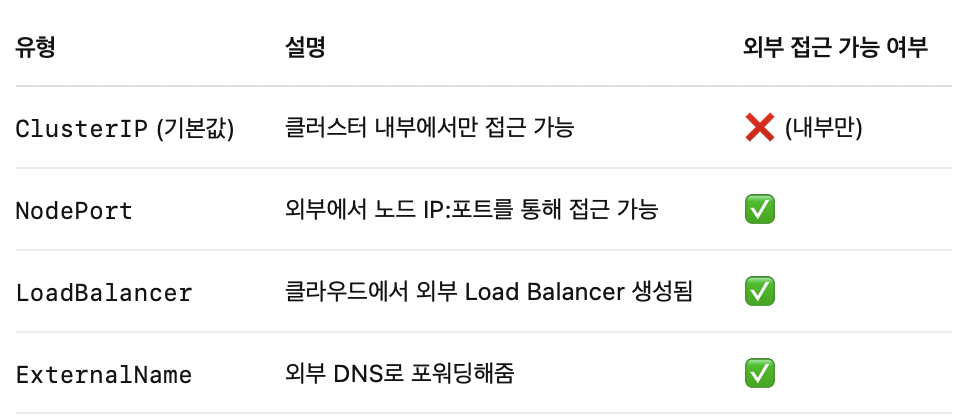

- #SQL마스터클래스
	- ### 9. JOINS
	- 9.0 Introduction
		- 여러 table에 나누어져 있는 data를 query하는 방법에 대해 배울 것
		- ```sql
		  CREATE TABLE dogs (
		      dog_id BIGINT UNSIGNED PRIMARY KEY AUTO_INCREMENT,
		      name VARCHAR(50) NOT NULL,
		      weight DECIMAL(5,2),
		      date_of_birth DATE,
		      owner_id BIGINT UNSIGNED,
		      breed_id BIGINT UNSIGNED,
		      FOREIGN KEY (owner_id) REFERENCES owners (owner_id) ON DELETE SET NULL,
		      CONSTRAINT breed_fk FOREIGN KEY (breed_id) REFERENCES breeds (breed_id) ON DELETE SET NULL
		  );
		  
		  CREATE TABLE owners (
		      owner_id BIGINT UNSIGNED PRIMARY KEY AUTO_INCREMENT,
		      name VARCHAR(50) NOT NULL,
		      email VARCHAR(100) UNIQUE,
		      phone VARCHAR(20),
		      address TINYTEXT
		  );
		  
		  CREATE TABLE breeds (
		      breed_id BIGINT UNSIGNED PRIMARY KEY AUTO_INCREMENT,
		      name VARCHAR(50) NOT NULL,
		      size_category ENUM ('small', 'medium', 'big') DEFAULT 'small',
		      typical_lifespan TINYINT
		  );
		  
		  CREATE TABLE pet_passports (
		      pet_passport_id BIGINT UNSIGNED PRIMARY KEY AUTO_INCREMENT,
		      blood_type VARCHAR(10),
		      allergies TEXT,
		      last_checkup_date DATE,
		      dog_id BIGINT UNSIGNED UNIQUE,
		      FOREIGN KEY (dog_id) REFERENCES dogs (dog_id) ON DELETE CASCADE
		  );
		  
		  CREATE TABLE tricks (
		      trick_id BIGINT UNSIGNED PRIMARY KEY AUTO_INCREMENT,
		      name VARCHAR(50) UNIQUE NOT NULL,
		      difficulty ENUM('easy', 'medium', 'hard') NOT NULL DEFAULT 'easy'
		  );
		  
		  CREATE TABLE dog_tricks (
		      dog_id BIGINT UNSIGNED,
		      trick_id BIGINT UNSIGNED,
		      proficiency ENUM('beginner', 'intermediate', 'expert') NOT NULL DEFAULT 'beginner',
		      date_learned TIMESTAMP DEFAULT CURRENT_TIMESTAMP,
		      PRIMARY KEY (dog_id, trick_id),
		      FOREIGN KEY (dog_id) REFERENCES dogs (dog_id) ON DELETE CASCADE,
		      FOREIGN KEY (trick_id) REFERENCES tricks (trick_id) ON DELETE CASCADE
		  );
		  
		  -- INSERT INTO breeds
		  INSERT INTO breeds (name, size_category, typical_lifespan) VALUES
		      ('Labrador Retriever', 'big', 12),
		      ('German Shepherd', 'big', 11),
		      ('Golden Retriever', 'big', 11),
		      ('French Bulldog', 'small', 10),
		      ('Beagle', 'medium', 13),
		      ('Poodle', 'medium', 14),
		      ('Chihuahua', 'small', 15);
		  
		  -- INSERT INTO owners
		  INSERT INTO owners (name, email, phone, address) VALUES
		      ('John Doe', 'john@example.com', '123-456-7890', '123 Main St, Anytown, USA'),
		      ('Jane Smith', 'jane@example.com', '234-567-8901', '456 Elm St, Someplace, USA'),
		      ('Bob Johnson', 'bob@example.com', '345-678-9012', '789 Oak St, Elsewhere, USA'),
		      ('Alice Brown', 'alice@example.com', '456-789-0123', '321 Pine St, Nowhere, USA'),
		      ('Charlie Davis', 'charlie@example.com', '567-890-1234', '654 Maple St, Somewhere, USA'),
		      ('Eva Wilson', 'eva@example.com', '678-901-2345', '987 Cedar St, Anyville, USA'),
		      ('Frank Miller', 'frank@example.com', '789-012-3456', '246 Birch St, Otherville, USA'),
		      ('Grace Lee', 'grace@example.com', '890-123-4567', '135 Walnut St, Hereville, USA'),
		      ('Henry Taylor', 'henry@example.com', '901-234-5678', '864 Spruce St, Thereville, USA'),
		      ('Ivy Martinez', 'ivy@example.com', '012-345-6789', '753 Ash St, Whereville, USA'),
		      ('Jack Robinson', 'jack@example.com', '123-234-3456', '951 Fir St, Thatville, USA'),
		      ('Kate Anderson', 'kate@example.com', '234-345-4567', '159 Redwood St, Thisville, USA');
		  
		  -- INSERT INTO dogs
		  INSERT INTO dogs (name, date_of_birth, weight, breed_id, owner_id) VALUES
		      ('Max', '2018-06-15', 30.5, 1, 1),
		      ('Bella', '2019-03-22', 25.0, NULL, 2),
		      ('Charlie', '2017-11-08', 28.7, 2, 3),
		      ('Lucy', '2020-01-30', 8.2, NULL, NULL),
		      ('Cooper', '2019-09-12', 22.3, 5, 5),
		      ('Luna', '2018-07-05', 18.6, 6, 6),
		      ('Buddy', '2016-12-10', 31.2, 1, 7),
		      ('Daisy', '2020-05-18', 6.8, NULL, 8),
		      ('Rocky', '2017-08-25', 29.5, 2, 9),
		      ('Molly', '2019-11-03', 24.8, 3, NULL),
		      ('Bailey', '2018-02-14', 21.5, 5, 11),
		      ('Lola', '2020-03-27', 7.5, 4, 12),
		      ('Duke', '2017-05-09', 32.0, NULL, 1),
		      ('Zoe', '2019-08-11', 17.8, 6, 2),
		      ('Jack', '2018-10-20', 23.6, NULL, 3),
		      ('Sadie', '2020-02-05', 26.3, 3, 4),
		      ('Toby', '2017-07-17', 8.9, 7, NULL),
		      ('Chloe', '2019-04-30', 20.1, 6, 6),
		      ('Bear', '2018-01-08', 33.5, 2, 7),
		      ('Penny', '2020-06-22', 7.2, 4, NULL);
		  
		  -- INSERT INTO tricks
		  INSERT INTO tricks (name, difficulty) VALUES
		      ('Sit', 'easy'),
		      ('Stay', 'medium'),
		      ('Fetch', 'easy'),
		      ('Roll Over', 'hard'),
		      ('Shake Hands', 'medium');
		  
		  -- INSERT INTO dog_tricks
		  INSERT INTO dog_tricks (dog_id, trick_id, proficiency, date_learned) VALUES
		      (1, 1, 'expert', '2019-01-15'),
		      (1, 2, 'intermediate', '2019-03-20'),
		      (14, 3, 'expert', '2019-02-10'),
		      (2, 1, 'expert', '2019-07-05'),
		      (2, 3, 'intermediate', '2019-08-12'),
		      (3, 1, 'expert', '2018-03-10'),
		      (3, 2, 'expert', '2018-05-22'),
		      (13, 4, 'beginner', '2019-11-30'),
		      (4, 1, 'intermediate', '2020-05-18'),
		      (5, 1, 'expert', '2020-01-07'),
		      (11, 3, 'expert', '2020-02-15'),
		      (5, 5, 'intermediate', '2020-04-22'),
		      (7, 1, 'expert', '2017-06-30'),
		      (7, 2, 'expert', '2017-08-14'),
		      (12, 3, 'expert', '2017-07-22'),
		      (16, 4, 'intermediate', '2018-01-05'),
		      (7, 5, 'expert', '2017-09-18'),
		      (10, 1, 'intermediate', '2020-03-12'),
		      (10, 3, 'beginner', '2020-05-01'),
		      (15, 1, 'expert', '2019-02-28'),
		      (14, 2, 'intermediate', '2019-04-15'),
		      (18, 1, 'intermediate', '2019-09-10'),
		      (18, 5, 'beginner', '2020-01-20');
		  
		  -- INSERT INTO pet_passports
		  INSERT INTO pet_passports (dog_id, blood_type, allergies, last_checkup_date) VALUES
		      (1, 'DEA 1.1+', 'None', '2023-01-05'),
		      (2, 'DEA 1.1-', 'Chicken', '2023-02-22'),
		      (3, 'DEA 4+', 'None', '2023-03-08'),
		      (5, 'DEA 7+', 'Beef', '2023-04-12'),
		      (7, 'DEA 1.1+', 'None', '2023-01-10'),
		      (10, 'DEA 3-', 'Dairy', '2023-05-03'),
		      (12, 'DEA 5-', 'None', '2023-03-27'),
		      (15, 'DEA 1.1-', 'Grains', '2023-04-20'),
		      (18, 'DEA 7+', 'None', '2023-04-03'),
		      (20, 'DEA 4+', 'Pollen', '2023-06-22');
		  ```
	- 9.1 CROSS JOIN
		- 니코 曰: "솔직히 말해서, 난 이게 유용하지 않다고 생각해.", "cross join은 사용할 수 있는 데가 별로 없어서, 내가 기억하기엔 아마 한 번 정도 사용했을 거야.
		- 
			- owners table의 모든 주인을 dogs table의 모든 개와 연결시킴.
		- 언제 필요할까? 예를 들어, 개와 주인 사이의 모든 조합?...
		- 그런데 정말 사용할 구석이 거의 없음... 첫 번째 table의 행과 두 번재 table의 행을 전부 다 연결해야 했던 적은 없음
		- CROSS JOIN은 왼쪽에서 오른쪽으로 진행된다.
		- ```sql
		  SELECT * FROM dogs CROSS JOIN owners WHERE ...;
		  ```
		- cross join은 from 절 다음, where 절 전에 실행된다.
	- 9.2 INNER JOIN
		- 대부분의 경우에는 CROSS JOIN 대신 INNER JOIN을 쓰게될 것이고, INNER를 생략할 수 있음
		- ON 절을 붙이지 않으면 CROSS JOIN과 똑같이 동작하는 것처럼 보이지만 ON 절을 추가하여 첫번째 테이블의 어떤 행과 두번째 테이블의 어떤 행을 JOIN시킬 수 있음
		- ```sql
		  SELECT
		  	dogs.name as dog_name,
		      owners.name as owner_name
		  FROM
		  	dogs
		      JOIN owners ON dogs.owner_id = owners.owner_id;
		  ```
		- 
		- 왼쪽에서 오른쪽으로 동작하는 것을 잊지말기
		- ```sql
		  SELECT
		  	dogs.name as dog_name,
		      owners.name as owner_name,
		      breeds.name as breed_name
		  FROM
		  	dogs
		      -- JOIN owners ON dogs.owner_id = owners.owner_id;
		      -- JOIN breeds ON dogs.breed_id = breeds.breed_id;
		      -- 양쪽 테이블에 같은 이름의 컬럼을 쓴다면...
		      JOIN owners USING (ownerd_id)
		      JOIN breeds USING (breed_id)
		  ```
	- 9.3 OUTER JOIN
		- LEFT OUTER JOIN, RIGHT OUTER JOIN 에서 OUTER 는 생략 가능.
		- OUTER JOIN은 주인 있는 개 뿐만 아니라 주인 없는 개도 볼 수 있게 해줌
		- ```sql
		  SELECT
		  	dogs.name as dog_name,
		      owners.name as owner_name,
		      breeds.name as breed_name
		  FROM
		  	dogs
		      LEFT JOIN owners USING (ownerd_id)
		  ```
		- 
		- 
		- 댕글링 로우(Dangling Row)
	- 9.4 Joins Practice
	- 9.5 Joins Practice part Two
	- 9.6 Joins practice part Three
-
- #SQLD
	- https://blog.naver.com/PostView.naver?blogId=hahaha0623&logNo=223489782656&redirect=Dlog&widgetTypeCall=true&topReferer=https%3A%2F%2Fgetliner.com%2F&trackingCode=external&directAccess=false
	-
- #NotebookLM
	- https://support.google.com/notebooklm/?visit_id=638835811778634852-1976649245&rd=2&topic=14272891#topic=16164070
	- Udemy CKA 강의 대본 긁어서 NotebookLM으로 학습 시도 ← 생각보다 괜찮음!
		- https://notebooklm.google.com/notebook/5a98b21b-9f9b-4b5e-b7aa-61b0b1ca8e0d/audio
		- {:height 638, :width 461}
		- {:height 565, :width 481}
	- 하나의 작업 공간에 모든 섹션? 섹션별로 작업 공간을 나눠야할까?
		- #Claude Says
			- **1단계**: 기초 및 기본 운영 (섹션 1-4)
			- **2단계**: 애플리케이션 관리 (섹션 5-6)
			- **3단계**: 보안 및 인프라 (섹션 7-9)
			- **4단계**: 클러스터 구축 (섹션 10-11)
			- **5단계**: 도구 활용 (섹션 12-14)
			- **6단계**: 실전 준비 (섹션 15-19)
-
- #CKA
	- #KodeKloud
		- Practice Tests - Deployments
			- kubectl get deployments
			- kubectl apply -f deployment-definition.yaml
				- ```yaml
				   apiVersion: apps/v1
				   kind: Deployment
				  ```
				- Deployment (O) , deployment(X): 대소문자 구분함..
			- ```yaml
			  ---
			  apiVersion: apps/v1
			  kind: Deployment
			  metadata:
			    name: httpd-frontend
			  spec:
			    replicas: 3 
			    selector:
			      matchLabels:
			        name: httpd-pod
			    template:
			      metadata:
			        labels:
			          name: httpd-pod
			      spec:
			        containers:
			        - name: httpd-container
			          image: httpd:2.4-alpine
			  ```
		- Practice Test - Namespaces
			- `-n <namespace>` flag
			- kubectl get namespaceq
			- kubectl -n research get pods --no-headers | wc -l
			- kubectl get pods --namespace=research
			- kubectl -n finance run redis --image=redis
			- kubectl get pods --all-namespaces | grep blue
				- 특정한 이름의 pod이 어떤 namespace에 존재하는지 알고싶을 때
			- Kubernetes에서 서로 다른 네임스페이스에 존재하는 서비스 간에 통신하려면, 서비스 이름만으로는 접근할 수 없다. 예를 들어, 애플리케이션이 blue 네임스페이스에 있고 데이터베이스 서비스가 dev 네임스페이스에 있다면, blue 네임스페이스에서 db-service에 접근하려면 **서비스 이름과 네임스페이스를 함께 사용해야 한다.**
			- 이때 사용되는 형식은 **db-service.dev.svc.cluster.local 같은 FQDN(완전한 도메인 이름)**이다. 또는 간단하게 **db-service.dev라고만 해도 Kubernetes의 내부 DNS가 이를 해석**할 수 있다. 요약하면, 네임스페이스가 다르면 반드시 서비스 이름 뒤에 네임스페이스를 명시하여야 하며, 이를 통해 다른 네임스페이스의 리소스에 안전하고 정확하게 접근할 수 있다.
		- Practice Test - Services
			- kubectl get services
				- ```bash
				  controlplane ~ ➜  kubectl get services
				  NAME         TYPE        CLUSTER-IP   EXTERNAL-IP   PORT(S)   AGE
				  kubernetes   ClusterIP   10.43.0.1    <none>        443/TCP   8m59s
				  ```
				- That is a default service created by Kubernetes at launch.
			- service default TYPE: ClusterIP
			- PORT vs. TargetPort
				- PORT:
					- kubectl get services
					- 클라이언트가 접근할 때 사용하는 서비스 포트(예: 443)
					- 예를 들어 curl https://kubernetes:443처럼, 클러스터 내부 파드가 kubernetes라는 서비스에 접근할 때 이 443 포트를 사용.
					- 쉽게 말해, 외부(서비스를 호출하는 측) 가 사용하는 포트
				- TargetPort: 서비스가 내부적으로 포워딩하는 실제 파드의 포트(예: 6443)
					- kubectl describe service
					- 이건 실제로 트래픽을 받아서 처리하는 대상 파드의 포트
					- 서비스는 443번 포트로 들어온 요청을 6443번 포트로 포워딩
					- 쉽게 말해, 내부(트래픽을 받는 측) 가 열어둔 포트
				- `[클러스터 내부 클라이언트] -- 443 (서비스 포트) --> [서비스] -- 6443 (TargetPort) --> [실제 API 서버 파드]`
			- ```yaml
			  ---
			  apiVersion: v1
			  kind: Service
			  metadata:
			    name: webapp-service
			    namespace: default
			  spec:
			    ports:
			    - nodePort: 30080
			      port: 8080
			      targetPort: 8080
			    selector:
			      name: simple-webapp
			    type: NodePort
			  ```
		- Practice Test - Imperative Commands
			- kubectl run redis -l tier=db --image=redis:alpine
			- OR kubectl run redis --image=redis:alpine --dry-run=client -oyaml > redis-pod.yaml
				- Then, add given labels tier=db under the metadata section
				- ```yaml
				  apiVersion: v1
				  kind: Pod
				  metadata:
				    creationTimestamp: null
				    labels:
				      tier: db
				      run: redis
				    name: redis
				  spec:
				    containers:
				    - image: redis:alpine
				      name: redis
				      resources: {}
				    dnsPolicy: ClusterFirst
				    restartPolicy: Always
				  status: {}
				  ```
				- `--dry-run=client`: **로컬에서만 처리**하고 클러스터에 아예 전송하지 않음.
				- `--dry-run=server`: 요청은 API 서버로 보내지만 **실제로 생성은 하지 않음**. 리소스 유효성 검사는 클러스터 기준으로 진행함.
			- kubectl expose pod redis --port=6379 --name redis-service
				- OR
				- ```yaml
				  apiVersion: v1
				  kind: Service
				  metadata:
				    creationTimestamp: null
				    labels:
				      run: redis
				      tier: db
				    name: redis-service
				  spec:
				    ports:
				    - port: 6379
				      protocol: TCP
				      targetPort: 6379
				    selector:
				      run: redis
				      tier: db
				  status:
				    loadBalancer: {}
				  ```
			- Kubernetes Service
				- 쿠버네티스에서 Service는 네트워크 통신을 위해 Pod에 안정적인 접근 방법을 제공하는 리소스
				- Pod는 생성될 때마다 IP가 바뀌지만 Service는 안정적인 DNS 이름과 고정된 IP를 제공해 줘서,
				  Pod가 죽고 새로 떠도, 그 이름만으로 항상 접근할 수 있게 해주는 것. (예: nginx)
				- 서비스 유형
					- {:height 176, :width 387}
				-
			- kubectl create deployment webapp --image=kodekloud/webapp-color --replicas=3
			- kubectl run custom-nginx --image=nginx --port 8080
			- kubectl create namespace dev-ns
			- kubectl create deployment redis-deploy --image=redis --replicas=2 -n dev-ns
			- kubectl run httpd --image=httpd:alpine --port=80 --expose
				- OR
					- kubectl run httpd --image=httpd:alpine --restart=Never
					- kubectl expose pod httpd --type=ClusterIP --name=httpd --port=80 --target-port=80
				- kubectl run pod ... --expose : kubectl 1.27 이상에서 제공되는 하위 명령어로 pod을 생성하고, ClusterIP타입(디폴트)의 Service도 자동 생성
					- v1.33: 현재 최신 버전
					- v1.27: 2023년 4월 출시
				-
			-
	- #UdemyCKA
		- 20. Recap - PODs
			- ## 쿠버네티스 Pod 핵심 개념 정리 (보완판)
			- ### 📦 기본 개념
			- **Pod**는 쿠버네티스에서 배포할 수 있는 **가장 작은 단위**이며, **하나의 애플리케이션 인스턴스**를 의미
			- 쿠버네티스는 **컨테이너를 직접 배포하지 않고**, 컨테이너를 **Pod에 래핑하여** 배포함
			- 일반적으로 **하나의 Pod에는 하나의 컨테이너**가 존재 (1:1 관계)
			- Pod는 **컨테이너의 실행 단위**로, 스케일 조절 및 생명 주기 관리의 단위가 됨
			- ### ⚙️ Pod 생성 및 스케일링
			- **확장(Scale Out)** 시, **기존 Pod에 컨테이너를 추가하지 않음**
				- 대신, **동일한 애플리케이션 컨테이너를 갖는 새로운 Pod를 생성**함
			- **축소(Scale Down)** 시, **기존 Pod를 삭제**함
			- 클러스터의 리소스가 부족할 경우, **새로운 노드에 Pod를 배치**하여 확장 가능
			- ### 🧰 멀티 컨테이너 Pod
			- 보통 Pod에는 하나의 컨테이너만 있지만, **Helper 컨테이너**를 함께 사용하는 경우 **하나의 Pod에 여러 개의 컨테이너**를 넣을 수 있음
				- 예: 웹 애플리케이션 컨테이너 + 데이터 처리용 헬퍼 컨테이너
			- **같은 종류의 애플리케이션 컨테이너는 하나의 Pod에 넣지 않음**
			- 같은 Pod에 있는 컨테이너는 다음을 **공유**함:
				- **네트워크 공간 (localhost로 서로 접근 가능)**
				- **스토리지 볼륨**
				- **생명주기 (함께 생성되고 함께 삭제됨)**
			- **멀티 컨테이너 Pod은 드문 사용 사례**임
			- ### 🔄 Docker와의 비교
			  
			  **Docker 직접 관리 시 필요한 작업:**
			- 컨테이너 간 **네트워크 연결 수동 설정** (links, custom networks)
			- **공유 볼륨 수동 생성 및 관리**
			- **애플리케이션-헬퍼 컨테이너 매핑 관리**
			- **컨테이너 상태 모니터링 및 수동 라이프사이클 관리**
			  
			  **쿠버네티스 Pod의 장점:**
			- 위의 모든 작업을 **자동으로 처리**
			- **선언적 방식**으로 컨테이너 관계 정의만 하면 됨
			- ### 🚀 Pod 배포 및 관리 명령어
			  
			  **Pod 생성:**
			  
			  ```
			  kubectl run <pod-name> --image=<image-name>
			  # 예시
			  kubectl run nginx-pod --image=nginx
			  ```
			  
			  **Pod 목록 확인:**
			  
			  ```
			  kubectl get pods
			  ```
			  
			  **Pod 상태 변화:**
			- ContainerCreating → Running
			  
			  **이미지 저장소:**
			- 기본: **Docker Hub** (공개 저장소)
			- 선택: **Private Registry** (기업 내부 저장소)
			- ### 📋 전제 조건
			  
			  강의에서 언급된 **사전 준비사항:**
			- **애플리케이션이 이미 개발되어 Docker 이미지로 빌드됨**
			- **Docker 저장소(Docker Hub 등)에 이미지가 업로드됨**
			- **쿠버네티스 클러스터가 설정되어 실행 중**
				- 단일 노드 또는 멀티 노드 구성 상관없음
				- 모든 서비스가 실행 상태여야 함
			- ### ⚠️ 중요 제한사항
			- **현재까지 배운 Pod는 외부에서 접근할 수 없음** (Internal only)
			- 외부 접근(예: 웹 접속)을 위해서는 **Service** 및 **Networking** 설정이 필요
			- **로드 밸런싱** 구현 방법은 추후 강의에서 다룰 예정
			- ### 🎯 핵심 요약
			  
			  **Pod는 쿠버네티스의 컨테이너 실행 단위**이며, 애플리케이션의 스케일링, 관리, 생명주기 통제를 효율적으로 가능하게 하는 핵심 개념입니다. 단일 컨테이너라도 Pod으로 래핑함으로써 **향후 아키텍처 변경과 확장에 대비**할 수 있습니다.
		- 21. PODs with yaml
			- ### 📝 YAML 기반 Pod 생성의 필요성
			- 이전 강의에서 **일반적인 YAML 파일**에 대해 학습
			- 이번 강의는 **쿠버네티스 전용 YAML 파일** 개발 방법
			- 쿠버네티스는 **YAML 파일을 입력으로 사용**하여 오브젝트 생성
			- **모든 쿠버네티스 오브젝트**가 유사한 구조를 따름 (Pods, ReplicaSets, Deployments, Services 등)
			- ### 🏗️ 쿠버네티스 YAML 파일의 4가지  **필수**  최상위 필드
			  
			  **모든 쿠버네티스 정의 파일**은 4개의 **최상위(root level) 필드**를 **반드시** 포함해야 함:
			- #### 1.  **apiVersion**  (API 버전)
			  
			  ```
			  apiVersion: v1
			  ```
			- **목적**: 오브젝트 생성에 사용할 쿠버네티스 API 버전 지정
			- **Pod의 경우**: `v1` 사용
			- **다른 오브젝트 예시**:
				- `apps/v1beta`
				- `extensions/v1beta`
			- **중요**: 생성하려는 오브젝트에 따라 **올바른 API 버전** 사용 필수
			- #### 2.  **kind**  (오브젝트 타입)
			  
			  ```
			  kind: Pod
			  ```
			- **목적**: 생성하려는 오브젝트의 **타입 지정**
			- **가능한 값**: `Pod`, `ReplicaSet`, `Deployment`, `Service` 등
			- **이번 예시**: `Pod` 사용
			- #### 3.  **metadata**  (메타데이터)
			  
			  ```
			  metadata:
			  name: myapp-pod
			  labels:
			    app: myapp
			    type: front-end
			  ```
			- **목적**: 오브젝트에 대한 **데이터** (이름, 라벨 등)
			- **형태**: **Dictionary 형태**
			- **하위 속성**:
				- **name**: Pod 이름 (문자열 값)
				- **labels**: Key-Value 쌍의 Dictionary
			- **labels의 활용**:
				- 나중에 Pod **필터링 및 그룹핑**에 사용
				- 예: `front-end`, `backend`, `database` 구분
				- **수백 개의 Pod** 중에서 특정 그룹 선택 가능
			- **제약사항**:
				- metadata 하위에는 **쿠버네티스가 기대하는 속성만** 추가 가능
				- labels 하위에는 **원하는 대로** key-value 쌍 추가 가능
			- #### 4.  **spec**  (사양/명세)
			  
			  ```
			  spec:
			  containers:
			  - name: nginx-container
			    image: nginx
			  ```
			- **목적**: 해당 오브젝트에 대한 **추가 정보** 제공
			- **특징**: **오브젝트마다 다른 형태**를 가짐
			- **Pod의 경우**:
				- **containers**: 리스트/배열 형태 (멀티 컨테이너 지원)
				- **`-` (대시)**: 리스트의 첫 번째 항목 표시
				- **각 컨테이너**: Dictionary 형태로 정의
					- **name**: 컨테이너 이름
					- **image**: Docker 저장소의 이미지 이름 (예: nginx)
			- ### 📋 완전한 Pod YAML 예시
			  
			  ```
			  apiVersion: v1
			  kind: Pod
			  metadata:
			  name: myapp-pod
			  labels:
			    app: myapp
			    type: front-end
			  spec:
			  containers:
			  - name: nginx-container
			    image: nginx
			  ```
			- ### 🚀 Pod 생성 및 관리 명령어
			  
			  **YAML 파일로 Pod 생성:**
			  
			  ```
			  kubectl create -f pod-definition.yaml
			  ```
			  
			  **Pod 목록 확인:**
			  
			  ```
			  kubectl get pods
			  ```
			  
			  **Pod 상세 정보 확인:**
			  
			  ```
			  kubectl describe pod <pod-name>
			  ```
			- **제공 정보**: Pod 생성 시간, 할당된 라벨, Docker 컨테이너 정보, 관련 이벤트 등
			- ### ⚠️ YAML 작성 시  **중요한**  들여쓰기 규칙
			  
			  **올바른 들여쓰기:**
			  
			  ```
			  metadata:
			  name: myapp-pod    # metadata의 자식
			  labels:            # metadata의 자식 (name과 동일 레벨)
			    app: myapp       # labels의 자식
			  ```
			  
			  **잘못된 들여쓰기 예시 1:**
			  
			  ```
			  metadata:
			  name: myapp-pod
			    labels:          # 잘못됨: labels가 name의 자식이 됨
			      app: myapp
			  ```
			  
			  **잘못된 들여쓰기 예시 2:**
			  
			  ```
			  metadata:
			  name: myapp-pod      # 잘못됨: 모두 같은 레벨 (형제관계)
			  labels:
			  app: myapp
			  ```
			  
			  **규칙 정리:**
			- **같은 레벨(형제) 속성**: 동일한 들여쓰기
			- **자식 속성**: 부모보다 더 많은 들여쓰기
			- **공백 개수**: 정확한 개수는 상관없지만 **일관성 유지** 필수
			- ### 🏷️ Labels의 중요성과 활용
			- **실제 사용 사례**: 수백 개의 Pod가 실행 중인 환경
				- Front-end 애플리케이션 Pod 수백 개
				- Backend 애플리케이션 Pod 수백 개
				- Database Pod 수백 개
			- **라벨 기반 관리**:
				- 배포 후 Pod 그룹핑 어려움 해결
				- `front-end`, `backend`, `database` 라벨로 구분
				- 나중에 **라벨 기반 필터링** 가능
			- ### 📚 핵심 요약
			- **4가지 필수 필드**: apiVersion, kind, metadata, spec (모두 **최상위 속성**)
			- **필수 필드**: 모든 쿠버네티스 설정 파일에 **반드시 포함**
			- **오브젝트별 차이**: spec 섹션은 **오브젝트 타입에 따라 다름**
			- **선언적 관리**: YAML 파일로 **원하는 상태** 정의
			- **들여쓰기 중요**: YAML 구문 오류의 주요 원인
			- **documentation 참조**: 각 오브젝트별 올바른 형식을 위해 공식 문서 참조 필요
			- ### 🎯 다음 단계
			- **실제 데모**: 다음 강의에서 실습 진행 예정
			- **명령어 vs YAML**: `kubectl run` 명령어보다 **더 체계적이고 관리하기 쉬운** 방법
			- **버전 관리**: Git 등으로 YAML 파일 관리 가능
		- 22. Demo - PODs with yaml
			- ### 📝 실제 YAML 파일 작성 과정
			- #### 1단계: 4가지 루트 레벨 속성 정의
			  
			  ```
			  apiVersion: v1
			  kind: Pod        # 대소문자 구분 중요 (Pod, not pod)
			  metadata:
			  spec:
			  ```
			- #### 2단계: metadata 섹션 작성
			  
			  ```
			  metadata:
			  name: nginx
			  labels:
			    app: nginx
			    tier: frontend
			  ```
			  
			  **주요 포인트:**
			- **name**: Pod 이름을 `nginx`로 설정
			- **labels**: Dictionary 형태로 여러 라벨 추가 가능
				- `app: nginx`: 애플리케이션 식별용
				- `tier: frontend`: 계층 구분용
			- **목적**: Pod 그룹핑 및 식별을 위한 라벨링
			- #### 3단계: spec 섹션 작성
			  
			  ```
			  spec:
			  containers:
			  - name: nginx           # 컨테이너 이름 (Pod 내에서의 식별용)
			    image: nginx          # Docker Hub 이미지 이름
			  ```
			  
			  **중요 개념:**
			- **containers**: List/Array 형태 (멀티 컨테이너 지원)
			- **컨테이너 이름**: Pod 내에서 컨테이너 구분용 (예: app, helper 등)
			- **이미지**: Docker Hub 외 다른 레지스트리 사용 시 전체 경로 명시 필요
			- #### 멀티 컨테이너 예시 (참고용)
			  
			  ```
			  spec:
			  containers:
			  - name: nginx
			    image: nginx
			  - name: busybox        # 두 번째 컨테이너
			    image: busybox
			  ```
			- ### 📐 들여쓰기 규칙 (매우 중요!)
			  
			  **올바른 들여쓰기:**
			  
			  ```
			  metadata:          # 루트 레벨
			  name: nginx       # metadata의 자식 (동일한 수직선)
			  labels:           # metadata의 자식 (name과 같은 레벨)
			    app: nginx      # labels의 자식
			    tier: frontend  # labels의 자식 (app과 같은 레벨)
			  ```
			  
			  **들여쓰기 규칙:**
			- **2개 공백** 사용 권장 (탭 사용 비추천)
			- **일관성 유지** 필수
			- **같은 레벨 속성**: 동일한 수직선상에 위치
			- **자식 속성**: 부모보다 2칸 더 들여쓰기
			- ### 🚀 Pod 배포 및 확인 명령어
			- #### Pod 생성
			  
			  ```
			  kubectl create -f pod.yaml
			  # 또는
			  kubectl apply -f pod.yaml
			  ```
			  
			  **create vs apply:**
			- **새로운 오브젝트 생성 시**: 둘 다 동일하게 작동
			- **선택**: 어느 것을 사용해도 무관
			- #### Pod 상태 확인
			  
			  ```
			  # Pod 목록 확인
			  kubectl get pods
			  
			  # Pod 상태 변화 확인
			  # ContainerCreating → Running
			  ```
			- #### Pod 상세 정보 확인
			  
			  ```
			  kubectl describe pod nginx
			  ```
			- **제공 정보**: Pod에 대한 심화된 상세 정보
			- ### 📋 완성된 YAML 파일 예시
			  
			  ```
			  apiVersion: v1
			  kind: Pod
			  metadata:
			  name: nginx
			  labels:
			    app: nginx
			    tier: frontend
			  spec:
			  containers:
			  - name: nginx
			    image: nginx
			  ```
			- ### 🔍 실습 검증 과정
			- #### 1. 파일 내용 확인
			  
			  ```
			  cat pod.yaml
			  ```
			- #### 2. 형식 검증 체크리스트
			- ✅ **metadata 하위**: name과 labels가 같은 수직선
			- ✅ **labels 하위**: app과 tier가 같은 수직선
			- ✅ **spec 하위**: containers가 리스트 형태 (`-`로 시작)
			- ✅ **컨테이너 정의**: name과 image가 포함
			- #### 3. 배포 및 상태 확인
			  
			  ```
			  kubectl create -f pod.yaml
			  kubectl get pods
			  kubectl describe pod nginx
			  ```
			- ### 💡 핵심 포인트
			- **대소문자 구분**: `kind: Pod` (P 대문자)
			- **들여쓰기 정확성**: YAML 오류의 주요 원인
			- **라벨 활용**: 나중에 Pod 필터링 및 그룹핑에 활용
			- **멀티 컨테이너**: 필요시 여러 컨테이너 정의 가능
			- **이미지 경로**: Docker Hub 외 사용 시 전체 경로 명시
		- 30. Certification Tips
			- Here's a tip!
			- As you might have seen already, it is a bit difficult to create and edit YAML files. Especially in the CLI. During the exam, you might find it difficult to copy and paste YAML files from browser to terminal. Using the `kubectl run `command can help in generating a YAML template. And sometimes, you can even get away with just the `kubectl run` command without having to create a YAML file at all. For example, if you were asked to create a pod or deployment with specific name and image you can simply run the `kubectl run` command.
			- Use the below set of commands and try the previous practice tests again, but this time try to use the below commands instead of YAML files. Try to use these as much as you can going forward in all exercises
			- Reference (Bookmark this page for exam. It will be very handy):
			- [https://kubernetes.io/docs/reference/kubectl/conventions/](https://kubernetes.io/docs/reference/kubectl/conventions/)
			- **Create an NGINX Pod**
			- `kubectl run nginx --image=nginx`
			- **Generate POD Manifest YAML file (-o yaml). Don't create it(--dry-run)**
			- `kubectl run nginx --image=nginx --dry-run=client -o yaml`
			- **Create a deployment**
			- `kubectl create deployment --image=nginx nginx`
			- **Generate Deployment YAML file (-o yaml). Don't create it(--dry-run)**
			- `kubectl create deployment --image=nginx nginx --dry-run=client -o yaml`
			- **Generate Deployment YAML file (-o yaml). Don’t create it(–dry-run) and save it to a file.**
			- `kubectl create deployment --image=nginx nginx --dry-run=client -o yaml > nginx-deployment.yaml`
			- **Make necessary changes to the file (for example, adding more replicas) and then create the deployment.**
			- `kubectl create -f nginx-deployment.yaml`
			- **OR**
			- **In k8s version 1.19+, we can specify the --replicas option to create a deployment with 4 replicas.**
			- `kubectl create deployment --image=nginx nginx --replicas=4 --dry-run=client -o yaml > nginx-deployment.yaml`