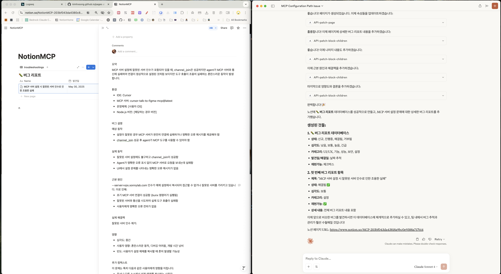

- #monorepo
	- id:: 68391387-3a36-41d7-bba0-6d7fcd4289f5
- #teamstudy
-
- #mcp
	- https://docs.cursor.com/context/model-context-protocol
	- 
	- MCP 서버 설정 이슈를 해결하고, 이를 Claude를 활용하여 [[mcp-server-config-issue]] 문서화 및 GitHub 블로그에 리포지토리에 커밋, 로컬에서는 git pull --rebase
	-
	- #network
		- 게이트웨이는 라우터의 인터페이스 IP, 라우터의 포트 IP.
		- 이 한문장으로 정리하는 걸 어째서 어려워했을까?
	-
	- #SQLD
		- SQL Server에서는 CREATE TABLE 문장도 TRANSACTON의 범주에 포함된다.
		- ORACLE에서는 DDL 문장의 수행은 내부적으로 트랜젝션을 종료(커밋)한다.
		- ROLLBACK 구문은 COMMIT되지 않은 상위의 모든 Transaction을 모두 rollback한다.
		- NOT > AND > OR
	-
	-