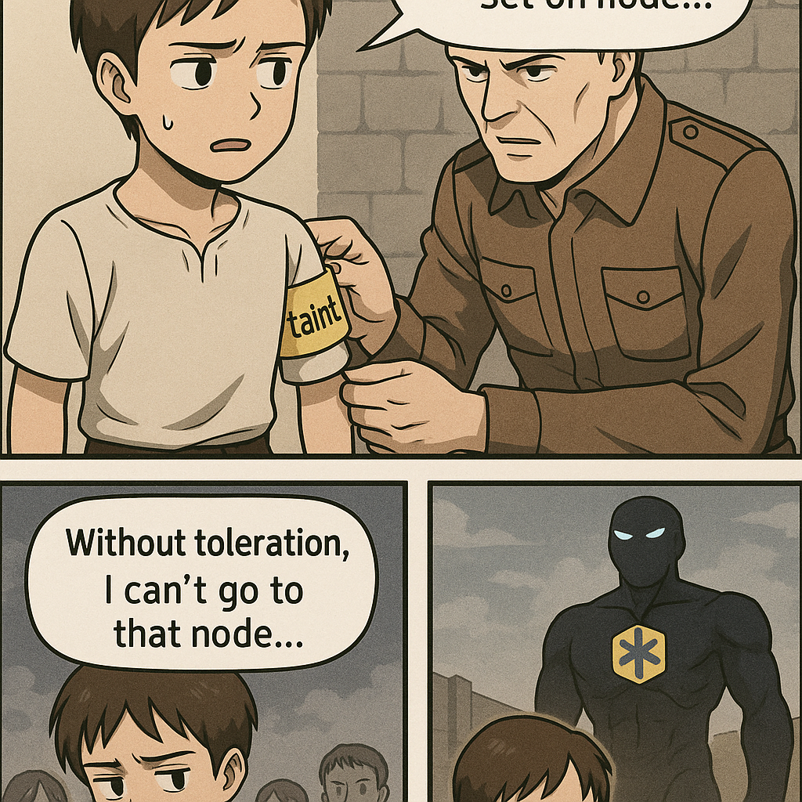

- [[yaml]]
- 도커 레지스트리에는 Dockerfile이 아니라, Dockerfile을 빌드해서 생성된 "이미지(=바이너리 형태의 실행 환경)"이 올라감.
- Dockerfile을 다운로드 받아서 로컬에서 빌드하는게 아님.
-
- #container #kubernetes
	- [[도커 컴포즈가 있는데 쿠버네티스 굳이 왜 써요?]]
	-
- #KodeKloud
	- kube-proxy는 두 개 있지만, 워커 노드가 있다는 증거는 아님. (노드 자체 정보를 보여주지 않음)
	- 워커노드에는 자동으로 스케줄러가 붙는건가?, 현재 pod에서는 kube-scheduler가 보이지 않는데, 워커노드를 추가하면 생기는건가? 워커노드 수에 상관없이 스케줄러는 하나만 필요한가? 1:1인가 아니면 1:n에 대응하여 스케일러블하게 늘어나는가?
	- kubectl get pods --selector env=dev --no-headers | wc -l
	- 띄어쓰기하면 오류 발생
		- controlplane ~ ➜  k get all --selector env=prod,bu=finance,tier=frontend
		  NAME              READY   STATUS    RESTARTS   AGE
		  pod/app-1-zzxdf   1/1     Running   0          21m
		- controlplane ~ ➜  k get all --selector env=prod, bu=finance, tier=frontend
		  error: name cannot be provided when a selector is specified
	- 메니페스토의 기본 구조, 리소스 분류
	- matchLabels는 쿠버네티스에서 **라벨 기반으로 리소스를 선택**할 때 쓰이는 필드인데, **Pod 자체가 아니라 Pod을 제어하거나 참조하는 리소스들에서** 주로 사용돼.
	- selector는 “이런 label을 가진 Po/d를 관리할 거야”라는 **조건 설정**이고
	- template.labels는 “이런 label을 가진 Pod를 새로 만들게요”라는 **실제 설정**
	- grep -i는 **대소문자를 구분하지 않고 문자열을 검색**할
- k taint
- *  A taint consists of a key, value, and effect. As an argument here, it is expressed as key=value:effect.
- Usage:
    kubectl taint NODE NAME KEY_1=VAL_1:TAINT_EFFECT_1 ... KEY_N=VAL_N:TAINT_EFFECT_N [options]
- **Node** 리소스에만 taint를 부여할 수 있다.
- > **“0/2 nodes are available: 1 node(s) had untolerated taint {node-role.kubernetes.io/control-plane: }, 1 node(s) had untolerated taint {spray: mortein}.”**
-
- `kubectl run`은 간단한 파드 생성에 특화되어 있어서 toleration, affinity 같은 고급 스케줄링 옵션은 YAML 파일을 통해서만 설정 가능하다.
- 
-
- 네, NoSchedule과 PreferNoSchedule은 **같은 키(key)에 대해 동시에 쓸 수는 없어요**.
- 즉, 한 노드에 동일한 node-role.kubernetes.io/control-plane 키로 NoSchedule과 PreferNoSchedule 두 가지 taint를 동시에 붙이는 건 불가능합니다.
-
-