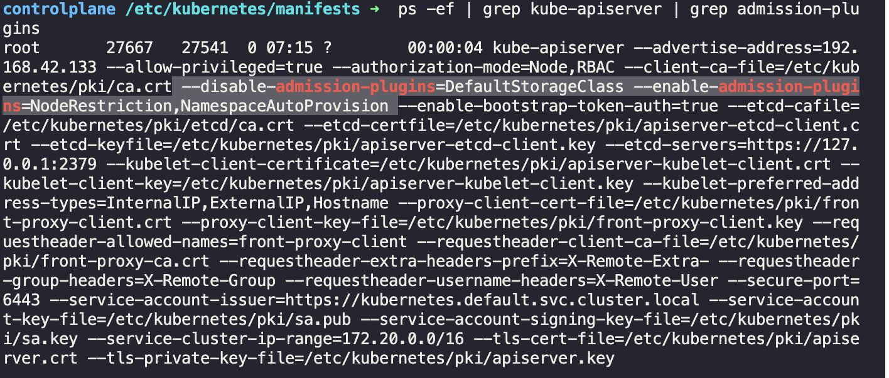

- #KodeKloud
	- You can compare the priority classes on both pods using the following command:
	- `kubectl get pods -o custom-columns="NAME:.metadata.name,PRIORITY:.spec.priorityClassName"``
	- https://kubernetes.io/docs/concepts/scheduling-eviction/pod-priority-preemption/
	- Metrics Server .
	- k apply -f https://github.com/kubernetes-sigs/metrics-server/releases/latest/download/components.yaml
		- URI 사용 가능
	- Addmision Controllers
		- 
		- 
	- Mutating and Validating Admission Controller
		- ```bash
		  controlplane ~ ✖ k create -n webhook-demo secret tls webhook-sever-tls --cert "/root/keys/webhook-server-tls.crt" --key "/root/keys/webhook-server-tls.key"
		  secret/webhook-sever-tls created
		  ```
-
-
-
-
- #cursor
	- v1.0
- #dev
	- calendar versioning
- #