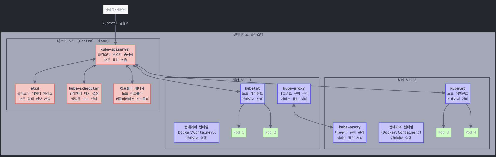

## 쿠버네티스의 기본 개념

쿠버네티스는 컨테이너화된 애플리케이션을 자동으로 배포, 확장 및 관리하기 위한 오픈소스 시스템입니다. 쉽게 이해하기 위해 배(船) 비유를 사용해 보겠습니다.
- ### 높은 수준의 아키텍처
  
  쿠버네티스 클러스터는 크게 두 종류의 노드로 구성됩니다:
- **마스터 노드(Master Node)** - 통제 선박
	- 전체 클러스터를 관리하고 제어하는 역할
	- 컨테이너가 어디에 배치될지 계획하고, 노드 정보 저장, 모니터링 등을 담당
- **워커 노드(Worker Node)** - 화물 선박
	- 실제로 컨테이너를 실행하는 노드
	- 애플리케이션 컨테이너가 이 노드 위에서 동작함
- ## 마스터 노드의 주요 구성 요소
- ### 1. etcd
- **역할**: 고가용성 키-값 저장소(데이터베이스)
- **기능**: 클러스터의 모든 상태 정보와 구성 데이터를 저장
- **비유**: 항구의 중앙 데이터베이스로, 모든 선박과 컨테이너의 정보를 관리
- ### 2. kube-scheduler
- **역할**: 컨테이너를 적절한 노드에 배치하는 결정을 담당
- **기능**: 노드의 자원 상태, 컨테이너의 요구사항, 정책 등을 고려하여 최적의 노드를 선택
- **비유**: 크레인 운영자로, 어떤 컨테이너를 어떤 배에 실을지 결정
- ### 3. 컨트롤러 매니저(Controller Manager)
- **역할**: 다양한 컨트롤러를 실행하여 클러스터 상태를 관리
- **주요 컨트롤러**:
	- **노드 컨트롤러**: 노드의 상태를 모니터링하고 관리
	- **레플리케이션 컨트롤러**: 원하는 수의 컨테이너가 항상 실행되도록 보장
- **비유**: 다양한 부서 사무실(운영팀, 화물팀 등)로, 각 부서가 특정 업무를 담당
- ### 4. kube-apiserver
- **역할**: 쿠버네티스 API를 제공하고 모든 작업의 중심점으로 작용
- **기능**: 사용자, 컨트롤러, 워커 노드 간의 통신을 조율
- **비유**: 중앙 관제 센터로, 모든 통신과 작업 조율을 담당
- ## 워커 노드의 주요 구성 요소
- ### 1. kubelet
- **역할**: 각 노드에서 실행되는 에이전트
- **기능**: kube-apiserver로부터 지시를 받아 컨테이너를 배포하거나 제거하고 상태 보고
- **비유**: 선박의 선장으로, 화물선에서 컨테이너 관리를 담당
- ### 2. kube-proxy
- **역할**: 네트워크 규칙을 관리하여 노드 간 통신을 가능하게 함
- **기능**: 서비스 간의 네트워크 통신을 처리
- **비유**: 선박 간 통신 시스템으로, 다른 배에 있는 컨테이너 간 통신을 가능하게 함
- ### 3. 컨테이너 런타임
- **역할**: 컨테이너를 실행하는 소프트웨어
- **예시**: Docker, ContainerD, Rocket 등
- **요구사항**: 모든 노드(마스터 및 워커)에 설치 필요
- ## 작동 방식 요약
- 사용자가 kube-apiserver에 애플리케이션 배포 요청을 보냄
- kube-scheduler가 적절한 워커 노드를 선택
- kubelet이 해당 워커 노드에서 컨테이너를 실행
- 컨트롤러들이 지속적으로 상태를 모니터링하고 관리
- etcd가 클러스터의 모든 상태 정보를 저장
- kube-proxy가 컨테이너 간 통신을 가능하게 함
-
- {:height 256, :width 780}
-