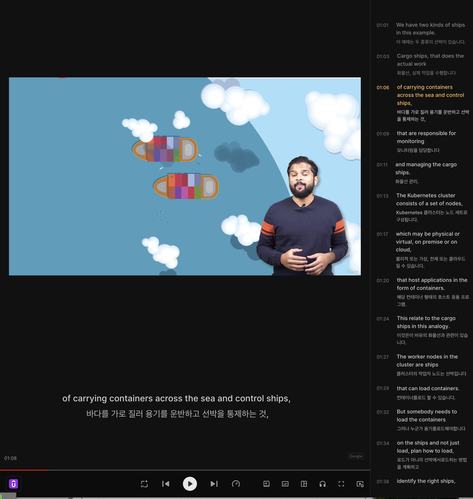
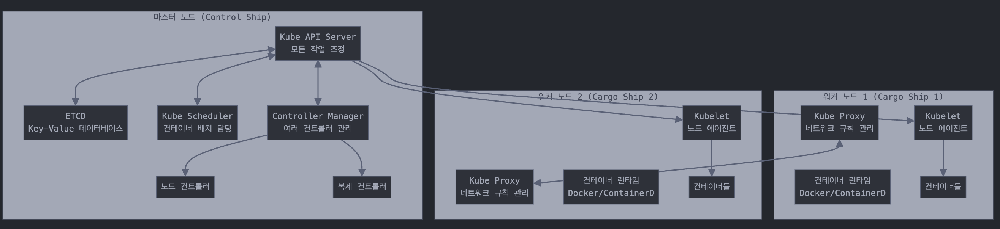
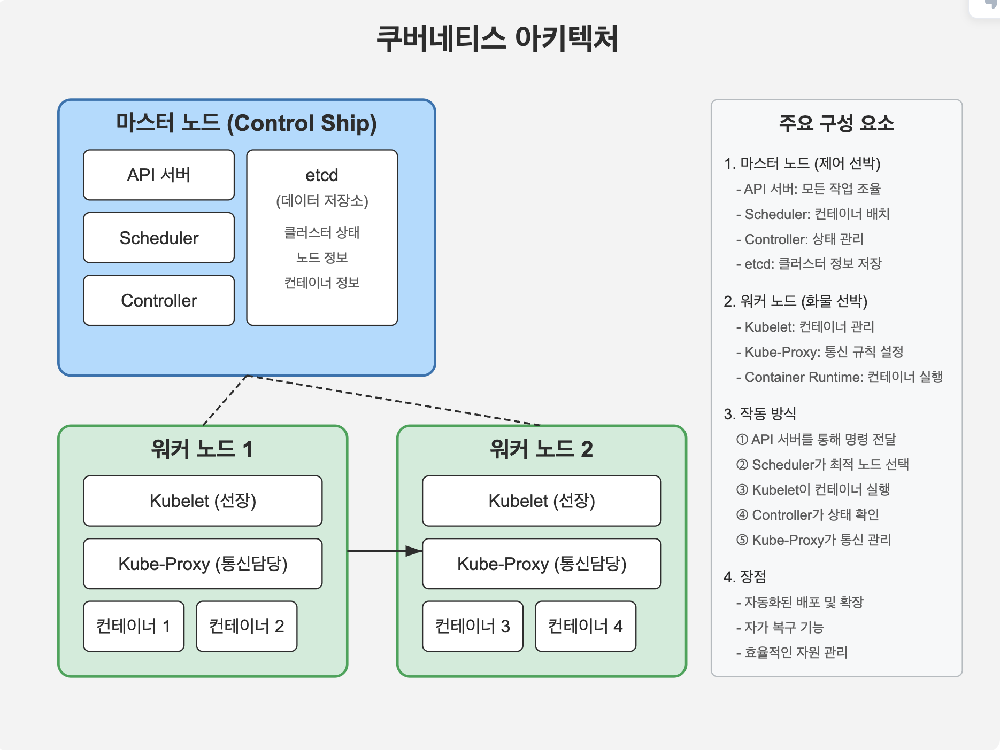

-
- 쿠버네티스 클러스터를 설계, 빌드, 관리
- 첫 번째 시도를 통과하지 못하면 12개월 안에 무료로 한 번 더 시도할 수 있다.
-
- Here are some helpful references:
	- [**Certified Kubernetes Administrator (CKA) official info**](https://www.cncf.io/certification/cka/)
	- [**Exam Curriculum (Topics)**](https://github.com/cncf/curriculum)
	- [**Candidate Handbook**](https://www.cncf.io/certification/candidate-handbook)
	- [**Exam Tips**](http://training.linuxfoundation.org/go//Important-Tips-CKA-CKAD)
	- https://kodekloud.com/pages/community
	- https://github.com/kodekloudhub/certified-kubernetes-administrator-course?tab=readme-ov-file
-
- ✅ Do’s (할 수 있는 것):
  •	강의에서 다룬 주제에 대해 질문하고 궁금한 점을 해결하세요.
  •	실습 활동(Lab Activities) 해결에 도움을 요청하세요.
  •	다른 학습자들과 함께 스터디 그룹을 만들어 학습하세요.
- ⸻
- 🚫 Don’ts (하지 말아야 할 것):
  •	시험과 관련된 질문은 하지 마세요:
  •	실제 시험에 어떤 문제가 나오는지 질문하기
  •	특정 주제가 시험에 포함되는지 질문하기
  •	특정 주제에 어떤 유형의 문제가 나오는지 질문하기
  •	시험 문제의 정답을 묻거나 공유하기
  •	시험의 채점 방식(부분 점수 여부 등)에 대해 질문하기
  •	CNCF FAQ에 명시되지 않은 시험 환경에 대한 질문하기
  •	시험 중 특정 도구 또는 유틸리티의 사용 가능 여부 묻기
  •	시험 중 특정 작업을 수행하는지 묻기
-
- Trancy 를 사용하면 한/영 동시에 볼 수 있다.
	- https://docs.google.com/document/d/1opfPw9rRbYsIB2eU9mJl1YwcElOnOOo5J3-Mp8Gd4fw/edit?tab=t.nxs954bwsod6
	- 
-
- 
-
- 
-
- Claude Says..
	- # 쿠버네티스 아키텍처 시각화 및 설명
	  
	  쿠버네티스 아키텍처를 이해하기 쉽게 시각화하고 설명해 드리겠습니다. 클라우드 네이티브를 처음 접하는 분들을 위해 개념을 단순화하여 설명하겠습니다.
	- ## 쿠버네티스란?
	  
	  쿠버네티스는 컨테이너화된 애플리케이션을 자동으로 배포, 확장 및 관리하는 오픈소스 플랫폼입니다. 쉽게 말해, 애플리케이션을 담은 컨테이너들을 효율적으로 관리해주는 시스템입니다.
	- ## 쿠버네티스 아키텍처: 선박 비유를 통한 이해
	  
	  강의에서는 쿠버네티스를 이해하기 위해 '선박' 비유를 사용했습니다. 이 비유를 통해 쿠버네티스의 구조를 살펴보겠습니다.
	- ## 쿠버네티스 아키텍처 구성 요소
	- ### 1. 마스터 노드 (Control Ship)
	  
	  마스터 노드는 컨트롤 플레인이라고도 하며, 쿠버네티스 클러스터 전체를 관리하는 중앙 통제 시스템입니다. 비유하자면 화물선들을 관리하는 '통제 선박'과 같습니다.
	  
	  **주요 구성 요소:**
	- **etcd**: 모든 클러스터 데이터를 저장하는 데이터베이스입니다. 선박 정보, 컨테이너 위치, 로드 시간 등을 기록하는 저장소와 같습니다.
	- **API 서버(kube-apiserver)**: 모든 작업을 조율하는 핵심 구성요소입니다. 클러스터의 게이트웨이 역할을 하며, 모든 통신이 여기를 통과합니다.
	- **스케줄러(kube-scheduler)**: 새로운 컨테이너를 어떤 노드에 배치할지 결정합니다. 비유하자면, 화물(컨테이너)을 적재할 적절한 선박을 찾는 크레인과 같습니다.
	- **컨트롤러 매니저(kube-controller-manager)**: 다양한 컨트롤러를 실행하는 구성요소입니다.
		- 노드 컨트롤러: 노드 관리
		- 레플리케이션 컨트롤러: 컨테이너의 적정 개수 유지
		- 기타 여러 관리 컨트롤러들
	- ### 2. 워커 노드 (Cargo Ship)
	  
	  워커 노드는 실제로 컨테이너를 실행하는 시스템으로, 선박 비유에서는 '화물선'에 해당합니다.
	  
	  **주요 구성 요소:**
	- **Kubelet**: 각 노드에서 실행되는 에이전트로, 마스터 노드의 지시를 받아 컨테이너를 관리합니다. 선박의 '선장'과 같은 역할을 합니다.
	- **Kube-proxy**: 노드 간의 네트워크 통신을 관리합니다. 컨테이너 간 통신을 가능하게 하는 규칙을 설정합니다.
	- **컨테이너 런타임**: 컨테이너를 실행하는 소프트웨어입니다. 도커(Docker)가 가장 유명하지만, ContainerD, Rocket 등 다른 런타임도 지원합니다.
	- ## 쿠버네티스가 작동하는 방식
	- **사용자 명령 전달**: 사용자가 API 서버에 명령을 전달합니다 (예: "웹 서버 3개 실행해줘").
	- **스케줄링**: 스케줄러는 각 컨테이너를 실행하기에 적합한 워커 노드를 선택합니다.
	- **컨테이너 실행**: 선택된 워커 노드의 Kubelet이 컨테이너를 실행합니다.
	- **상태 모니터링**: 컨트롤러는 지속적으로 클러스터의 상태를 모니터링하고, 필요한 경우 조치를 취합니다.
	- **네트워크 통신**: Kube-proxy는 컨테이너 간 통신을 가능하게 합니다.
	- ## 초보자를 위한 쿠버네티스 이해하기
	- ### 쿠버네티스란 결국...
	- **자동화된 컨테이너 관리 시스템**입니다
	- 애플리케이션을 손쉽게 배포하고 확장할 수 있게 해줍니다
	- 장애가 발생해도 자동으로 복구되는 자가 복구 기능을 제공합니다
	- 컨테이너 간 통신을 쉽게 할 수 있도록 도와줍니다
	- ### 실생활 비유로 쿠버네티스 이해하기
	  
	  쿠버네티스를 **레스토랑**에 비유해볼 수 있습니다:
	- **마스터 노드**: 레스토랑 매니저와 예약 시스템
		- API 서버: 매니저이자 모든 직원들의 중심 소통 창구
		- etcd: 레스토랑 예약 기록부
		- 스케줄러: 손님을 적절한 테이블에 안내하는 역할
		- 컨트롤러: 각종 문제 상황을 처리하는 매니저
	- **워커 노드**: 실제 음식이 제공되는 테이블과 주방
		- Kubelet: 각 테이블을 관리하는 서빙 직원
		- 컨테이너: 손님이 주문한 실제 음식
		- Kube-proxy: 주방과 테이블 간의 소통을 담당하는 시스템
	- ## 쿠버네티스의 장점
	- **확장성**: 트래픽이 증가하면 자동으로 애플리케이션 인스턴스를 증가시킬 수 있습니다.
	- **자가 복구**: 장애가 발생하면 자동으로 새로운, 건강한 컨테이너로 대체합니다.
	- **로드 밸런싱**: 트래픽을 여러 컨테이너에 분산시킵니다.
	- **롤링 업데이트**: 서비스 중단 없이 애플리케이션을 업데이트할 수 있습니다.
	- **자원 효율성**: 하드웨어 자원을 효율적으로 사용할 수 있습니다.
	  
	  이제 클라우드 네이티브를 이제 막 배우시는 분들도 쿠버네티스의 기본 아키텍처와 작동 방식을 이해하셨을 것입니다. 더 자세히 알고 싶은 부분이 있으시면 말씀해 주세요!
-
	- # 컨테이너 런타임과 Kubernetes의 관계 설명
	  
	  도커(Docker)와 Containerd, 그리고 Kubernetes의 관계를 클라우드 네이티브 초보자를 위해 시각화하고 설명해 드리겠습니다.
	- ## 컨테이너 기술의 진화와 Kubernetes의 관계
	- ### 1. 컨테이너 런타임의 역사
	- #### 초기 단계: Docker 중심 시대
	  
	  처음에는 Docker만 있었습니다. Docker는 컨테이너 기술을 사용하기 쉽게 만들어 대중화시켰습니다.
	- Docker는 단순한 컨테이너 런타임이 아닌 여러 도구의 모음이었습니다:
		- Docker CLI: 사용자가 명령어를 입력하는 인터페이스
		- Docker API: 프로그램이 Docker와 통신하는 방법
		- Containerd: Docker의 내부 구성요소로, 컨테이너 관리 담당
		- runC: 실제 컨테이너를 실행하는 저수준 런타임
		- 기타: 이미지 빌드 도구, 볼륨 관리, 보안 등
	- 초기 Kubernetes는 Docker만 지원했습니다:
		- Kubernetes와 Docker는 밀접하게 통합되어 있었습니다
		- 다른 컨테이너 런타임은 지원되지 않았습니다
	- #### 중간 단계: CRI(Container Runtime Interface) 도입
	  
	  Kubernetes가 인기를 얻으면서, Docker 외에 다른 컨테이너 런타임도 지원할 필요성이 생겼습니다.
	- CRI(Container Runtime Interface)가 도입되었습니다:
		- 모든 컨테이너 런타임이 Kubernetes와 통합될 수 있는 표준 인터페이스
		- OCI(Open Container Initiative) 표준을 따르는 런타임은 누구나 사용 가능
	- 하지만 문제가 있었습니다:
		- Docker는 CRI를 지원하지 않았습니다 (Docker가 먼저 개발되었기 때문)
		- 하지만 Docker는 이미 널리 사용되고 있었습니다
	- 임시 해결책:
		- Kubernetes는 'dockershim'이라는 임시 방편을 만들었습니다
		- dockershim은 Docker와 Kubernetes 사이의 다리 역할을 했습니다
	- #### 현재: Containerd의 독립과 Docker 지원 중단
	  
	  시간이 지나면서 Docker의 내부 구성요소였던 Containerd가 독립했습니다.
	- Containerd의 독립:
		- 원래 Docker의 일부였던 Containerd가 독립적인 프로젝트가 되었습니다
		- CNCF(Cloud Native Computing Foundation)의 정식 프로젝트로 승격
		- CRI 표준을 완벽히 지원합니다
	- Kubernetes 1.24 이후 변화:
		- dockershim 유지보수가 부담되어 Kubernetes 1.24부터 제거되었습니다
		- Docker는 더 이상 Kubernetes의 공식 런타임으로 직접 지원되지 않습니다
		- Containerd가 권장되는 런타임이 되었습니다
	- 중요한 점:
		- Docker로 만든 이미지는 계속 작동합니다 (OCI 표준을 따르기 때문)
		- Docker를 사용하여 이미지 빌드는 계속 가능합니다
		- 단지 Kubernetes 클러스터에서 컨테이너를 실행할 때 Docker 대신 Containerd를 사용합니다
	- ### 2. 컨테이너 관련 CLI 도구 비교
	  
	  클라우드 네이티브 환경에서 컨테이너를 다루기 위한 여러 CLI 도구들이 있습니다:
	- #### 1. Docker CLI
	- 목적: 일반적인 컨테이너 관리
	- 특징: 사용자 친화적이고 기능이 풍부함
	- 용도: 개발 환경에서 컨테이너 빌드 및 테스트
	- 예시: `docker run`, `docker build`, `docker ps`
	- #### 2. Containerd 관련 도구
	  
	  **ctr**
	- 목적: Containerd 디버깅 전용
	- 특징: 기능이 제한적이고 사용자 친화적이지 않음
	- 용도: Containerd 문제 해결 시에만 사용
	- 예시: `ctr images pull`, `ctr run`
	  
	  **nerdctl**
	- 목적: Docker CLI와 유사한 사용자 친화적인 인터페이스
	- 특징: Docker 명령어와 매우 유사하며 호환성 높음
	- 용도: Docker 대체로 일상적인 컨테이너 관리
	- 예시: `nerdctl run`, `nerdctl ps` (Docker 명령어와 거의 동일)
	- #### 3. Kubernetes 관련 도구
	  
	  **crictl**
	- 목적: Kubernetes 관점에서 컨테이너 디버깅
	- 특징: CRI 호환 런타임과 모두 호환됨
	- 용도: Kubernetes 클러스터에서 컨테이너 문제 해결
	- 예시: `crictl ps`, `crictl logs`, `crictl exec`
	- 주의사항: 컨테이너 생성 용도가 아닌 디버깅 용도로만 사용해야 함
	- ### 3. 초보자를 위한 쉬운 정리
	- #### Docker vs Containerd를 이해하는 비유
	  
	  **식당 비유로 이해하기:**
	- **Docker**: 전체 레스토랑 경험
		- 메뉴판 (CLI): 손님이 주문하는 인터페이스
		- 주방장 (Containerd): 실제 요리 담당
		- 요리사 (runC): 음식 조리 담당
		- 홀 서빙, 예약, 결제 등 (기타 기능): 추가 서비스
	- **Containerd**: 주방만 있는 식당
		- 기본 주문서 (ctr): 주방에 직접 주문하는 기본 방식
		- 친절한 주문서 (nerdctl): 메뉴판과 유사하게 만든 주문 방식
		- 주방 감독관 (crictl): 레스토랑 체인 관리자가 주방을 검사할 때 사용
	- #### 클라우드 네이티브 초보자가 알아야 할 핵심 포인트
	- **Docker는 여전히 유용합니다**:
		- 개발 환경에서 이미지 빌드 및 테스트용으로 계속 사용 가능
		- 사용자 친화적인 인터페이스로 컨테이너 학습에 좋음
	- **Kubernetes 환경에서는 Containerd가 표준입니다**:
		- Kubernetes 1.24 이후 Docker 대신 Containerd 사용
		- Docker로 만든 이미지는 문제없이 계속 사용 가능
	- **CLI 도구 선택 가이드**:
		- 일반적인 컨테이너 작업: Docker 또는 nerdctl 사용
		- Kubernetes 클러스터 디버깅: crictl 사용
		- Containerd 자체 디버깅: ctr 사용 (거의 사용할 일 없음)
	- **OCI 표준이 핵심입니다**:
		- OCI 덕분에 다양한 도구로 만든 이미지가 서로 호환됨
		- 이미지 빌드는 Docker로, 실행은 Containerd로 하는 조합 가능
	- ### 4. 실무적인 팁
	- **Docker에서 Containerd로 이전하기**:
		- Docker: `docker run -p 8080:80 nginx`
		- nerdctl: `nerdctl run -p 8080:80 nginx` (거의 동일)
	- **Kubernetes 클러스터 디버깅**:
		- 예전: `docker ps`, `docker logs <container-id>`
		- 지금: `crictl ps`, `crictl logs <container-id>`
	- **기억할 점**:
		- Docker로 컨테이너를 빌드해도 Kubernetes/Containerd에서 문제없이 실행됩니다
		- nerdctl은 Docker의 대체제로 사용하기 가장 좋은 도구입니다
		- crictl은 디버깅 목적으로만 사용해야 합니다 (kubelet이 관리하지 않는 컨테이너를 생성하면 삭제됨)
		  
		  클라우드 네이티브 세계에서 컨테이너는 계속 발전하고 있습니다. 처음에는 복잡해 보일 수 있지만, 기본 개념을 이해하면 다양한 도구를 상황에 맞게 선택하여 사용할 수 있습니다.
		  
		  더 자세한 내용이나 특정 부분에 대한 추가 설명이 필요하시면 말씀해 주세요!
-
-
-