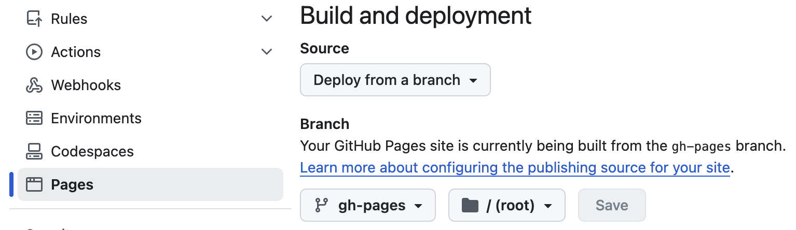

### **🌐 Logseq 배포 자동화 및 GitHub Pages 설정**
- Logseq에서 ‘그래프 내보내기’ 또는 ‘사이트 내보내기’를 통해 배포가 가능하지만, **새로운 파일이 생성될 때마다 반복적으로 내보내기 작업을 수행해야 하는 불편함**이 있다.
- 이 문제를 해결해주는 것이 바로 **logseq/publish-spa**.
- ---
- ### **✅ GitHub Pages와 연동하기**
- **GitHub 블로그** → $USERNAME.github.io 리포지토리 생성
- **Actions 탭** → 기존에 설정된 워크플로우가 있다면 **삭제**
- **New Workflow 생성** → 마켓플레이스에서 logseq/publish-spa 검색
- **Settings 탭** → Pages에서 Branch 설정을 적절하게 수정하기
	- 
	- **gh-pages** 는 깃헙 액션을 통한 배포과정에서 생성된 브랜치.
- ---
- ### **✅  주의할 점**
- 마켓플레이스에 제공된 스니펫만으로는 워크플로우가 정상 작동하지 않을 수 있음
- **기존 워크플로우 파일이 없다면**, $USERNAME.github.io 리포지토리로 이동하여, 예시로 작성된 publish.yml을 참고하여 워크플로우 파일을 구성하기.
	-
	- ```
	  on: [push]
	  
	  permissions:
	    contents: write
	  jobs:
	    test:
	      runs-on: ubuntu-latest
	      name: Publish Logseq graph
	      steps:
	        - uses: actions/checkout@v4
	        - uses: logseq/publish-spa@v0.3.0
	        - name: Add a nojekyll file # to make sure asset paths are correctly identified
	          run: touch $GITHUB_WORKSPACE/www/.nojekyll
	        - name: Deploy 🚀
	          uses: JamesIves/github-pages-deploy-action@v4
	          with:
	            folder: www
	  ```
-
- [kimhxsong.github.io](https://github.com/kimhxsong/kimhxsong.github.io)
-