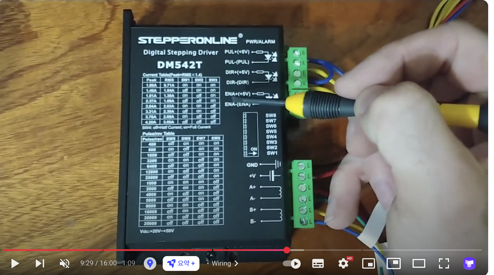
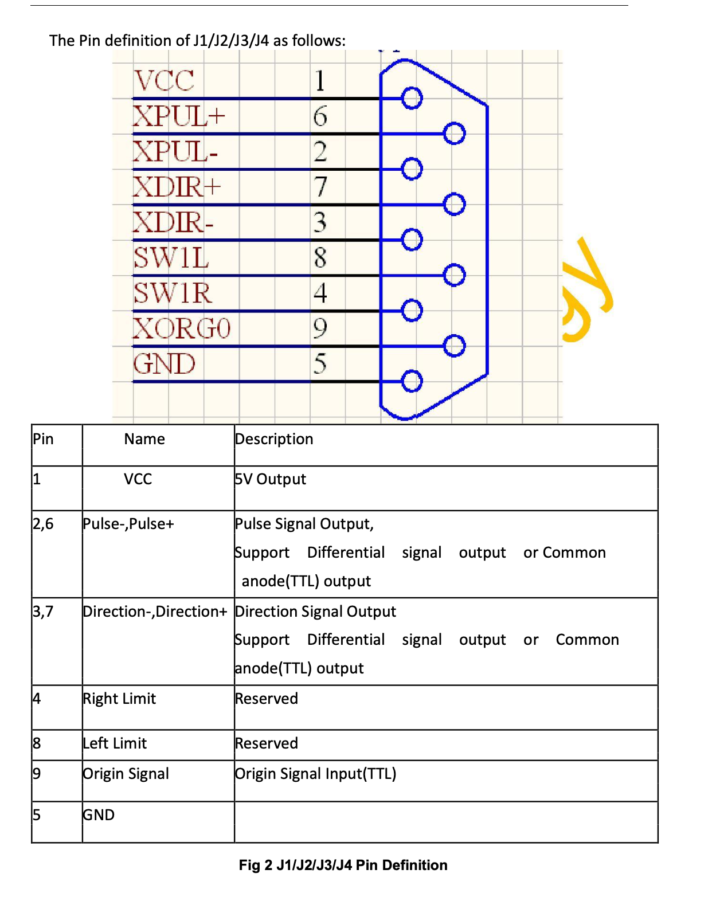
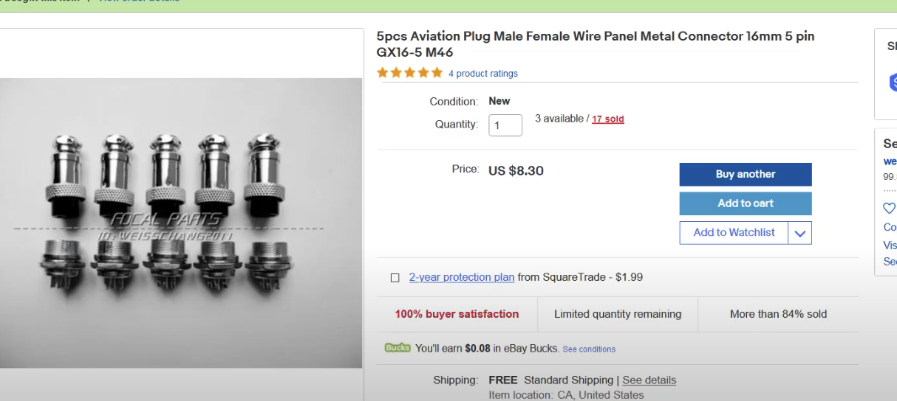
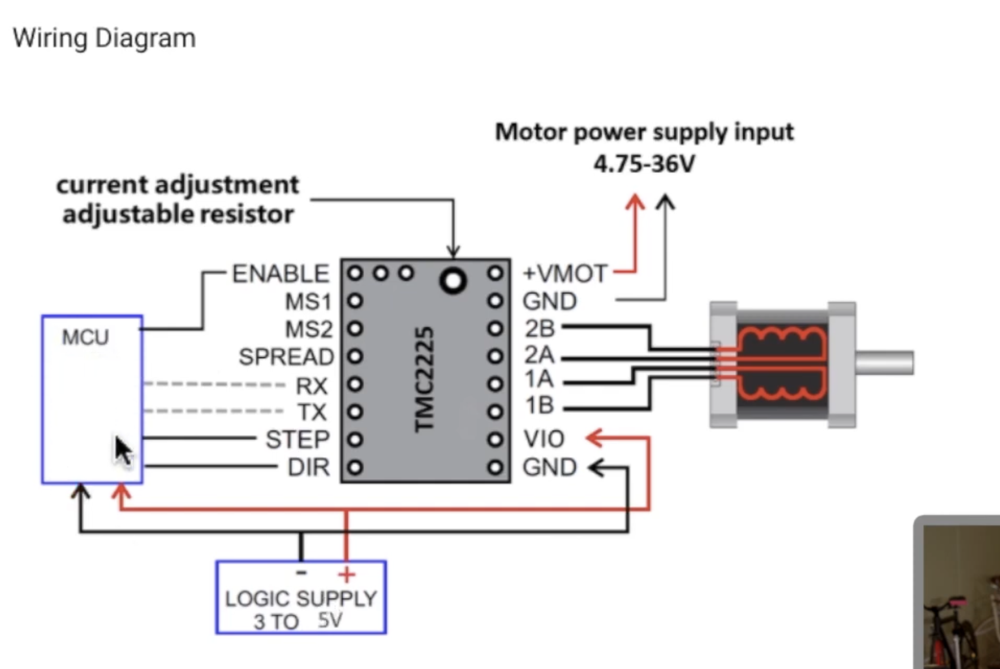

-
- 
-
- {{video https://youtu.be/WLFyXvxH62I}}
- 
- https://www.omc-stepperonline.com/ko/nema-17-23-24-%EC%8A%A4%ED%85%8C%ED%8D%BC-%EB%AA%A8%ED%84%B0%EC%9A%A9-%EB%94%94%EC%A7%80%ED%84%B8-%EC%8A%A4%ED%85%8C%ED%8D%BC-%EB%93%9C%EB%9D%BC%EC%9D%B4%EB%B2%84-1-0-4-2a-20-50vdc-dm542t?srsltid=AfmBOooYEUJvy8VlWUdoJeJ77JbHXMGqU7zv9sK5SE9NT23kMSQnPDwV
-
-
- 
- 
- 와이어링 신호를 보면 .... 이게 좀 다른데 이게 컨트롤보드에 의존적으로 모터드라이브의 형태도 달라지는 것인지 알아볼 필요가 있을 것 같기도 하다.
- 추가한다면 5C, 6C