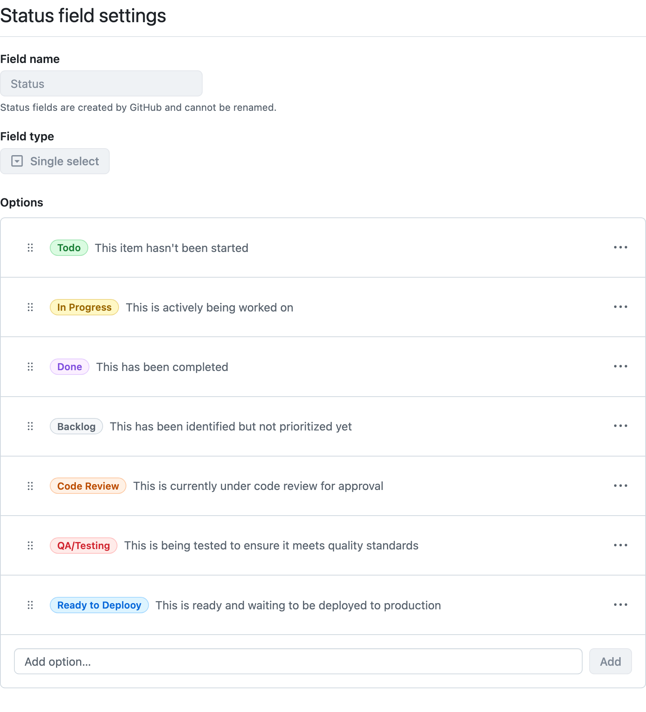
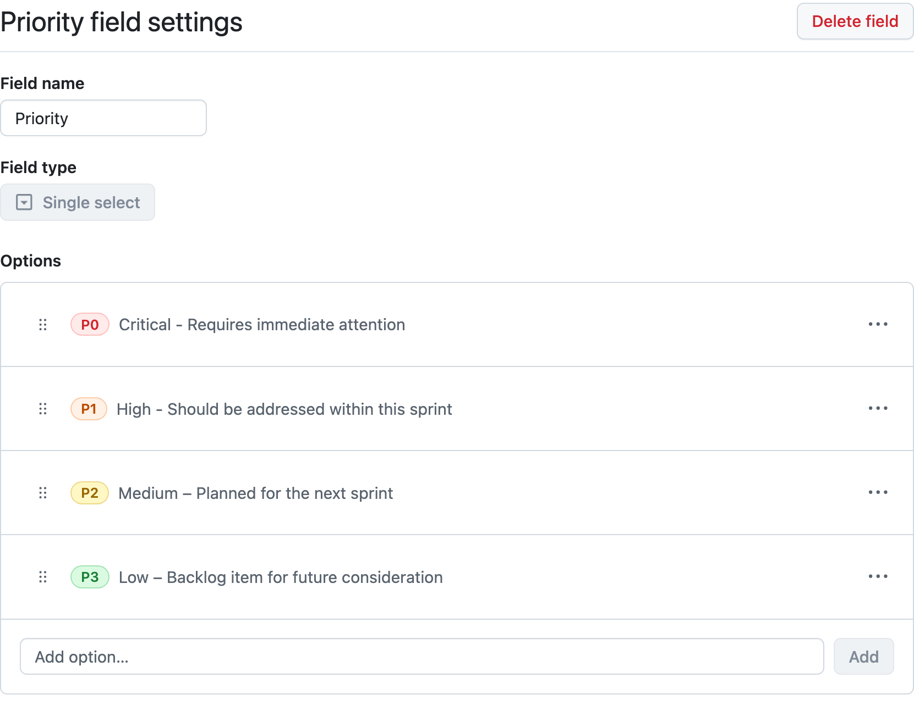
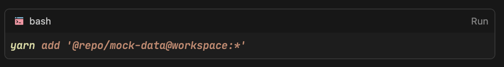
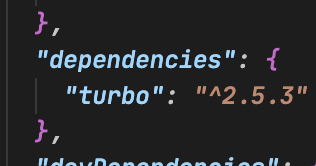

- 
-
-
- #Github Issues
	- [Linking a pull request to an issue](https://docs.github.com/en/issues/tracking-your-work-with-issues/using-issues/linking-a-pull-request-to-an-issue)
-
- #Github Projects
	- 
	- 
- #TroubleShooting
	- 
	-
	- ```bash
	  (base) ➜  web git:(main) ✗ yarn explain peer-requirements p329e2
	  Package @repo/eslint-config@workspace:packages/eslint-config is requested to provide turbo by its descendants
	  
	  @repo/eslint-config@workspace:packages/eslint-config
	  └─ eslint-plugin-turbo@npm:2.5.3 [27737] (via >2.0.0)
	  
	  ✘ Package @repo/eslint-config@workspace:packages/eslint-config does not provide turbo.
	  ```
		- 
	-
	- **React Hydration Mismatch**
	- 1. 문제 상황
		- **발생 시점**: Next.js 애플리케이션 실행 중
		- **에러 메시지**: React hydration mismatch 경고
		- **영향 범위**: `html` 및 `body` 태그의 속성 불일치
	- 2. 에러 상세 내용
		- ```
		  Error: A tree hydrated but some attributes of the server rendered HTML didn't match the client properties.
		  ```
		- 불일치 발생 요소:
			- `html` 태그: `data-be-installed="true"` 속성 불일치
			- `body` 태그: `data-liner-extension-version="7.16.8"` 속성 불일치
	- 3. 원인 분석
		- 1. **브라우저 확장 프로그램 간섭**
			- Liner 확장 프로그램이 서버 렌더링 후, 클라이언트 hydration 전에 DOM을 수정
			- 확장 프로그램이 자체 속성을 HTML 요소에 추가
		- 2. **렌더링 타이밍 이슈**
			- 서버 사이드 렌더링(SSR)과 클라이언트 사이드 렌더링(CSR) 사이의 불일치
			- 확장 프로그램이 중간에 DOM을 수정하여 발생하는 문제
	- 4. 해결 방법
		- 적용된 수정사항
			- ```typescript
			  // alsosandwich/apps/web/app/layout.tsx
			  export default function RootLayout({
			  children,
			  }: Readonly<{
			  children: React.ReactNode;
			  }>) {
			  return (
			    <html lang="en" suppressHydrationWarning>
			      <body className={`${geistSans.variable} ${geistMono.variable}`} suppressHydrationWarning>
			        {children}
			      </body>
			    </html>
			  );
			  }
			  ```
		- 해결 방식 설명
		- `suppressHydrationWarning` 속성 추가
			- `html` 및 `body` 태그에 적용
			- React에게 해당 요소들의 hydration 불일치를 무시하도록 지시
	- 5. 해결 결과
		- ✅ hydration 불일치 경고 메시지 제거
		- ✅ 애플리케이션 정상 작동 유지
		- ✅ 브라우저 확장 프로그램 기능 정상 작동
	- 6. 예방 조치
		- 1. **브라우저 확장 프로그램 관리**
			- 개발 시 불필요한 확장 프로그램 비활성화 고려
			- 확장 프로그램으로 인한 DOM 수정 가능성 인지
		- 2. **코드 품질 관리**
			- `suppressHydrationWarning` 사용 시 주의사항 문서화
			- hydration 관련 이슈 발생 시 즉시 대응 가능한 모니터링 체계 구축
	- 7. 참고 자료
		- [React Hydration Mismatch 공식 문서](https://react.dev/link/hydration-mismatch)
		- Next.js SSR/CSR 렌더링 프로세스 문서
-
- #SQL마스터클래스
	- ### 16. DCL
	- 16.0 Introduction
		- SQLite는 DCL이 없다. username도, password도 로그인하는 서버도 전부 없으니까
	- 16.1 Users
		- ```sql
		  CREATE ROLE marketer WITH login password 'marketing4ever'
		  
		  GRANT SELECT/*READ*/, INSERT, UPDATE/*WRITE*/ ON movies TO marketer;
		  
		  GRANT SELECT ON ALL TABLES INSERT SCHEMA PUBLIC
		  ```
		-
- #자격증
	- TODO #SQLD
	  collapsed:: true
		- 시험: 5.31
	- TODO #CKA
	  collapsed:: true
		- $395
		- 시험 예약 및 일정 조정
	- TODO #AWSSAA
	  collapsed:: true
		- $150
		- 시험 예약 및 일정 조정
	- TODO #리눅스마스터 1급
	  collapsed:: true
		- 1차 접수: 7.28 - 8.8, ₩55,000
		- 1차 시험: 9.13
		- 1차 발표: 10.3
		- 2차 접수: 10.6 - 10.17, ₩77,000
		- 2차 시험: 11.8
		- 2차 발표: 11.28
	- #빅데이터분석기사
	  collapsed:: true
		- 필기 접수: 8.4 - 8.8, ₩30,000
		- 필기 시험: 9.6
		- 실기 접수: 10.27 - 10.31, ₩50,000
		- 실기 시험: 11.29
	- #PCCP
	  collapsed:: true
		- 매달, 중하순, 일요일, ₩50,000원
	- #PCSQL
	  collapsed:: true
		- 3개월 마다, 중하순, 일요일, ₩50,000원
		- 접수: ~8.20
		- 시험: 8.24
	- #NCP
	  collapsed:: true
		- ₩50,000 X 3 = ₩150,000
		- 매주 월요일 오전 10시(화, 수, 목)
		-
		-