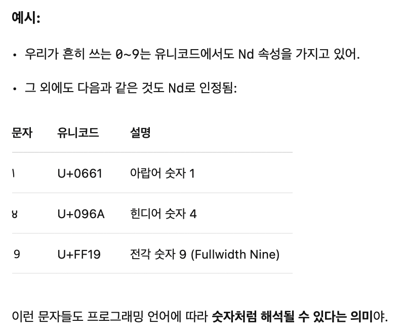
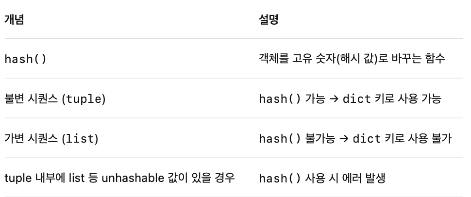

# Python Standard Libaray (v3.12.10)
- [Built-in Types](https://docs.python.org/3.12/library/stdtypes.html#)
	- DONE [Truth Value Testing](https://docs.python.org/3.12/library/stdtypes.html#truth-value-testing)
	  :LOGBOOK:
	  CLOCK: [2025-05-21 Wed 11:28:01]--[2025-05-21 Wed 11:28:02] =>  00:00:01
	  :END:
	- DONE [Boolean Operations — and, or, not](https://docs.python.org/3.12/library/stdtypes.html#boolean-operations-and-or-not)
		- > **Notes:** 
		  1. This is a short-circuit operator, so it only evaluates the second argument if the first one is false.
		  2. This is a short-circuit operator, so it only evaluates the second argument if the first one is true.
		  3. `not` has a lower priority than non-Boolean operators, so `not a == b` is interpreted as `not (a == b)`, and `a == not b` is a syntax error.
	- DONE [Comparisons](https://docs.python.org/3.12/library/stdtypes.html#comparisons)
	  :LOGBOOK:
	  CLOCK: [2025-05-21 Wed 11:28:12]--[2025-05-21 Wed 11:28:12] =>  00:00:00
	  :END:
		- >| Operation | Meaning |
		  | ---- | ---- | ---- |
		  | < | strictly less than |
		  | <= | less than or equal |
		  | > | strictly greater than |
		  | >= | greater than or equal |
		  | == | equal |
		  | != | not equal |
		  | **is** | object identity |
		  | **is not** | negated object identity |
	- DONE [Numeric Types — int, float, complex](https://docs.python.org/3.12/library/stdtypes.html#numeric-types-int-float-complex)
	  :LOGBOOK:
	  CLOCK: [2025-05-21 Wed 11:39:13]--[2025-05-21 Wed 11:39:13] =>  00:00:00
	  :END:
		- There are three distinct numeric types: *integers*, *floating-point numbers*, and *complex numbers*. In addition, Booleans are a subtype of integers. Integers have unlimited precision. Floating-point numbers are usually implemented using double in C;
		- | Operation | Result | Notes | Full documentation |
		  | ---- | ---- | ---- |
		  | x + y | sum of *x* and *y* |  |  |
		  | x - y | difference of *x* and *y* |  |  |
		  | x * y | product of *x* and *y* |  |  |
		  | x / y | quotient of *x* and *y* |  |  |
		  | x // y | floored quotient of *x* and *y* | (1)(2) |  |
		  | x % y | remainder of x / y | (2) |  |
		  | -x | *x* negated |  |  |
		  | +x | *x* unchanged |  |  |
		  | abs(x) | absolute value or magnitude of *x* |  | [abs()](https://docs.python.org/3.12/library/functions.html#abs) |
		  | int(x) | *x* converted to integer | (3)(6) | [int()](https://docs.python.org/3.12/library/functions.html#int) |
		  | float(x) | *x* converted to floating point | (4)(6) | [float()](https://docs.python.org/3.12/library/functions.html#float) |
		  | complex(re, im) | a complex number with real part *re*, imaginary part *im*. *im* defaults to zero. | (6) | [complex()](https://docs.python.org/3.12/library/functions.html#complex) |
		  | c.conjugate() | conjugate of the complex number *c* |  |  |
		  | **divmod(x, y)** | **the pair (x // y, x % y)** | (2) | [divmod()](https://docs.python.org/3.12/library/functions.html#divmod) |
		  | pow(x, y) | *x* to the power *y* | (5) | [pow()](https://docs.python.org/3.12/library/functions.html#pow) |
		  | **x \*\* y** | *x* to the power *y* | (5) |  |
		- > **Notes:**
		  4. float also accepts the strings “nan” and “inf” with an optional prefix “+” or “-” for Not a Number (NaN) and positive or negative infinity.
		  5. Python defines pow(0, 0) and 0 ** 0 to be 1, as is common for programming languages. 
		  6. The numeric literals accepted include the digits 0 to 9 or any Unicode equivalent (code points with the Nd property).
		  {:height 360, :width 375}
		- All [numbers.Real](https://docs.python.org/3.12/library/numbers.html#numbers.Real) types ([int](https://docs.python.org/3.12/library/functions.html#int) and [float](https://docs.python.org/3.12/library/functions.html#float)) also include the following operations:
		  | Operation | Result |
		  | ---- | ---- | ---- |
		  | [math.trunc(x)](https://docs.python.org/3.12/library/math.html#math.trunc) | *x* truncated to [Integral](https://docs.python.org/3.12/library/numbers.html#numbers.Integral) |
		  | [round(x[, n])](https://docs.python.org/3.12/library/functions.html#round) | *x* rounded to *n* digits, rounding half to even. If *n* is omitted, it defaults to 0. |
		  | [math.floor(x)](https://docs.python.org/3.12/library/math.html#math.floor) | the greatest [Integral](https://docs.python.org/3.12/library/numbers.html#numbers.Integral) <= *x* |
		  | [math.ceil(x)](https://docs.python.org/3.12/library/math.html#math.ceil) | the least [Integral](https://docs.python.org/3.12/library/numbers.html#numbers.Integral) >= *x* |
		  For additional numeric operations see the [math](https://docs.python.org/3.12/library/math.html#module-math) and [cmath](https://docs.python.org/3.12/library/cmath.html#module-cmath) modules.
		- TODO [Bitwise Operations on Integer Types](https://docs.python.org/3.12/library/stdtypes.html#bitwise-operations-on-integer-types)
		- TODO [Additional Methods on Integer Types](https://docs.python.org/3.12/library/stdtypes.html#additional-methods-on-integer-types)
		- TODO [Additional Methods on Float](https://docs.python.org/3.12/library/stdtypes.html#additional-methods-on-float)
		- TODO [Hashing of numeric types](https://docs.python.org/3.12/library/stdtypes.html#hashing-of-numeric-types)
	- DONE [Boolean Type - bool](https://docs.python.org/3.12/library/stdtypes.html#boolean-type-bool)
		- > *Deprecated since version 3.12: *The use of the bitwise inversion operator ~ is deprecated and will raise an error in Python 3.16.
		- [bool](https://docs.python.org/3.12/library/functions.html#bool) is a subclass of [int](https://docs.python.org/3.12/library/functions.html#int) (see [Numeric Types — int, float, complex](https://docs.python.org/3.12/library/stdtypes.html#typesnumeric)). In many numeric contexts, False and True behave like the integers 0 and 1, respectively. However, relying on this is discouraged; explicitly convert using [int()](https://docs.python.org/3.12/library/functions.html#int) instead.
	- TODO [Iterator Types](https://docs.python.org/3.12/library/stdtypes.html#iterator-types)
		- TODO [Generator Types](https://docs.python.org/3.12/library/stdtypes.html#generator-types)
	- DOING [Sequence Types — list, tuple, range](https://docs.python.org/3.12/library/stdtypes.html#sequence-types-list-tuple-range)
	  :LOGBOOK:
	  CLOCK: [2025-05-21 Wed 11:49:10]
	  :END:
		- [Common Sequence Operations](https://docs.python.org/3.12/library/stdtypes.html#common-sequence-operations)
			- The in and not in operations have the same priorities as the comparison operations. The ==+ (concatenation)== and ==* (repetition)== operations have the same priority as the corresponding numeric operations.
			- | Operation | Result | Notes |
			  | ---- | ---- | ---- |
			  | x in s | True if an item of *s* is equal to *x*, else False | (1) |
			  | x not in s | False if an item of *s* is equal to *x*, else True | (1) |
			  | s + t | the concatenation of *s* and *t* | (6)(7) |
			  | s \* n or n \* s | equivalent to adding *s* to itself *n* times | (2)(7) |
			  | s[i] | *i*th item of *s*, origin 0 | (3) |
			  | s[i:j] | slice of *s* from *i* to *j* | (3)(4) |
			  | s[i:j:k] | slice of *s* from *i* to *j* with step *k* | (3)(5) |
			  | len(s) | length of *s* |  |
			  | min(s) | smallest item of *s* |  |
			  | max(s) | largest item of *s* |  |
			  | s.index(x[, i[, j]]) | index of the first occurrence of *x* in *s* (at or after index *i* and before index *j*) | (8) |
			  | s.count(x) | total number of occurrences of *x* in *s* |  |
				- TODO s[i:j:k]
				- TODO s.index(x[, i[, j]])
		- DONE [Immutable Sequence Types](https://docs.python.org/3.12/library/stdtypes.html#immutable-sequence-types)
			- The only operation that immutable sequence types generally implement that is not also implemented by mutable sequence types is support for the [hash()](https://docs.python.org/3.12/library/functions.html#hash) built-in.
			- This support allows immutable sequences, such as [tuple](https://docs.python.org/3.12/library/stdtypes.html#tuple) instances, to be used as [dict](https://docs.python.org/3.12/library/stdtypes.html#dict) keys and stored in [set](https://docs.python.org/3.12/library/stdtypes.html#set) and [frozenset](https://docs.python.org/3.12/library/stdtypes.html#frozenset) instances.
			- Attempting to hash an immutable sequence that contains unhashable values will result in [TypeError](https://docs.python.org/3.12/library/exceptions.html#TypeError).
			- {:height 224, :width 553}
		- TODO [Mutable Sequence Types](https://docs.python.org/3.12/library/stdtypes.html#mutable-sequence-types)
			- | Operation | Result | Notes |
			  | ---- | ---- | ---- |
			  | s[i] = x | item *i* of *s* is replaced by *x* |  |
			  | s[i:j] = t | slice of *s* from *i* to *j* is replaced by the contents of the iterable *t* |  |
			  | del s[i:j] | same as s[i:j] = [] |  |
			  | s[i:j:k] = t | the elements of s[i:j:k] are replaced by those of *t* | (1) |
			  | del s[i:j:k] | removes the elements of s[i:j:k] from the list |  |
			  | s.append(x) | appends *x* to the end of the sequence (same as s[len(s):len(s)] = [x]) |  |
			  | s.clear() | removes all items from *s* (same as del s[:]) | (5) |
			  | s.copy() | creates a shallow copy of *s* (same as s[:]) | (5) |
			  | s.extend(t) or s += t | extends *s* with the contents of *t* (for the most part the same as s[len(s):len(s)] = t) |  |
			  | s *= n | updates *s* with its contents repeated *n* times | (6) |
			  | s.insert(i, x) | inserts *x* into *s* at the index given by *i* (same as s[i:i] = [x]) |  |
			  | s.pop() or s.pop(i) | retrieves the item at *i* and also removes it from *s* | (2) |
			  | s.remove(x) | removes the first item from *s* where s[i] is equal to *x* | (3) |
			  | s.reverse() | reverses the items of *s* in place | (4) |
			- TODO del s[i:j:]
			- TODO del s[i:j:k]
			- TODO s.extend(t) or s += t
			- TODO s.insert(i, x)
		- DONE [Lists](https://docs.python.org/3.12/library/stdtypes.html#lists)
		  :LOGBOOK:
		  CLOCK: [2025-05-21 Wed 11:58:22]--[2025-05-21 Wed 11:58:58] =>  00:00:36
		  :END:
		- DONE [Tuples](https://docs.python.org/3.12/library/stdtypes.html#tuples)
		  :LOGBOOK:
		  CLOCK: [2025-05-21 Wed 11:58:24]--[2025-05-21 Wed 11:59:00] =>  00:00:36
		  :END:
		- DONE [Ranges](https://docs.python.org/3.12/library/stdtypes.html#ranges)
			- *class ***range**(*stop*)[](https://docs.python.org/3.12/library/stdtypes.html#range)
			  *class ***range**(*start*, *stop*[, *step*])
			- ```python
			  >>> list(range(10))
			  [0, 1, 2, 3, 4, 5, 6, 7, 8, 9]
			  >>> list(range(1, 11))
			  [1, 2, 3, 4, 5, 6, 7, 8, 9, 10]
			  >>> list(range(0, 30, 5))
			  [0, 5, 10, 15, 20, 25]
			  >>> list(range(0, 10, 3))
			  [0, 3, 6, 9]
			  >>> list(range(0, -10, -1))
			  [0, -1, -2, -3, -4, -5, -6, -7, -8, -9]
			  >>> list(range(0))
			  []
			  >>> list(range(1, 0))
			  []
			  
			  >>> r = range(0, 20, 2)
			  >>> r
			  range(0, 20, 2)
			  >>> 11 in r
			  False
			  >>> 10 in r
			  True
			  >>> r.index(10)
			  5
			  >>> r[5]
			  10
			  >>> r[:5]
			  range(0, 10, 2)
			  >>> r[-1]
			  18
			  ```
	- TODO [Text Sequence Type — str](https://docs.python.org/3.12/library/stdtypes.html#text-sequence-type-str)
		- [String Methods](https://docs.python.org/3.12/library/stdtypes.html#string-methods)
		- [printf-style String Formatting](https://docs.python.org/3.12/library/stdtypes.html#printf-style-string-formatting)
	- [Binary Sequence Types — bytes, bytearray, memoryview](https://docs.python.org/3.12/library/stdtypes.html#binary-sequence-types-bytes-bytearray-memoryview)
		- [Bytes Objects](https://docs.python.org/3.12/library/stdtypes.html#bytes-objects)
		- [Bytearray Objects](https://docs.python.org/3.12/library/stdtypes.html#bytearray-objects)
		- [Bytes and Bytearray Operations](https://docs.python.org/3.12/library/stdtypes.html#bytes-and-bytearray-operations)
		- [printf-style Bytes Formatting](https://docs.python.org/3.12/library/stdtypes.html#printf-style-bytes-formatting)
		- [Memory Views](https://docs.python.org/3.12/library/stdtypes.html#memory-views)
	- TODO [Set Types — set, frozenset](https://docs.python.org/3.12/library/stdtypes.html#set-types-set-frozenset)
	- [Mapping Types — dict](https://docs.python.org/3.12/library/stdtypes.html#mapping-types-dict)
		- [Dictionary view objects](https://docs.python.org/3.12/library/stdtypes.html#dictionary-view-objects)
	- [Context Manager Types](https://docs.python.org/3.12/library/stdtypes.html#context-manager-types)
	- [Type Annotation Types — Generic Alias, Union](https://docs.python.org/3.12/library/stdtypes.html#type-annotation-types-generic-alias-union)
		- [Generic Alias Type](https://docs.python.org/3.12/library/stdtypes.html#generic-alias-type)
			- [Standard Generic Classes](https://docs.python.org/3.12/library/stdtypes.html#standard-generic-classes)
			- [Special Attributes of GenericAlias objects](https://docs.python.org/3.12/library/stdtypes.html#special-attributes-of-genericalias-objects)
		- [Union Type](https://docs.python.org/3.12/library/stdtypes.html#union-type)
	- [Other Built-in Types](https://docs.python.org/3.12/library/stdtypes.html#other-built-in-types)
		- [Modules](https://docs.python.org/3.12/library/stdtypes.html#modules)
		- [Classes and Class Instances](https://docs.python.org/3.12/library/stdtypes.html#classes-and-class-instances)
		- TODO [Functions](https://docs.python.org/3.12/library/stdtypes.html#functions)
		- TODO [Methods](https://docs.python.org/3.12/library/stdtypes.html#methods)
		- [Code Objects](https://docs.python.org/3.12/library/stdtypes.html#code-objects)
		- [Type Objects](https://docs.python.org/3.12/library/stdtypes.html#type-objects)
		- TODO [The Null Object](https://docs.python.org/3.12/library/stdtypes.html#the-null-object)
		- [The Ellipsis Object](https://docs.python.org/3.12/library/stdtypes.html#the-ellipsis-object)
		- [The NotImplemented Object](https://docs.python.org/3.12/library/stdtypes.html#the-notimplemented-object)
		- [Internal Objects](https://docs.python.org/3.12/library/stdtypes.html#internal-objects)
	- [Special Attributes](https://docs.python.org/3.12/library/stdtypes.html#special-attributes)
	- [Integer string conversion length limitation](https://docs.python.org/3.12/library/stdtypes.html#integer-string-conversion-length-limitation)
		- [Affected APIs](https://docs.python.org/3.12/library/stdtypes.html#affected-apis)
		- [Configuring the limit](https://docs.python.org/3.12/library/stdtypes.html#configuring-the-limit)
		- [Recommended configuration](https://docs.python.org/3.12/library/stdtypes.html#recommended-configuration)
	-
-
- ### 1단계: 기본 문법 및 자료구조
	- **반복문**: `for`, `while`
	- **조건문**: `if`, `elif`, `else`
	- **자료형**: **정수**, **실수**, **문자열**, **불리언**, **None**
	- **연산자**: **산술**, **비교**, **논리 (and, or, not)**, **비트**
	- **함수**: **정의**, **호출**, **매개변수**, **반환값**
	- **배열/리스트**: **생성**, **접근**, **슬라이싱**, **메서드 (append, pop 등)**
	- **문자열 처리**: **슬라이싱**, **메서드 (split, strip, find 등)**
	- **입출력**: `input()`, `print()`, **`sys.stdin.readline`**
	-
	- +++:
		- try statement
		- with statement
		- match statement
		- guard
		-
	- ---
- ### 2단계: 고급 자료구조 및 알고리즘 기법
	- **클래스**: **객체**, **속성**, **메서드**
	- **재귀**: **기본 케이스**, **재귀 호출**
	- **스택**: **LIFO**, **`append()`, `pop()`**
	- **큐**: **FIFO**, **`collections.deque`**, **`append()`, `popleft()`**
	- **해시/딕셔너리**: **키-값 쌍**, **빠른 탐색**, **`keys()`, `values()`, `items()`**
	- **벡터**: (파이썬에서는 주로 **리스트** 사용)
	- **트리**: **이진 트리**, **이진 탐색 트리**, **힙(Heap)**
	- **그래프**: **인접 행렬**, **인접 리스트**
	- **우선순위 큐**
	- **집합**: **`set`**
	- **분할 정복**
	  
	  ---
- ### 3단계: 고급 알고리즘 설계 패러다임
	- **순열**: **`itertools.permutations`**
	- **조합**: **`itertools.combinations`**
	- **구간 합**: **부분합 배열**
	- **슬라이딩 윈도우**: **고정 크기 윈도우 이동**
	- **동적 계획법 (DP)**: **메모이제이션**, **타뷸레이션**
	- **그리디 알고리즘**
	- **백트래킹**
	- **투 포인터**
	- **스위핑**
	- **유니온-파인드**
	  
	  ---
- ### 추가 고려사항
	- **시간 복잡도**: **O(N), O(N log N), O(N^2)** 등
	- **공간 복잡도**: **O(1), O(N)** 등
	- **디버깅**